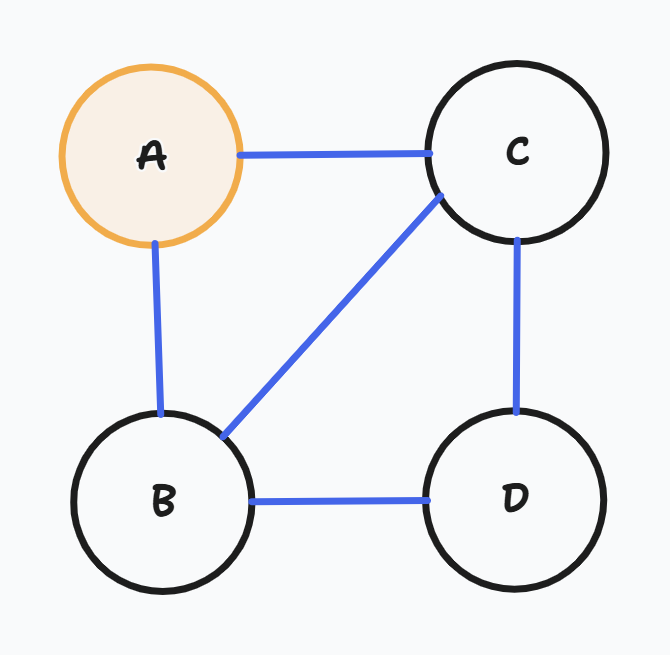
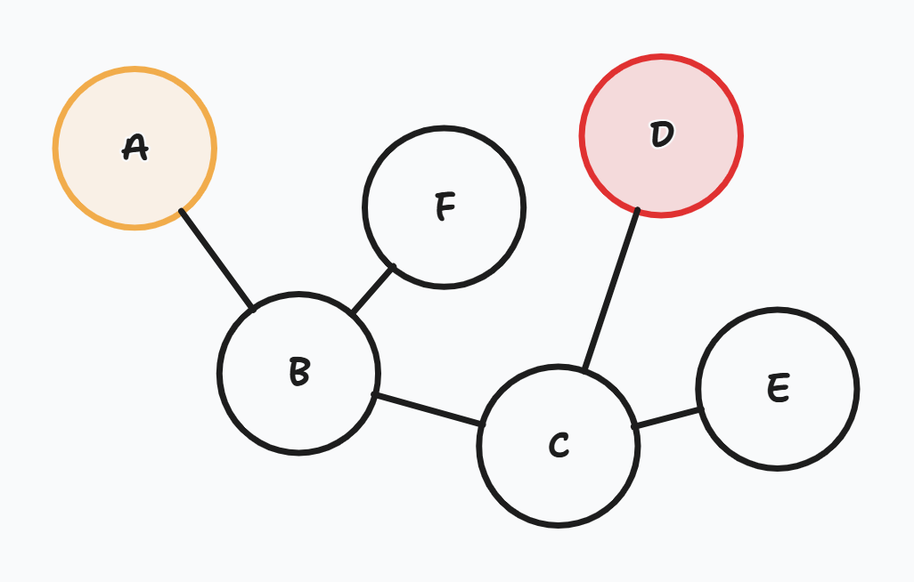

# 개요

**너비 우선 탐색(BFS, Breadth First Search)** 는 깊이 우선 탐색과 함께 그래프 순회 알고리즘의 주요한 두 방법 중 하나이다.

너비 우선 탐색은, 현재 방문 중인 정점의 **인접한 정점** 을 우선적으로 모두 탐색하는 것을 목표로 한다.

# 기본 BFS 알고리즘

기본적인 BFS의 알고리즘은 다음과 같다:

> [**BFS 알고리즘**]
> 
> * **`BFS 초기화 단계`**
>   * 시작 정점을 **큐**에 넣는다
>   * 시작 정점을 방문 처리한다
> * **`BFS 실행 단계`**
>   * 큐가 완전히 빌 때까지 다음을 반복한다:
>     * `현재 정점 처리 단계`
>       * 큐에서 정점을 하나 꺼낸다.
>       * 꺼낸 정점이 원하는 정점이면, 정점을 반환하고 알고리즘을 종료한다
>     * `인접 정점 탐색 단계`
>       * 꺼낸 정점의 모든 인접한 정점을 탐색한다:
>         * 인접한 정점이 이미 방문 처리가 되어있으면, 아무것도 하지 않는다
>         * 인접한 정점이 방문 처리가 되어있지 않으면:
>           * 해당 인접한 정점을 방문 처리한다.
>           * 해당 인접한 정점을 큐에 넣는다.

이 알고리즘을 토대로 구현하면 다음과 같다.

크게 그래프를 **인접 리스트** 로 표현하냐, **인접 행렬** 로 표현하냐에 따라서 구현이 달라진다.

### 구현 - 인접 리스트 방식 그래프



   

### 구현 - 인접 행렬  방식 그래프



조금 복잡해 보이지만, 여러 문제에서 비슷한 패턴으로 출제되니 숙지해 두는 것이 좋다.

> [**팁**] `dx` 와 `dy`의 값을 잘 조절하여, 인접 정점을 탐색할 때, 항상 *오른쪽 아래*의 정점이 먼저 큐에 들어오도록 조절하면 조금 더 빠른 속도를 기대할 수 있다.

## [팁] 조건이 만족되면, 빠른 종료를 하라

`현재 정점 처리 단계` 에서 현재 처리중인 정점이 원하는 정점인지 판단하고, 원하는 정점이라면 더 이상의 로직을 수행하지 않고 해당 정점의 정보를 반환한다.

이는 이후의 불필요한 탐색을 막는 효율적인 종료이다.

## [팁] 방문 처리는 인접 정점을 탐색할 때 하는 것이 좋다.

헷갈리기 쉬운데, `현재 정점 처리 단계`가 *의미상* 정점을 방문하는 단계이나, ==방문 처리 자체는 `인접 정점 탐색 단계`에서 진행하는 것이 권장된다.==

사실 방문 처리가 어디에 있든 BFS의 로직이 틀리는 것은 아니지만, **효율성**에서 유의미한 차이가 발생한다.

방문 처리를 `현재 정점 처리 단계`에서 하면 어떤 일이 발생되는지 확인해보자:

> * `A`를 시작 정점이라고 하면, 처음에 큐에 `A`를 넣고, 방문 처리한다.
> * 그리고 큐에서 `A`를 빼서, **`A`를 방문 처리한 후** `A`의 인접 정점을 탐색한다.
> * `A`의 방문되지 않은 인접 정점은 `B`와 `C`이므로, 큐에 `B`와 `C`를 넣는다. 그러면 현재 큐는 `{B, C}`이다.
> * 그리고 큐에서 `B`를 빼서 **`B`를 방문 처리한 후**, `B`의 인접 정점을 탐색한다.
> * `B`의 방문되지 않은 인접 정점은 `C`와 `D`이므로, 큐에 `C`와 `D`를 넣는다. 그러면 현재 큐는 `{C, C, D}`이다.

**자, 문제가 발생했다. `C`에 대한 방문 처리가 지연되어서, 큐에 불필요하게 `C`가 두번 들어갔다.**

반면, 방문 처리를 `인접 정점 탐색 단계`에서 진행하면 다음과 같아진다.

> * `A`를 시작 정점이라고 하면, 처음에 큐에 `A`를 넣고, 방문 처리한다.
> * 그리고 큐에서 `A`를 빼서, `A`의 인접 정점을 탐색한다.
> * `A`의 방문되지 않은 인접 정점은 `B`와 `C`이므로, **이들을 모두 방문 처리한 후** 큐에 `B`와 `C`를 넣는다. 그러면 현재 큐는 `{B, C}`이다.
> * 그리고 큐에서 `B`를 뺀 후, `B`의 인접 정점을 탐색한다.
> * `B`의 방문되지 않은 인접 정점은 `D`이므로, **방문 처리한 후** 큐에 넣는다. 그러면 현재 큐는 `{C, D}`이다.

방문 처리를 `인접 정점 탐색 단계` 하면 큐에 불필요한 노드를 추가하지 않을 수 있다.

# BFS의 특징

* BFS를 이용하여 가중치가 없는 그래프를 탐색하여 도출된 경로는 최단 경로이다.
* 또한 BFS는 단일한 출발점에서 모든 도착점까지의 경로를 찾을 수 있는, Single Source to All Destination 알고리즘이다.
  * ==이 말은, 한 번의 BFS 실행으로 출발 노드에서 도달 가능한 모든 노드까지의 최단 경로 정보를 구할 수 있다는 뜻이다.==
* 유한한 그래프에서 출발 노드로부터 도달 가능한 노드까지 경로가 존재한다면, BFS는 반드시 그 경로를 찾아낸다. 이것을 완전성(Completeness)이라고 한다.

# `응용` 최단 **거리(Distance)** 를 알고 싶은 경우

BFS는 간선의 **가중치가 없거나 모든 가중치의 값이 동일한 그래프** 에서 어떤 정점과 목표 정점까지 최단 거리를 계산하고 싶을 때 사용할 수도 있다.

## TODO: 그런데 왜 최단 거리인가?

BFS는 출발점에서 시작하여 가장 가까운 인접한 노드부터 탐색하는 알고리즘으로 정의하였다.

그 다음, 출발점에서 한 걸음 더 멀리 떨어진 곳을 찾고, 그 다음, 거기서 또 한걸음 멀리 있는 곳을 찾는다.

BFS는 가까운 곳부터 탐색을 시작하기 때문에, 목표 지점에 도달할 때까지 가장 짧은 경로를 먼저 찾게 된다. 따라서 목표 지점에 도달한 경로가 최단 경로임이 보장된다.

## BFS 거리 계산 알고리즘

[기본 BFS 알고리즘](#기본-bfs-알고리즘)을 다음처럼 조금만 바꾸면 된다.

> * **`BFS 초기화 단계`**
>   * 시작 정점을 **큐**에 넣는다
>   * 정점의 갯수와 동일한 크기의 **거리 배열**을 만들고, *거리 없음*으로 모두 초기화한다.
>   * 시작 정점에서 시작 정점까지의 거리를 0으로 설정한다.
> * **`BFS 실행 단계`**
>   * 큐가 완전히 빌 때까지 다음을 반복한다:
>     * `현재 정점 처리 단계`
>       * 큐에서 정점을 하나 꺼낸다.
>       * 꺼낸 정점이 원하는 정점이면, 정점이나 시작 정점에서 이 정점까지 거리를 반환하고 알고리즘을 종료한다
>     * `인접 정점 탐색 단계`
>       * 꺼낸 정점의 모든 인접한 정점을 탐색한다:
>         * 인접한 정점에 이미 거리가 계산되어 있으면, 아무것도 하지 않는다
>         * 인접한 정점이 거리가 계산되어 있지 않으면:
>           * *시작 정점 ~ 해당 인접한 정점* 까지의 거리를, *시작 정점 현재 ~ 처리 중인 정점* 까지의 거리에 1 더한 거리로 설정한다.[^1]
>              * (이는 시작부터 인접 정점까지 거리를, 시작 정점부터 현재 처리하고 있는 정점을 경유하여, 인접 정점에 도달하는 거리로 계산하겠다는 뜻이다.)
>           * 해당 인접한 정점을 큐에 넣는다.

[^1]: "인접한" 정점이므로 거리가 1 떨어져 있다는 가정이다.

### 구현 - 인접 리스트 방식 그래프



 

### 구현 - 인접 행렬 방식 그래프



# `응용` 최단 **경로(Path)** 자체를 알고 싶은 경우

최단 경로를 표현하는 방식이 조금 독특하다는 것만 주의하면 된다.

다음과 같은 그래프에서, *노드 A* 에서 *노드 D* 까지의 최단 경로를 표현하고 싶은 상황이라고 가정하자.

이때, 최단 경로는 A → B → C → D 임을 알 수 있다. 이 경로를 어떻게 표현해야 할까?

어떤 경로 $P$에 속한 노드 $n$에 대해서, 같은 경로에 속하는 바로 이전 노드 $n_p$를 그 노드의 **경로 부모 노드**라고 하자.

경로 부모 노드를 표시하는 배열을 다음처럼 생성할 수 있다.

|A의 경로 부모|B의 경로 부모|C의 경로 부모|D의 경로 부모|E의 경로 부모|F의 경로 부모|
|:-:|:-:|:-:|:-:|:-:|:-:|
|부모 없음|A|B|C|C|B|

이 배열을 경로의 목표 지점인 D 부터 거꾸로 부모를 타고 올라가면, 최단 경로의 역순열이 나온다.

* D → D의 경로 부모 → (D의 경로 부모)의 경로 부모 → ((D의 경로 부모)의 경로 부모)의 경로 부모
* D → C → B → A

결과를 뒤집으면 최단 경로를 구할 수 있다.

구체적인 알고리즘은 아래와 같다.

## BFS 경로 계산 알고리즘

> * **`BFS 초기화 단계`**
>   * 시작 정점을 **큐**에 넣는다
>   * 정점의 갯수와 동일한 크기의 **경로 부모 노드 배열**을 만들고, 부모 없음으로 모두 초기화한다.
> * **`BFS 실행 단계`**
>   * 큐가 완전히 빌 때까지 다음을 반복한다:
>     * `현재 정점 처리 단계`
>       * 큐에서 정점을 하나 꺼낸다.
>       * 꺼낸 정점이 원하는 정점이면, 정점이나, 경로 부모 노드 배열을 반환하고 알고리즘을 종료한다
>     * `인접 정점 탐색 단계`
>       * 꺼낸 정점의 모든 인접한 정점을 탐색한다:
>         * 인접한 정점에 경로 부모 노드가 이미 존재하면, 아무것도 하지 않는다
>         * 인접한 정점이 경로 부모 노드가 존재하지 않으면:
>           * 인접 정점의 경로 부모 노드를 *현재 처리 중인 정점* 으로 갱신한다.
>           * 해당 인접한 정점을 큐에 넣는다.

### 구현 - 인접 리스트 방식 그래프



 

### 구현 - 인접 행렬 방식 그래프 



# BFS 시간 복잡도 분석

어떤 그래프의 정점의 개수를 $V$, 간선의 개수를 $E$라고 한다.

## 인접 리스트

각 노드는 최대 한번 큐에 들어갔다 나오므로 최악의 경우 $O(V)$이다.
또한, 각 노드별로 연결된 간선을 모두 확인하므로, $O(E)$이다.

총 시간 복잡도는 따라서 $O(V + E)$이다.

모든 노드를 단 한번 방문하고, 모든 간선을 단 한번 확인하므로  $O(V + E)$보다 효율적일 수 없다.

정점의 개수가 간선의 개수와 비슷한 희소 그래프의 경우 인접 리스트는 매우 효율적이다.

## 인접 행렬

노드를 하나 방문할 때마다 모든 노드에 대해 간선이 있는지 검사하므로, $O(V)$인데, 모든 노드에 대해 이것을 수행하므로 총 시간 복잡도는 $O(V^2)$이다.

간선의 개수가 정점의 개수의 제곱만큼 많은 조밀 그래프의 경우 인접 행렬로 계산하여도 상관 없다.