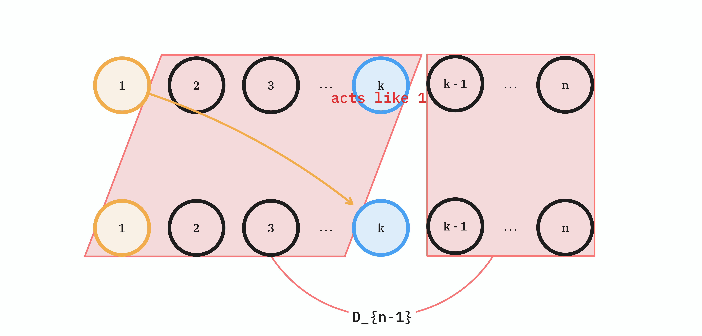

# 정의

> **완전 순열(Complete Permutation)**, 또는 **교란 순열(Derangement)** 은 순열의 일종으로, 모든 원소의 위치를 바꾸는 순열이다.
>   
> 집합 $S$의 순열 $\sigma: S \to S$ 가 모든 $s \in S$에 대해 $\sigma(s) \neq s$를 만족시키면, $\sigma$를 완전 순열이라고 한다.

$n$ 개 원소를 배열하는 순열의 수를 우리는 계승(팩토리얼)이라고 하고, $n!$이라고 표현하였다. $n$개 원소에 대한 완전순열의 수는 **준계승(Subfactorial)** 이라고 하고, $!n$이라고 표현한다.

$!n$을 $D_n$이라고 하고, 완전 순열의 점화식을 구해보자.

# 완전 순열의 점화식 $D_n$ 유도하기

1부터 $n$까지의 자연수를 두 줄 쓴다.

윗 줄의 숫자들을 하나하나씩 대응할 때, *자기 자신을 제외한 다른 숫자로 대응* 시키는 것이 완전 순열이다. 

숫자의 갯수가 $n$ 개일 때, 이 대응하는 방법의 수를 $D_n$이라 하자.

1부터 $n$까지의 수 중 임의의 수 $a$를 하나 뽑아 버리자.

$a$를 자기 자신을 제외한 다른 $n-1$개의 수 중 하나와 대응시켜야 한다. 이 대응시키는 수를 $k$라고 하자. $(k \neq a)$

그러면 $k$의 관점에서는 다음 두 선택지가 있다.
* **$k$가 $a$에 대응된다.**
  * 그러면 $a$와 $k$, 그리고 $k$와 $a$가 짝을 이루었으므로, *이 둘을 제외한 나머지 $n - 2$개 수의 완전 순열*을 구하는 문제로 환원된다.
  * 따라서 경우의 수를 **$D_{n-2}$** 로 표현할 수 있다.
* **$k$가 $a$에 대응되지 않는다.**
  * $a$는 $k$를 선택하였으나, $k$는 $a$를 선택하지 않은 상황이다. 
  * $k$는 $a$에 대응되면 **안 되는** 상황이다. ==$k$를 마치 $a$인 것처럼 취급하면,== 이미 $k$를 선택한 $a$를 제외하고 나머지 $n-1$개의 완전 순열을 구하는 문제로 환원된다.
  * 따라서, 경우의 수는 **$D_{n-1}$** 로 표현할 수 있다.

$a$에 대해 $k$를 선택하는 가짓수가 $n-1$이므로, 최종 점화식은[^1]

[^1]: 임의의 $a$에 대해 모두 생각하는 것이 아니라, $a$를 **하나** 뽑아서 고정해 버리는 것이고, 그 $a$에 대해 $k$를 몇 개 뽑느냐가 분기되는 것 임에 주의한다. $a$가 실제로 어떤 값인지는 전혀 중요하지 않으며, 그냥 하나의 항을 임의로 처리해 버리려면 $k$를 선택해야 하는데, 여기서 분기가 $n-1$개 생긴다고 생각하는 것이 좋다.

> [`완전 순열의 점화식`]
> 
> $$
> D_n = (n-1)(D_{n-2} + D_{n-1}) \ (n \geq 2)
> $$
> 그리고, $D_0 = 1$, $D_1 = 0$이다.

이다.

## $a=1$일 때, 다이어그램으로 표현

$a = 1$일때, 다이어그램으로 표현하면 아래와 같다.

먼저, $1$도 $k$에, $k$도 $1$에 대응된 상황이다.


$1$과 $k$를 제외한 나머지 $n-2$개의 완전 순열을 구하는 문제로 환원된다.

그리고, $1$은 $k$에 대응되었으나, $k$는 $1$에 대응되지 않은 상황이다.



이러면 $k$는 $1$에 대응되면 **안 되는** 상황이므로, $k$를 마치 $1$인 것처럼 취급하여, 이미 짝이 정해진 $1$을 제외한 나머지 $n-1$개의 완전 순열을 구하는 문제로 환원된다.

# 완전 순열 알고리즘

점화식으로 표현될 수 있으므로, $n$까지의 완전 순열의 개수를 동적 계획법을 이용해 쉽게 계산할 수 있다.

대표적인 완전순열 문제로 [백준 1947 G3 선물 전달](https://www.acmicpc.net/problem/1947)이 있다.

이 문제의 코드는 아래와 같이, 위에서 계산한 점화식을 그대로 사용하면 된다.

```cpp
#include <iostream>
#include <vector>

using namespace std;

using ll = long long;

int main() {
  int N; cin >> N; // [10^6]

  vector<ll> dp(N + 1);

  // 초항 계산
  dp[0] = 1; 
  dp[1] = 0;

  for (int n = 2; n <= N; ++n) {
    // mod를 여기서 취하지 않으면 오버플로우가 발생한다.
    // 점화식으로 dp 계산
    dp[n] = (n - 1) * (dp[n - 1] + dp[n - 2]) % 1'000'000'000ll;
  }

  cout << dp[N];
}
```

# 참고 문헌

- [완전 순열/나무위키](https://namu.wiki/w/%EC%99%84%EC%A0%84%20%EC%88%9C%EC%97%B4)
- [완전 순열/Wikipedia](https://ko.wikipedia.org/wiki/%EC%99%84%EC%A0%84%EC%88%9C%EC%97%B4)
