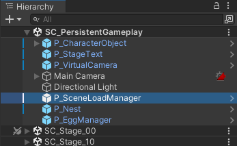

## 개요

싱글턴 디자인 패턴은 게임 개발자에겐 사랑의 대상인 동시에 증오의 대상이다. 싱글턴 패턴에 대해 검색하면, "싱글턴을 어떻게 구현해야 할까요?" 라는 질문에 **"싱글턴 패턴을 사용하지 말라"** 같은 답변이 달려있는 것을 심심찮게 볼 수 있다.

게임 개발에서 절대 안 된다거나 절대 된다는건 없다. 해결하려는 문제의 범위와 난이도에 맞추어, 싱글턴 패턴도 유연하게 작성한다면 게임 구조를 단순화하는 데에 도움을 줄 수 있다.

> 어떤 클래스가 (1) 단 하나의 인스턴스만 가지는 것이 보장되고, (2) 해당 인스턴스를 어디서든지 접근 가능하다면, 그 클래스를 싱글턴 클래스라고 부른다.
 
위 두 조건만 만족하면 되므로, 구현은 정말 다양하다. 싱글턴의 초기화 시점부터 스레드 안정성까지 해결하려는 문제가 얼마나 복잡하냐에 따라서 구현도 천차만별이다. 

## 유니티에서 간단한 싱글턴 구현하기

여기서는 유니티에서 아주 간단하게 싱글턴을 구현해 보겠다. 내가 애용하는 방법이다.



먼저 PersistentGameplay라는 씬을 만들고, 이 씬을 게임이 실행되는 동안 언로드하지 않는다. 오브젝트 계층 구조를 보면 알겠지만, 이 씬에는 매니저 클래스 같은 특정 씬에 종속되지 않고 유지되어야 하는 객체들이 상주하는 곳이다.

싱글톤을 관리할 때 항상 `DontDestroyOnLoad`를 통해 씬이 전환될 때 파괴되지 않도록 만드는데, 위처럼 상시 유지되는 씬을 만들어 놓고, 나머지 씬을 `LoadSceneMode.Additive`로 로드하면 싱글턴들을 쫓아다니면서 살아있는지 관리할 필요가 없다.
 
예를 들어 씬 로딩을 관리하는 `SceneLoadManager`라는 오브젝트에 부착할 싱글턴 스크립트 SingletonTest는 아래와 같이 간단하게 만들 수 있다.

```csharp
// Singleton
public class SceneLoadManager : MonoBehaviour
{
    void Awake() => Instance ??= this;
    public static SceneLoadManager Instance { get; private set; }
 
    public event Action Something;
    public static event Action StaticSomething;
}
 
// Client
public class SceneLoadTrigger : MonoBehaviour
{
    void Awake() => SceneLoadManager.StaticSomething += () => {};
    void Start() => SceneLoadManager.Instance.Something += () => {};
}
```

여기서 주의할 사안이 몇가지 있다.

* `Awake`에서 초기화가 일어나므로, `Awake` **이하**의 시점에서는 `Instance`가 유효함이 보장되지 않는다. 
	* 따라서 `Awake` 이하의 시점에서 `Instance`를 통한 싱글턴 클래스 접근은 널 오류를 발생시킬 수 있다. 
	* 주로 이벤트 바인딩 관련하여 마주하기 쉬운 문제인데, 해당 이벤트도 `StaticSomething`처럼 정적 멤버로 만들어 주거나, 아니라면 `Start`와 같이 `Awake` 이후의 시점에서 바인드 해주어야 한다. [^1] 

[^1]: 스크립트 실행 순서를 에디터에서 설정하여, `SceneLoadManager`의 `Awake`가 가장 먼저 실행되게 할 수도 있으나, 지저분한 방법이라고 생각한다.

* 또, 이 방법을 일반화하여 `SingletonBase`와 같은 것을 만들고 싶을 수도 있다.
하지만 정적 프로퍼티는 `abstract` 하거나 `virtual`할 수 없어서 다형성 관련 문제가 생긴다.
	* 상속 관계를 정의한다는 것은 하나의 기초 클래스를 두고 여러 유도 싱글턴을 만든다는 것인데, 정적 프로퍼티는 그 구조와 상관 없이 *단 하나만* 존재하므로, 의미가 꼬이게 된다. [^2] 

[^2]: 이런게 하고 싶으면 제너릭을 사용하면 되지만 - 약간 복잡하므로 이 게시글에선 다루지 않는다.

이 방법은 매우 간편하게 싱글턴을 구현할 수 있지만 한계를 명확히 알고 사용해야 한다.

언로드되지 않는 씬 PersistentGameplay에 객체가 하나만 존재한다는 것을 유니티 에디터를 사용하는 주체가 관리하는 것이므로, 멀티플레이 게임 같이 싱글턴이 반드시 하나만 존재해야 하는 전제가 강하게 지켜져야 하는 곳에는 추가적인 처리가 필요하다.

## 정리
 
싱글턴은 (1) 인스턴스가 하나만 존재해야 하고, (2) 해당 인스턴스에 대한 전역 접근 지점이 존재해야 한다.

(1)의 경우 언로드되지 않는 씬에 하나의 게임오브젝트만 올려두고, 퍼블릭 정적 멤버 `Instance`로 (2)를 구현하였다.

전역 접근 지점을 만들기 위한 다른 방법도 있는데, 이것을 싱글턴으로 부를 수 있는지는 조금 애매하다.

싱글턴을 사용하는 클라이언트 코드에서 `[SerializeField] SceneLoadManager _manager` 처럼 일일히 참조를 만들어서, 연결을 에디터에서 설정해 주는 것이다. 이 방법은 귀찮지만 어떤 클라이언트가 무슨 매니저를 필요로 하고, 없는 경우 어떻게 대처해야 하는지 조금 더 명시할 수 있고, 싱글턴 자체도 일반 `MonoBehaviour` 처럼 다룰 수 있으므로 조금 더 지속 가능한 방법으로 느껴지기는 한다.

나는 매니저 클래스들을 매우 싫어하는데, 왜냐하면 남용하기가 너무 쉽기 때문이다. 예를 들어 `GameManager`는 대체 뭘 매니징하는 녀석인가? 약하게 연관있는 기능들이 두서 없이 모일 가능성이 높고, 해당 매니저에 의존하는 클래스들 간에도 강한 커플링이 발생할 것이다. 싱글턴을 생각 없이 사용하다간, 어느새 코드끼리 근친 교배를 하고 있는 것을 발견하게 된다.

때문에 싱글턴을 사용할 때에는 본인 혹은 본인이 속한 팀이 사용에 대한 구체적인 원칙을 세운 후 작성하는 것이 정신 건강을 유지하는 데에 필수적일 것 같다.

예를 들어, 나는 다음과 같은 원칙이 있다.

1. 싱글턴을 쓰지 않는다.
2. 쓴다면, 이 싱글턴이 정확히 무슨 일을 하고, 그 일을 어디까지 책임지는지 구체적으로 적어 본다.
3. (2)를 하고 나면, 다시 (1)로 돌아가 해당 기능을 구현할 다른 방법이 없나 생각한다. 다른 방법이 떠오르면, 그 방법을 쓴다. 다른 방법이 없으면 그 때 싱글턴으로 만든다.