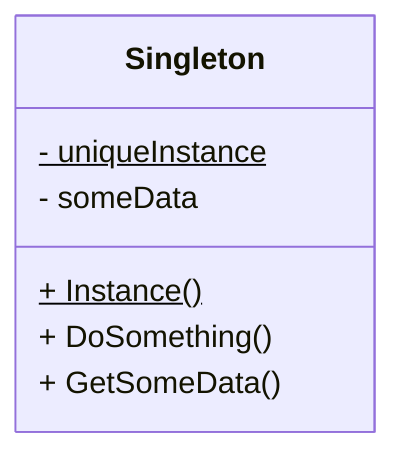

# 의도와 동기

어떤 클래스는 단 하나의 인스턴스만 존재하는 것이 말이 될 때가 있으며, 보통 이러한 인스턴스는 접근하기 쉬워야 하는 경우가 많다.

예를 들어, 시스템에는 *파일 시스템*도 하나여야 하고, *윈도우 매니저*도 하나여야 한다.

나이브한 방법은 전역 변수를 사용하는 것인데, 이는 사용자가 여러 객체를 생성하는 것 자체를 금지하지는 못한다.
(잘 모르는 사용자가 윈도우 매니저를 여러개 인스턴싱 한다고 생각해 보라...)

아무튼 이런 문제를 해결하기 위해 전역 변수보다는 더 나은 뭔가가 필요하다는 합의가 있었고, 그 뭔가가 바로 싱글턴 클래스이다.

단일체라고도 부르는 싱글턴 클래스는 자신의 인스턴스가 유일하도록 추적하고 관리하는 의무를 부여받는다. 또한, 전역 변수처럼 자기 자신에 대한 전역 접근 지점도 제공한다.

# 구조



# 언제 쓰는가?

싱글턴 패턴은 다음과 같은 상황에서 유용하다:
* 클래스의 인스턴스가 하나만 존재해야 하며, 클라이언트가 잘 알려진 접근 지점을 통해 그 인스턴스에 접근할 수 있어야 할 때
* 싱글턴 클래스를 서브클래싱하여 확장 가능한 방식으로 유지하고 싶은 경우

# C++ 구현

## 정적 지역 변수 싱글턴 (Meyer's Singleton)

```cpp{lineNos=false}
#pragma once

class Singleton {
public:
    static Singleton &Instance();

    Singleton(Singleton const &) = delete;
    Singleton &operator=(Singleton const &) = delete;

private:
    Singleton() = default;
    ~Singleton() = default;
};
```

선언은 위와 같고, 정의는 아래와 같다.

```cpp{lineNos=false, hl_lines=4}
#include "Singleton.h"

Singleton &Singleton::Instance() {
    static Singleton instance;
    return instance;
}
```

스콧 마이어스의 간단한 싱글턴이며 싱글턴을 구현해야 하는 대부분의 경우 위의 구현으로 충분한 경우가 많다.

눈여겨 볼 점은 `Instance`가 호출되는 시점에 게으른 초기화(Lazy Initialization)가 진행되는데, 이 시점에 `instance`라는 정적 지역 변수가 초기화 된다.

정적 지역 변수 `instance`는 `Instance`가 처음으로 호출되는 시점부터, 프로그램이 종료될 때까지의 생애주기를 갖는다.

이러한 정적 지역 변수의 생애주기는 외부의 요인에 절대 영향받아서는 안 되므로:
* 싱글턴의 생성자 뿐 아니라 소멸자 또한 `private`에 넣어버렸다.
* 싱글턴의 복사 생성자와 대입 연산자를 지워 버렸다.

정적 멤버 함수 내에 정적 지역 변수가 있는 인스턴스를 외부에서 강제로 소멸시킨다고 생각해 보자. 완전히 역설적인 상황이며 정의되지 않은 행동이다. 이런 짓을 못 하게 소멸자를 숨겨버리는 것이다. 

하지만 소멸자를 숨김으로서 싱글턴의 소멸 시점을 제어할 수 없게 되었다는 점은 주의해야 한다. 이 구현의 싱글턴은 프로그램이 종료될 때 소멸된다.

또한, 다음과 같은 이상한 명령문들도 쓰지 못하게 하기 위해:
```cpp{lineNos=false}
// 복사 초기화 - 복사 생성자 호출
Singleton s1 = Singleton::Instance();
// 대입 연산자 호출
Singleton s2; s2 = Singleton::Instance();
```
복사 생성자와 대입 연산자도 `delete`로 뽑아버린다. 싱글턴 패턴은 인스턴스의 유일성을 보장하는 것이 가장 큰 목표 중 하나인데, 위 명령문들은 그 목표를 정면으로 거스르기 때문이다.

추가적으로, C++11부터 정적 변수에 대한 스레드 안전성이 보장된다. 때문에 여러 스레드에서 `Instance`를 동시에 호출해도, 안전하게 하나의 인스턴스만 초기화된다.

이 구현에서는 포인터가 아니라 참조를 반환하므로 가져오는 싱글턴 인스턴스가 진짜 있는지 없는지 고민할 필요도 없다.

## 정적 멤버 변수 싱글턴

```cpp{lineNos=false}
#pragma once

class Singleton {
public:
    static Singleton &Instance();
    static void Destroy();

    Singleton(Singleton const &) = delete;
    Singleton &operator=(Singleton const &) = delete;

private:
    Singleton() = default;
    Singleton() = default;

    static Singleton *instance_;
};
```

선언은 위와 같고, 정의는 아래와 같다.

```cpp{lineNos=false}
#include "Singleton.h"

Singleton *Singleton::instance_ = nullptr;

Singleton &Singleton::Instance() {
    if (!instance_) {
        instance_ = new Singleton();
    }
    return *instance;
}

void Singleton::Destroy() {
    delete instance;
    instance = nullptr;
}
```

`Instance`를 처음으로 호출하는 시점에 게으른 초기화가 진행되나, 이번에는 정적 지역 변수가 아닌 정적 멤버 변수에 직접 동적으로 할당하여 구현한 싱글턴이다.

마이어의 싱글턴과 다르게 정적 멤버 변수로 구현한 싱글턴의 생애주기는 클라이언트가 명시적으로 제어해야 한다. 외부에서 `Destroy`를 호출하면 싱글턴이 정리된다. (때로는 `Initialize`처럼 게으른 초기화가 아니라 명시적 초기화 정적 메서드를 제공하기도 한다.)

하지만, 정적 지역 변수가 스레드 안전한 것돠 대비되게, 정적 멤버 변수는 스레드 안전하지 않다. [^1] 위는 스레드 안전성을 고려하지 않은 설계로, 만일 위와 같은 싱글턴이 멀티스레드 환경에서 사용된다면 `mutex`등과 같은 추가적인 스레드 안전성 장치들을 구현해 주어야 한다. 

[^1]: 정적 클래스 멤버는 다른 정적 전역 변수들과 함께 `main()` 호출 이전에 초기화된다. 그리고, 이 초기화에는 순서가 정해져 있지 않다. 반면 정적 지역 변수는 해당 스코프에 들어갔을 때(함수가 호출되었을 때) 초기화되므로 순서에 대해 걱정하지 않아도 된다.

## 제너릭 싱글턴

```cpp{lineNos=false}
#pragma once

template <typename T>
class Singleton {
public:
    static T &Instance() {
        static T instance;
        return instance;
    }
    Singleton(Singleton const &) = delete;
    Singleton &operator=(Singleton const &) = delete;
protected:
    Singleton() = default;
    virtual ~Singleton() = default;
};
```

제너릭 싱글턴의 템플릿 클래스는 위와 같고, 아래처럼 사용한다.

```cpp
#include "Singleton.h

#include <iostream>

class Logger: public Singleton<Logger> {
    friend class Singleton<Logger>;
public:
    void Log(std::string const &msg) {
        std::cout << "[LOG]" << msg << std::endl;
    }
private:
    Logger() = default;
};
```

`Singleton<Logger>` 클래스 내의 `Instance`에서 `Logger`의 생성자를 `new T`로 호출하려는데 `Logger`는 싱글턴으로 생성자가 `private` 영역에 있어서 접근할 수 없다. 이 상태를 해소하기 위해 `Logger` 내에서 `Singleton<Logger>`에 대한 `friend` 선언을 해준다.

# 싱글턴의 장점과 단점

## 장점

* 유일성이 보장된 인스턴스에 대한 전역 접근 지점 제공
* 초기화 시점 제어 가능
* 전역 변수와 다르게 이름 공간을 오염시키지 않음

## 단점

* 싱글턴은 전역 상태를 가지므로 테스트 시 독립성을 유지하기 어려움
* 다른 객체들이 싱글턴 인스턴스에 너무 의존하면 결합도가 높아짐
* 정적 멤버 변수 방식의 싱글턴은 스레드 안전 문제가 발생할 수 있음

# 싱글턴은 안티 패턴인가?



이전에는 싱글턴 사용을 지양하려 하였으나, 생각을 좀 바꿔 보기로 했다.

안티패턴
* 많이 사용하는 것이긴 한데, 올바른 방법이 아님.
* 이렇게 하면 뭔가 문제가 더 많이 발생함.
* 그리고, 이것보다 더 나은 방법이 있음.

싱글턴 패턴은 안티 패턴인가?

싱글턴은 디자인 패턴입니다. 다수설에 의하면. 소수설이 안티 패턴이라고 얘기하는 경우가 있다.
90년대말 ~ 2000년대 초에는 안티패턴이라고 말하는 사람이 많았는데, 지금은 오히려 줄었다. 소수설이며 수는 줄어들어 가고 있다.

그럼 왜 이사람들이 안티 패턴이라고 부를까?
싱글턴은 그냥 사실 전역 변수를 OOP 환경에서 쓰려는 꼼수라고 보면 됩니다.
프로그램 전체에서 하나만 있는 오브젝트가 말이 되냐? 원래 싱글턴 안 만들어도 되는 것을 싱글턴으로 만들어서 코드를 해치는 경우가 많다! SOLID도 해친다! (근데 SOLID는 항상 지키는 것은 원래 어려움) 
그리고 테스트 기준으로 안티패턴 나누는 것도 현실적이지 못함

핵심은 원래 OOP적으로 쪼개야 할 객체들을 싱글턴으로 자꾸 뭉쳐서 전역 상태를 만들어서 코드가 드러워진다! 이게 이들의 논리인 것 같음.

근데 이제 교육 패러다임 자체가 OOP로 시작되기 때문에 비 OOP적 방식으로 싱글턴을 사용하는 사례가 많이 줄어든 것이 아닌가.

그리고, 싱글턴 없애고 이거 대신 사용할 수 있는게 있냐? 이게 없다.
싱글턴보다 더 효율적이고 재활용 가능한 패턴을 아무도 제시하지 못함.

프로그램 역사상 실행중에 딱 하나 있어야 하는게 딱 하나 필요한 경우는 되게 많았음. 싱글턴 안 썼어도 프레임워크 가져다 썼으면 그 안에 싱글턴이 다 있음. 웬만한 규모 있는 제품에 싱글턴 안 쓰는건 거의 불가능에 가까움.

암튼 싱글턴이 안티패턴이라는 것은 소수설임. 근데 이거 보다 나은 방법이 존재하지 않는 경우 빈말이나 다름 없음. 나은 방법 제시할 수 있으면 안티 패턴 맞음.

그냥 맘에 안 든다고 안티 패턴이라고 하면 안됩니다. 애초에 안티패턴이라고 하는 사람들은 소수임. 이게 안티 패턴이면 왜 디자인 패턴 도서에 나오겠어요? 그리고 업계에서도 매우 많이 씁니다.

그리고 경력 2년 안되면 디자인 패턴 어줍잖게 쓸 생각 하지 마시오. 디자인 패턴 잘못 쓰면 배보다 배꼽이 더 커지는 경우가 많습니다. 절반 이상 잘못 씁니다.

디자인 패턴을 그대로 따라하려고 하지 마세요---!!!

애초에 모든 디자인 패턴이 안티 패턴이 될 수 있다.
