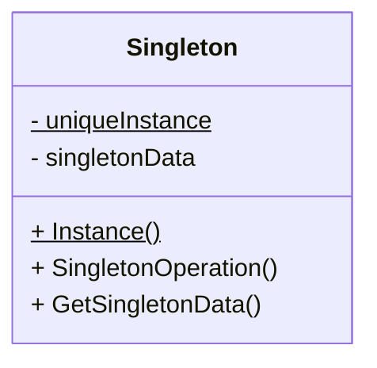

# 의도

어떤 클래스가 단 하나의 인스턴스만 존재하는 것이 보장되면서, 그 인스턴스에 대한 전역 접근 지점을 제공하고 싶다.

# 동기

어떤 클래스들은 단 하나의 객체만 존재하는 것이 보장되어야 하는 경우가 있다.

* 시스템에 "프린터"는 많을 수 있어도, "프린터 스풀러"는 단 하나만 존재해야 한다.
* 시스템에는 단 하나의 "파일 시스템"과 "윈도우 매니저"가 존재해야 한다.

어떻게 하면 어떤 클래스가 단 하나의 객체만 가지게 하면서, 그 객체에 쉽게 접근할 수 있도록 할 수 있을까?

전역 변수를 사용하면 접근은 쉬워지지만, 이런 방식은 당신이 여러 객체를 생성하는걸 금지하지는 못한다.

때문에 좀 더 나은 방법은 클래스를 만들어서, 그 클래스에게, 자신의 단 하나의 인스턴스를 추적하고 관리할 의무를 부여하는 것이다.

때문에 좀 더 나은 방법은 클래스를 만들어서 클래스에게 자신의 인스턴스가 유일하도록 추적하고, 관리할 의무를 부여하도록 만든다. 또한, 전역 변수가 그랬던 것처럼 전역 접근 지점도 제공한다.

이것을 싱글턴 패턴이라고 부른다.

# 적용

싱글턴 패턴은 다음과 같은 상황에서 사용한다.

* 클래스의 인스턴스가 단 하나만 존재해야 하며, 클라이언트에게 잘 알려진 접근 지점을 통해 접근할 수 있어야 할 때
* 존재하는 유일한 인스턴스가 서브클래싱을 통해 확장 가능하고, 클라이언트가 그들의 코드를 수정하지 않고도 확장된 인스턴스를 사용할 수 있을 때.
    * When the sole instance should be extensible by subclassing, and clients should be able to use an extended instance without modifiying their code.

# 구조



# 참여자

Singleton
* Defines an Instance operation that lets clients access its unique instance. Instance is a class operation (that is, a class method in Smalltalk and static member function in C++)
* may be responsible for creating its own unique instance.

# 협동

클라이언트들은 오직 싱글턴의 `Instance` 연산을 통해서만 싱글턴의 객체에 접근한다.

# 결과

싱글턴 패턴을 사용하면 다음과 같은 장점이 있다:

* 유일 인스턴스에 대한 제어된 접근
    * 싱글턴이라는 클래스 자체가 자신의 유일 객체를 캡슐화 하기 위한 용도이므로, 자기 자신과 그 접근에 대해 엄격히 통제할 수 있다.
* 이름 공간 오염 방지
    * 싱글턴 패턴은 전역 변수를 발전시킨 개념으로도 볼 수 있다.
    * 전역 변수 때문에 이름 공간이 오염될 염려를 하지 않아도 된다.
* 싱글턴을 쉽게 확장(상속)하여 표현력을 높일 수 있음.
    * 예를 들어, `Logger`라는 싱글턴을 확장해 `AdvancedLogger`클래스를 만들어 사용할 수 있음.
* 인스턴스 수 변경 가능
    * 싱글턴은 원래 하나의 인스턴스만 존재하도록 설계한 것이지만, 이 패턴을 사용하면 나중에 여러 개의 인스턴스를 허용하도록 바꿀 수도 있다.
    * 예를 들어, DB와의 연결을 표현하는 `DBConnection`이라는 싱글턴이 있는데, 
    * 싱글턴의 접근 메서드만 수정하면 인스턴스를 하나에서 여러 개로 변경할 수 있다.
    * 어떤 인스턴스가 필요한지를 런타임에 결정할 수 있기 때문에, 애플리케이션에 필요한 인스턴스 수를 유동적으로 관리할 수 있다.
* 클래스 연산보다 더 유연함
    * 싱글턴 패턴은 정적 메서드를 사용해 클래스를 다룰 수 있는데, 이는 하나의 인스턴스를 다룰 때 유용하다.
    * 하지만 정적 메서드는 다형성을 지원하지 않기 때문에, 상속된 클래스에서 오버라이드 할 수 없다.
    * 싱글턴 패턴은 정적 메서드 대신 인스턴스를 관리하는 더 유연한 방식을 제공하며, 인스턴스의 수를 나중에 변경할 수 있다는 장점이 있다.

# 구현

싱글턴 패턴을 사용할 때 구현 이슈는 다음과 같은 것들이 있다:

## 하나의 클래스에 대해 하나의 인스턴스만 존재하도록 보장하기

해당 클래스의 인스턴스를 직접 생성하는 것이 아니라, 클래스 내부적으로 하나의 인스턴스만 생성되도록 제한하는 방식을 사용한다.

* 외부에서 클래스의 인스턴스를 직접 생성할 수 없도록 생성자를 `private`으로 숨신다.
* 클래스 내부에서 유일한 인스턴스를 가리키는 정적 멤버 변수(`_instance`)를 선언한다.
* 외부에서 인스턴스에 접근할 수 있도록, 해당 인스턴스를 반환하는 정적 멤버 함수(`Instance`)를 제공한다.
* `Instance` 함수 내에서, 아직 인스턴스가 생성되지 않았다면 유일한 인스턴스를 생성하고, 저장한 후, 반환한다.
 
이러한 방식으로, 최초 사용시 인스턴스를 생성하고 이후에는 동일한 인스턴스를 반환하여 하나의 인스턴스만 유지할 수 있다.

싱글턴 클래스는 다음 처럼 선언된다:



구현은 아래와 같다.



`Instance`는 **게으른 초기화(Lazy Initialization)**를 진행한다: `Instance`의 반환값은 처음으로 접근되기 이전까지는 생성조차 되지 않는다.

생성자의 접근 제한자가 `protected`임을 눈여겨 본다. 클라이언트가 싱글턴의 인스턴스를 생성자로 직접 생성하려면 컴파일 타임에 오류를 발생시킬 것이며, 이는 싱글턴의 인스턴스가 단 하나만 생성되도록 보장해 줄 것이다.

더해서, `_instance`는 싱글턴 객체에 대한 포인터이다. `Instance` 멤버 함수는 이 변수에 대해서 `Singleton` 클래스의 유도 클래스를 할당할 수 있다. 이는 일반화된 싱글턴을 만드는 데에 사용된다.

C++ 구현에서는 조금 더 주의해야 할 것이 있다. 단순히 싱글턴을 전역이나 정적 객체로 정의하고 자동 초기화에 의존하는 것은 충분하지 않다. 세 가지 이유가 있다.
* 정적 객체가 단 하나만 생성된다는 보장이 없다.
    * C++에서 여러 개의 번역 단위(Translation Unit) [^1] 가 존재하는 경우, 동일한 정적 객체가 중복으로 생성될 가능성이 존재한다.
    * 즉, 싱글턴이 여러 번 인스턴스화될 위험이 있기 때문에 단순히 정적 변수로 선언하는 것 만으로는 충분하지 않다.
* 프로그램 실행 중 나중에 계산된 값을 필요로 할 수 있다.
    * 정적 객체는 프로그램이 시작할 때 자동으로 초기화되므로, 나중에 필요한 값들을 전달하지 못 할수도 있다.
    * 예를 들어 싱글턴 객체가 설정 파일에서 값을 읽어와야 하는데, 정적 객체 초기화 시점에서는 파일이 아직 로드되지 않았다면 올바른 값을 설정할 수 없다.
* C++에서는 번역 단위 간 전역 객체의 생성 순서를 보장하지 않는다.
    * C++에서 여러 개의 전역 객체를 선언할 때, 이 객체들이 생성되는 순서는 번역 단위간에 정해져 있지 않다.
    * A 싱글턴 객체가 B 싱글턴 객체를 필요로 하지만, B가 먼저 생성된다는 보장이 없으면 프로그램이 비정상적으로 작동할 수도 있다.
    * 이 문제는 여러 개의 싱글턴 객체가 서로 의존 관계가 있는 경우 심각한 버그를 유발할 수도 있다.

이를 해결하기 위해 일반적으로 정적 지역 변수를 사용하여 게으른 초기화를 통해 싱글턴을 구현하는 것이 일반적이다.

[^1]: 컴파일러가 하나의 독립적인 소스로 처리하는 단위로, 보통 하나의 .cpp 파일과 그 안에서 포함된 모든 헤더 파일을 포함한 코드 조각을 의미한다.

```cpp
#pragma once

class g_Singleton {
public:
    Singleton();
    void foo();
}

extern g_Singleton g_singleton;
```

```cpp
#include "g_Singleton.h"

void g_Singleton::foo() {}

g_Singleton g_singleton;
```

그리고 위 `g_Singleton` 클래스를 다음처럼 사용한다고 가정한다.

```cpp
#include "g_Singleton.h"

class g_Client {
    Client() {
        // 이 시점에 g_singleton이 아직 초기화 되지 않았을 수도 있음.
        g_singleton.foo();
    }
}

g_Client g_client;

int main() {
    return 0;
}
```

이것이 어떤 실행 환경에서는 정상적으로 작동할 수도 있으나, 컴파일러나 링커에 따라 실행 순서가 다르게 배치되면 치명적인 문제로 이어질 수도 있다. `g_client`가 먼저 생성될 때 `g_singleton`이 초기화되어 있다는 것이 보장되지 않는 것이다.

참고 문헌: [Initializing a static variable in header/StackOverflow](https://stackoverflow.com/questions/3837490/initializing-a-static-variable-in-header)

전역/정적 객체로 싱글턴을 만드는 접근은 모든 싱글턴이 사용되지 않더라도 생성되도록 강제한다. 정적 멤버 함수를 사용하는 접근은 이러한 모든 문제를 피할 수 있게 해준다.

## `Singleton` 를 상속하기

상속 그 자체보다는 역시 인스턴스가 단 하나임을 보장하는 것이 관건이다.

본질적으로, `Singleton` 인스턴스를 참조하는 변수는 유도 클래스의 인스턴스로 초기화되어야 한다.

가장 간단한 방법은 `Singleton`의 `Instance` 작업에 사용할 `singleton`을 결정하는 것이다.

하위 클래스를 선택하는 또다른 방법은 부모 클래스에서 `Instance`의 구현을 가져 와서 하위 클래스에 넣는 것이다. C++프로그래머는 링크 타임에 싱글턴의 클래스를 결정할 수 있지만, 싱글턴의 클라이언트에게는 숨길 수 있다.

링크 접근법은 링크 타임에 싱글턴 클래스의 선택을 수정하므로 런타임에 싱글턴 클래스를 선택하기 어렵다. 조건문을 사용하여 서브 클래스를 결정하는 것이 더 유연하지만, 가능한 싱글턴 클래스 집합을 하드 와이어링 한다는 점에서 유연성이 떨어진다.

보다 유연한 접근 방식은 싱글턴 레지스트리를 사용하는 것이다. `Instance`가 가능한 싱글턴 클래스 집함을 정의하는 대신, 싱글턴 클래스는 잘 알려진 레지스트리에 이름으로 싱글턴 인스턴스를 등록할 수 있다.

이 레지스트리는 싱글턴과 문자열 이름을 매핑한다. `Instance`는 싱글턴이 필요한 경우, 레지스트리를 참조하여 이름으로 싱글턴을 요청한다. 레지스트리는 해당 싱글턴이 존재하는 경우 조회하고 반환한다. 이 접근법은 `Instance`가 가능한 모든 싱글턴 클래스 또는 인스턴스를 알지 못하게 한다. 필요한 것은 레지스트리에 대한 연산을 포함하는 모든 싱글턴 클래스에 대한 공통 인터페이스이다.

```cpp
class Singleton {
public:
    static void Register(char const *name, Singleton *);
    static Singleton *Instance();
    static Singleton *Lookup(char const *name);
private:
    static Singleton *_instance;
    static std::unordered_map<char const *, Singleton *> _reg;
};
```

메서드 `Register`가 싱글턴을 주어진 이름으로 등록하게 만든다. `Lookup` 메서드는 이름으로 싱글턴 객체를 찾아낸다. 우리는 한 환경 변수가 필요한 싱글턴의 이름을 특정한다고 가정한다.

```cpp
Singleton *Singleton::Instance {
    if (_instance == nullptr) {
        char const *name = getenv("SINGLETON");

        // 찾지 못하면 nullptr을 반환
        _instance = Lookup(name)
    }
    return _instance;
}
```

어디에서 싱글턴 클래스들이 자신을 등록할까? 첫 번째로, 생성자에서 할 수 있다.

```cpp
MySingleton::MySingleton() {
    Singleton::Register("MySingleton", this);
}
```

당연히 누가 인스턴스화 하지 않는 한 생성자는 호출되지 않는데 이는 싱글턴 패턴이 해결하려는 문제를 또다시 반복하는 것이다.