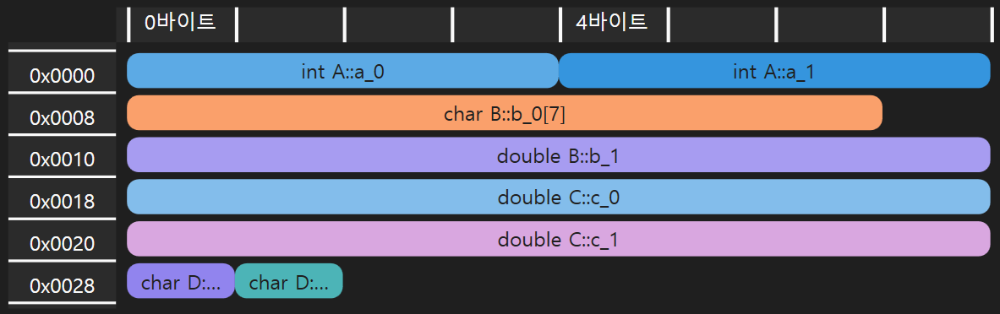
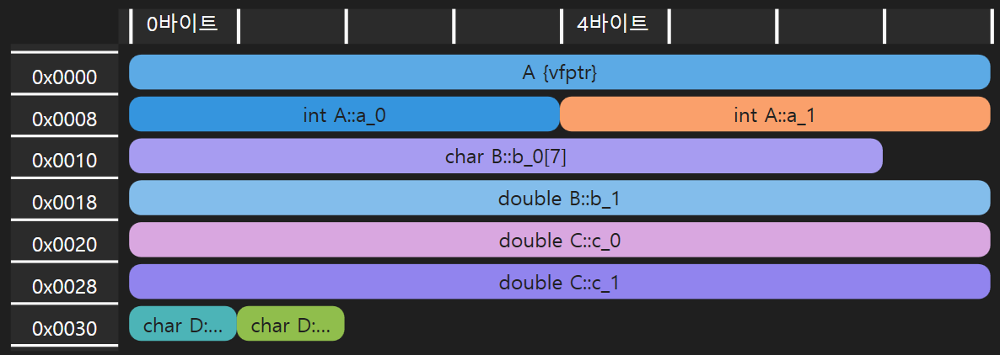
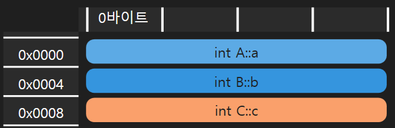
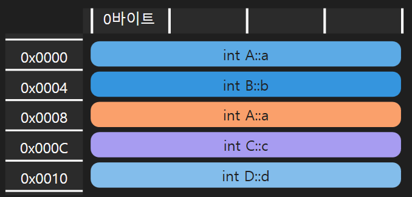
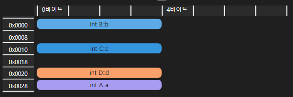

--- 
title: "[C++] 상속과 메모리 배치 가이드: 가상 함수, 다중 상속, RTTI"
description: "C++의 상속과 메모리 배치를 이해하고 싶다면? 가상 함수, vtable, 다중 상속, RTTI, 다이아몬드 문제까지 완벽 정리. C++의 메모리 구조를 깊이 탐구합니다!"
keyword: ["C++", "C++ 상속", "C++ 메모리 배치", "가상 함수", "vtable", "vfptr", "다중 상속", "가상 상속", "다이아몬드 문제", "dynamic_cast", "RTTI", "C++ 다형성", "C++ 메모리 최적화", "C++ 가상 함수 원리", "C++ 다중 상속 문제 해결"]
toc: true
date: 2025-03-11
lastmod: 2025-03-13
---

# 개요

C++의 상속은 객체지향 프로그래밍의 핵심 개념중 하나이지만 이것이 메모리 레벨에서 어떻게 구현되는지 궁금한 점이 많았다.

때문에 다양한 상속 구조에서 객체가 메모리에 어떻게 배치되는지, 생성자 호출 순서가 어떻게 되는지, 그리고 캐스팅시 어떤 일이 벌어지는지 알아보기 위해 몇 가지 실험을 진행했다.

# 가상 함수와 `vfptr`

## 가상 함수가 존재하지 않는 경우

다음과 같은 상속 구조가 있다고 하자.

```cc{lineNos=false}
struct A    { int a_0{}, a_1{}; };
struct B: A { char b_0[7]{}; double b_1{}; };
struct C: B { double c_0{}, c_1{}; };
struct D: C { char d_0{}, d_1{}; };
```

만일 `D` 객체를 하나 만든다면, 메모리에 다음과 같이 배치된다.



상속 구조도의 맨 꼭대기부터 생성자가 호출되어, 낮은 주소에서 높은 주소 방향으로 적재된다. 위 레이아웃에서도 `A`, `B`, `C`, `D` 순으로 배치된걸 확인할 수 있다.

이 상속 계층구조에 속하는 임의의 형식인 `T` 의 포인터로 객체를 가리키면, 항상 객체의 시작 부분을 가리킨다.

```
=====D====
| A의 영역 | [낮은 주소]  <--- T* ptr
==========
| B의 영역 |
==========
| C의 영역 |
==========
| D의 영역 | [높은 주소]
==========
```

`T` 가 어떤 형식인가에 따라서 메모리의 시작 부분에서 얼마만큼 읽어낼 수 있는가 결정된다. 예를 들어, `D` 형식의 인스턴스를 `B` 형식의 포인터로 가리키면, 다음과 같아진다.

```
=====D====
| A의 영역 | [낮은 주소]  <--- B* ptr
==========
| B의 영역 |
========== --- 이 아래로는 접근 불가 ---
| C의 영역 |
==========
| D의 영역 | [높은 주소]
==========
```

`B` 형식의 포인터로는 `B`에서 파생된 클래스의 멤버에는 접근할 수가 없다.

## 가상 함수가 존재하는 경우

이번에는 위 예제에 가상 함수를 추가해 보자.

```cc{lineNos=false}
struct A    { /*...*/ virtual void foo() {}  };
struct B: A { /*...*/ void foo() override {} };
struct C: B { /*...*/                        };
struct D: C { /*...*/ void foo() override {} };
```

그러면 `D`의 메모리 레이아웃이 다음처럼 바뀐다.



객체의 시작 부분에 `vfptr`이 생성되었으며, 이는 Virtual Function table Pointer 의 약자로, 가상 함수 테이블 포인터를 의미한다.

가상 함수가 포함된 상속 계층에 존재하는 모든 클래스는 **자신의 가상 함수 테이블** 을 가지게 되고, `vfptr`은 그 테이블을 가리킨다.

==상속 계층 구조에 가상 함수가 하나라도 존재하면 클래스는 **다형 클래스** 가 되며, 내부에 `vfptr`이라는 다형성에 필요한 추가적인 정보가 생기는 것이다.==

다시 한번 `B` 형 포인터로 `D` 형 인스턴스를 가리킨다고 생각해 보자.

```
=========D=========
| A의 영역 [vfptr] | [낮은 주소]  <--- B* ptr
===================
| B의 영역         |
=================== --- 이 아래로는 접근 불가 ---
| C의 영역         |
===================
| D의 영역         | [높은 주소]
===================
```

여전히 `B`의 영역 아래로 접근할 수 없는 것은 동일하다.

하지만, ==`vfptr`이 가리키는 **`D` 형식의 가상 함수 테이블** `vtable`이 존재==하므로, `ptr->foo()`와 같은 함수 호출 요청이 들어왔을 때, 가상 함수 테이블에서 실제로 무슨 함수를 호출해야 하는지 알 수 있다.

실제로는 `(ptr->vfptr[0])(ptr)` 처럼 작동한다. `vfptr`은 호출될 함수 포인터를 저장하는 배열을 가리키고 있고, `ptr->vfptr[0]`는 `B::foo`에 대한 함수 포인터이다. 이는 메서드이므로 호출시 객체가 필요하므로, 자기 자신을 매개변수로 전달하여 호출한다.

이는 `ptr`이 자신이 가리키고 있는 인스턴스가 실제로 무엇인지 아는가 와는 별개의 개념이다.

다형성은 하나의 인터페이스로 여러 개의 다른 동작을 수행하는 것을 의미하며, C++에서 가상 함수 테이블은 이 다형성을 구현하는 데에 사용되는 핵심 기술이다.

**인터페이스 아래의 구현이 실제로 무엇인지는 관심을 갖지 않는다**는 것이 중요하다. 위 예에서도 볼 수 있듯이, `ptr`은 여전히 `B의 영역` 아래에 무엇이 있는지 *알수도 없고, 알고 싶어 하지도 않는다.*

> `[참고]` C++ 표준에서는 다형성의 구현에 대한 구체적인 사항을 명시하지는 않고, 추상적인 보장(Behavioural Guarantee)만 제공한다. 예를 들어 "기본 클래스의 포인터로 파생 클래스의 오버라이딩된 가상 함수를 호출할 수 있어야 한다"정도로 명시한다. 가상 함수 테이블은 이러한 요구 사항을 충족하는데 매우 적절한 방법(단순하면서도 효율적 - $O(1)$)이므로 사실상의 표준 으로서 대부분의 컴파일러가 사용한다. `vfptr`이니 `vtable`같은 용어는 MSVC  기준이며, 다른 컴파일러에서는 조금씩 다르다.

## 다형 클래스와 다운 캐스팅

상속 구조의 기초 클래스에서 유도 클래스 방향으로 캐스팅 하는 것을 다운 캐스팅이라고 한다.

런타임에 참조하고 있는 인스턴스가 실제로 정확히 무슨 타입인지 알 수 없는 경우, 다운캐스팅은 위험한 작업이 된다.

다음과 같은 상속 구조가 있다고 하자.

```cc{lineNos=false}
struct A    { int a; };
struct B: A { int b; };
struct C: B { int c; };
struct D: C { int d; };
```

다음과 같은 캐스팅은 매우 위험하지만 컴파일 타임에 오류를 잡아낼 수 없다.

```cc{lineNos=false}
A* ptr = new B{};
static_cast<D*>(ptr)->d; // UB
```

`D`는 어쨌든 `A` 의 파생 클래스 계층도에 속한다는 정보만이 컴파일 타임에 존재하기 때문이다. 

하지만 `ptr`이 실제로 가리키는 객체는 `B` 형이었고, 따라서 캐스팅 후 `d`에 접근하는 것은 무엇이 들어있는지 모르는 메모리 영역에 접근하는 것이다.

```
=====B====
| A의 영역 | [낮은 주소]  <--- T* ptr
========== - - - - - A* ptr은 여기까지 - - - - 
| B의 영역 |
==========
| XXXXXX |            (무엇이 들어있는지 모름)
==========
| XXXXXX | [높은 주소]
========== - - - - - D* ptr은 여기까지 - - - - 
```

이는 모두 런타임에 `A* ptr`이 가리키는 객체가 실제로 무엇인지 모르는 데다가, 메모리에 적재되어 버리면 실제로 이게 정확이 무슨 객체인지에 대한 정보가 존재하지 않기 때문에 발생한다. 

단지 포인터가 `A` 형식이어서 `A의 영역`만 볼 수 있고 나머지가 잘리는 건지, 아니면 실제로 객체가 `A` 형식인 건지 컴파일 타임에는 확실하지가 않은 상태이다.

* 만일 `A* ptr`이 가리키는 메모리에 적재된 객체 자체가 실제로 무슨 타입인지 메모리 어딘가에 적혀 있다면 어떨까?
* 그리고 `ptr`을 유도 클래스 형식으로 캐스팅할때, 그 정보를 가져와서 실제로 캐스팅 해도 안전한지, 판단할 수 있다면 어떨까?

정확히 이 기능을 제공하는 것이 `dynamic_cast` 이며, 언급한 바와 같이 메모리에 적재된 객체가 **실제로 무엇인지** 에 대한 정보를 어딘가에 저장하고, 캐스팅 시 룩업 해야 하므로 성능상의 손해가 조금 있다.

> `[참고]` 런타임에 메모리에 적재된 객체가 실제로 무엇인가에 대한 정보를 RTTI(Run Time Type Information)라고 한다.

==`dynamic_cast`를 사용하려면 우선 상속 계층 구조에 가상 함수가 반드시 하나 포함되어야 하고, 그렇게 생성된 다형 클래스에 대해서는 다음처럼 **안전하게**  다운캐스팅을 수행할 수 있다.==

```cc{lineNos=false}
A* ptr = new B{};

D* dp = dynamic_cast<D*>(ptr);

if (dp != nullptr) {
  dp->d; // OK!
}
```

RTTI 정보는 가상 함수 생성시 객체가 가리키게 되는 `vtable`에 포함되어, 다운캐스팅 요청이 들어오면 활용한다.

> `[참고]` 안전한 다운캐스팅, 즉 `dynamic_cast`가 다형 클래스에서만 가능해야 한다는 것은 표준에 명시된 사항이다.
> 표준에서는 왜 다형 클래스에서만 안전한 다운 캐스팅이 가능하도록 만들었을까? 아마도 비다형 타입에 대해서는 C 언어 시절부터 내려오는 많은 가정들이 존재하고, 프로그래머가 선언한 멤버와 패딩으로만 메모리에 배치되어야 하기 때문에 RTTI 정보를 추가할 곳이 없다.
> 다형성을 실제로 사용하려는 클래스에 대해서만 RTTI라는 추가적인 정보를 포함하고, 필요한 경우에만 조회하도록 하는 효율적인(?) 설계이다. [^1]

[^1]: 이는 C++ 의 설계 철학인 "사용하지 않는 것에는 지불하지 마라(Don't pay for what you don't use)"를 반영한다.

# 가상 상속과 `vbptr`

## 다중 상속의 메모리 배치

다음 두 상황을 보자.

```cc{lineNos=false}
// Case A)
struct A    { int a; };
struct B: A { int b; };
struct C: B { int c; };
```

그리고, 

```cc{lineNos=false}
// Case B)
struct A       { int a; };
struct B       { int b; };
struct C: A, B { int c; };
```

두 상황의 상속 구조도는 다르지만, `C`의 메모리 레이아웃은 다음처럼 동일하다.



다중 상속의 경우 클래스의 *상속 순서*가 `C: A, B`이므로 A가 가장 먼저 적재되었고, B가 그 다음에 적재되었다.  

다음과 같은 코드를 각각의 케이스에서 실행한 상황을 생각해보자.

```cc{lineNos=false}
C c;
B* ptr = &c;
```

다중 상속이 아닌 Case A의 경우 아래와 같다.

```
// Case A)
=====D====
| A의 영역 | [낮은 주소]  <--- B* ptr
==========
| B의 영역 |
========== - - - - - - - - - - - -
| C의 영역 | [높은 주소]
==========
```

다중 상속인 Case B의 경우 아래와 같다.

```
// Case B)
=====D====
| A의 영역 | [낮은 주소] 
========== - - - - - - - - - - - - 
| B의 영역 |            <--- B* ptr
========== - - - - - - - - - - - -
| C의 영역 | [높은 주소]
==========
```

흥미로운 점은, 메모리 레이아웃이 동일하더라도 상속 계층 구조의 차이로 인해 동일한 코드가 상이한 동작을 유발할 수 있다는 점이다.  

일반적으로 객체 포인터는 해당 객체의 시작 주소를 가리킨다고 생각하기 쉽지만, 실제로는 해당 포인터 형식에서 가장 상위의 기초 클래스가 위치한 주소를 가리킨다.

그리고 Case B 에서 *B 형식은 A와는 사실상 아무 관계가 없기 때문*에 `ptr`로는 A의 영역에도 접근할 수 없다. 기초 클래스 포인터로 유도 클래스 영역에 접근할 수 없으니, C의 영역에도 접근할 수 없다.

## 다이아몬드 문제

인터페이스를 제외하고 다중 상속을 허용하지 않는 다른 고수준 언어들과 다르게, C++은 다중 상속을 거의 제약 없이 허용한다.  

다중 상속에 대부분의 언어들이 제약을 두는 것은 **다이아몬드 문제** 라는 유명한 상속 관련 문제 때문이다.

다음과 같은 상속 구조가 있다고 하자.

```cc{lineNos=false}
struct A       { int a; };
struct B: A    { int b; };
struct C: A    { int c; };
struct D: B, C { int d; };
```

다이어그램으로 그리면 아래와 같다.


@startuml
hide empty member
struct A { 
  + a: int
}
struct B {
  + b: int
}
struct C {
  + c: int
}
struct D {
  + d: int
}

A <|-- B
A <|-- C
B <|-- D
C <|-- D
@enduml


이 계층 구조 모양이 다이아몬드 모양<sup>아무리 봐도 마름모인데 다이아몬드라는 간지나는 이름을 붙여주어서 문제가 훨씬 심각하게 들리는 효과가 있다</sup>이어서, 다이아몬드 문제라는 이름이 붙었다.

다이아몬드 구조가 위험한 이유는 다음 때문이다:

```cc{lineNos=false}
D d;
d.a; // ??
```

`d.a`를 호출하면, "**`d.a`가 모호하다**"라는 컴파일 에러가 난다.  
모호한 이유는 다음처럼 메모리 레이아웃을 보면 알 수 있다.



```
=====D====
| A의 영역 | [낮은 주소]
==========
| B의 영역 |
========== 
| A의 영역 |
==========
| C의 영역 | 
==========
| D의 영역 | [높은 주소]
==========
```

`A의 영역`이 중복되는 것이 보이는가? 실제로 생성자도 두 번 호출된다.  
다중 상속을 하는 바람에 메모리에 `A`가 두 번 올라간 것이다. - **같은 객체에!**  

이 구조를 쓰는 것이 매우 추천되지 않지만 그래도 꼭 써야겠다면 다음처럼 `a`를 호출할 수 있다.

```cc{lineNos=false}
d.a;    // Error
d.B::a; // OK
d.C::a; // OK
d.D::a  // Error
```

모호성은 사라지만 `C::a`와 `D::a`는 **서로 다른 `a`** 이다. 메모리 주소를 직접 찍어 보면 알 수 있다.

> `[참고]` 위 예제에 포함시키지는 않았지만, `d.A::a`는 컴파일 오류를 발생시키지 않고, `d.B::a`와 동일한 `a`를 가리킨다. 실제로 컴파일 오류를 발생시킬 것으로 예상하였는데, 그렇지 않아서 매우 당황. 그리고 만족할 만한 답도 찾지 못했다. 추측컨데, `d.A::`라고 명시하면, `B`와 `C`중 먼저 상속이 명시된 `B`계층도의 `A`를 따라가는듯 하다. (확실하지 않다)

아무튼, 상기한 이유로 다중 상속시 다이아몬드 문제는 꼭 의식하고 피해야 한다.  

사실 다중상속이 문제를 해결하는 경우보다는 문제를 더 복잡하게 만드는 경우가 많아서, ==대부분의 고수준 언어에서는 인터페이스가 아닌 클래스의 다중 상속을 불허한다.== 

인터페이스는 애초에 구현과 멤버가 존재하지 않는 기초 클래스이므로, 메모리에 중복되어 적재될 것이 없다. 그저 가상 함수 테이블만 업데이트 할 뿐이다.

그러나 우리의 C++은 그런거 없고 그냥 허용한다.  

### 다중 상속과 업 캐스팅

```cc{lineNos=false}
D obj;

A* ap = &obj; // Error

A* ap_b = (A*)(B*)&obj;
A* ap_c = (A*)(C*)&obj;
```

`D` 형식의 `obj`의 주소를 `A*`로 캐스팅하는건 모호성 이슈로 불가능하다. `D` 형식 정보에 `A`로 도달하는 루트가 2개라 그렇다.

그런데 `ap_b`나 `ap_c`처럼 `B`나 `C`를 통해 캐스팅하면 가능하다. 그리고 `ap_b`와 `ap_c`는 서로 다른 주소를 가리키고 있다. 메모리 레이아웃은 아래와 같다.

```
=====D====
| A의 영역 | [낮은 주소]   <--- ap_b
==========
| B의 영역 |
========== 
| A의 영역 |             <--- ap_c
==========
| C의 영역 | 
==========
| D의 영역 | [높은 주소]
==========
```


## 가상 상속

다이아몬드 문제를 해결하기 위해 가상 상속 - `virtual` 상속 이라는 것이 있다.

다이아몬드 문제가 왜 발생했냐면, 결국 하나의 부모를 공유하는데, *서로 다른 분기로 부모에 여러 번 도달하는 바람에* 생성자가 여러 번 호출되어 메모리에 중복되어 적재되었기 때문이다.

가상 상속을 사용하면 다이아몬드 꼴로 부모가 공유되더라도, 부모가 중복하여 생성되는 것을 방지할 수 있다.

앞선 예제에 가상 상속을 적용하면 다음과 같다. **키워드 `virtual`은 공유된 단일 기초 클래스를, 단 하나만 생성하도록 한다.**

```cc{lineNos=false}
struct A              { int a; };
struct B: virtual A   { int b; };
struct C: virtual A   { int c; };
struct D: B, C        { int d; };
```

이때 `D`의 메모리 레이아웃은 다음과 같아진다.



여기서 눈여겨볼 변화는 3가지이다.
* `B의 영역`과 `C의 영역`에 공백이 생겼다.
* 가상 상속에 사용된 기초 클래스 `A`는, 일반 상속에서 메모리 적재 순서를 따르지 않고, `D`까지 생성된 이후에 적재되었다.
* `A`는 한 번만 생성되었다.

저 공백에는 `vbptr`이라는 정보가 포함된다. (왜 VS에서 `vfptr`은 레이아웃이나 디버깅 정보로 표시해 주는데, `vbptr`은 안 표시해 주는지 모르겠다.)

아무튼, `vfptr`이 그랬던 것처럼, `vbptr`은 가상 상속된 유일한 부모를 찾아내기 위한 포인터이다.

```
=========D=========
| B의 영역 [vbptr] | [낮은 주소]  
===================
| C의 영역 [vbptr] |
===================
| D의 영역         |
===================
| A의 영역         | [높은 주소]
===================
```

`vbptr`은 *오프셋*을 저장하는 포인터로서 기능한다. `vbptr`에는 해당 지점부터 몇 바이트만큼 내려가야 가상 상속한 기초 클래스가 등장하는지 그 오프셋의 크기가 들어 있다.

```cc{lineNos=false}
D d;

B* bp = &d;
C* cp = &d;
```

위와 같은 상황은 아마 메모리에서 아래처럼 표현될 것이다.

```
=========D=========
| B의 영역 [vbptr] | [낮은 주소]  <--- B* bp
===================
| C의 영역 [vbptr] |             <--- C* cp
===================
| D의 영역         |
===================
| A의 영역         | [높은 주소]  
===================
```

왜 가상 상속한 클래스의 영역이 일반 상속과 다른 순으로, 일반 상속이 끝난 후부터 높은 주소에 배치되는지와, 어째서 실제 주소가 아닌 오프셋으로 관리하는지는 잘 모르겠다. 사실 `vfptr`이 그랬던 것처럼, `vbptr`과 이러한 메모리 배치도 아마 구현 명세인 것으로 추정된다. 

> `[참고]` `virtual` 상속을 하더라도, 해당 상속 구조에 속한 클래스들이 다형 클래스가 되지는 않는다. (`dynamic_cast`를 할 수 없다.)

## 가상 상속과 업 캐스팅

[다중 상속과 업 캐스팅](#다중-상속과-업-캐스팅)의 예를, 가상 상속 상황에서 다시 한번 써보자.

```cc{lineNos=false}
D obj;

A* ap = &obj; // OK

A* ap_b = (A*)(B*)&obj;
A* ap_c = (A*)(C*)&obj;
```

이제 `A` 영역이 객체 메모리 레이아웃에 단 하나만 존재하므로 모호성이 사라져 `A`로 접근할 수 있다. 또한, `B`와 `C` 를 통해서도 유일 `A` 인스턴스에 대해 오프셋으로 실제 위치를 특정이 가능하다.

출력으로 주소를 찍어 보면, `ap`와 `ap_b`, `ap_c`가 모두 동일한 곳을 가리키고 있음을 알 수 있다.

> `[참고]` 가상 상속이라 하더라도 다형 클래스는 아니기 때문에 안전한 다운캐스팅은 수행할 수 없다.

# 결론

이 기나 긴 글에서 다룬 내용은 다음과 같다
* 일반적인 상속 구조에서 메모리 배치
* 다형 클래스와 메모리 배치
* 업 캐스팅
* 다운 캐스팅과 RTTI, `dynamic_cast`
* 다중 상속과 메모리 배치
* 다이아몬드 문제와 그 해결

C++은 저수준 메모리 관리와 무비용 추상화(객체지향 구현)을 함께 제공하는 독특한 언어이므로, 이번 상속 관련 조사를 통해 내부적으로 객체지향이 어떻게 작동하고 구현되는지에 대해 시야가 넓어진 것 같다.

# 참고 문헌

* [C++ Inheritance Memory Model/Josh Segal/Medium](https://medium.com/geekculture/c-inheritance-memory-model-eac9eb9c56b5)
* [FAQ: Why does dynamic_cast only work if a class has at least 1 virtual method?/StackOverflow](https://stackoverflow.com/questions/4227328/faq-why-does-dynamic-cast-only-work-if-a-class-has-at-least-1-virtual-method)
