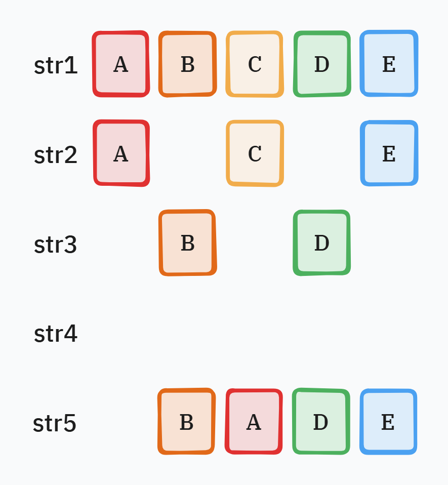
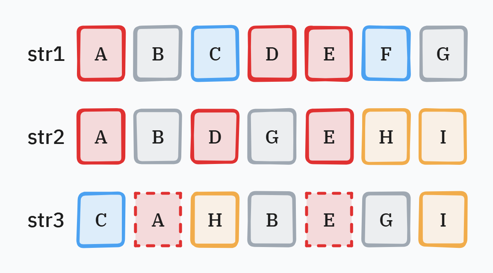
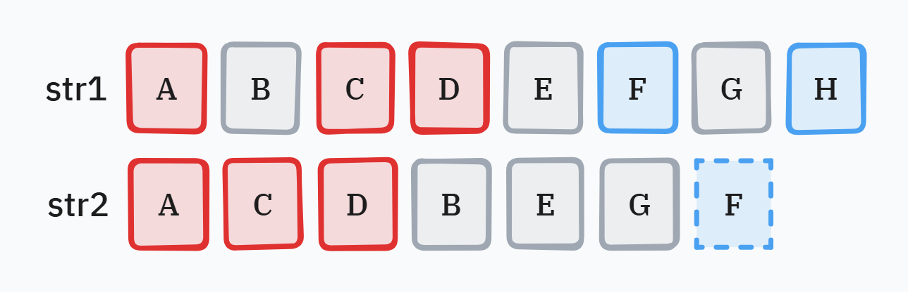
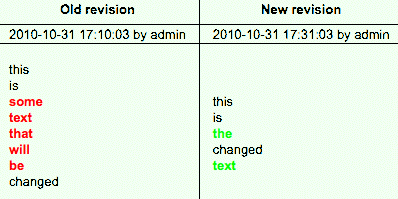
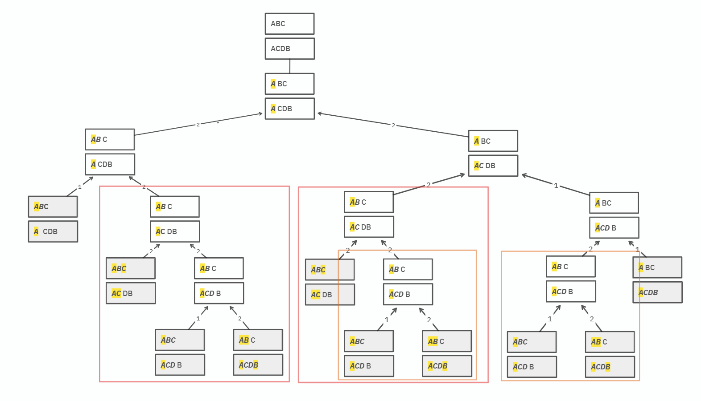

# 개요

알고리즘 문제를 풀다가 LCS를 도저히 이해할 수가 없어 몇 날 몇 일을 끙끙대며 정리한 기록을 아카이빙한다.

# 용어의 정의

## 부분 수열(Subsequence)

> **부분 수열(Subsequence)** 이란, 어떤 주어진 수열(문자열, 리스트)에서 0개 이상의 요소를 제거하고 남은 요소들을 **원래의 순서대로 유지**하여 만든 새로운 수열을 말한다.



* `str1`의 부분 수열은 `str2`, `str3`, `str4`, `str1`이다.  
* 빈 문자열과 자기 자신도 부분 수열이 될 수 있음에 주의한다.
* 순서가 섞인 `str5`는 `str1`의 부분 수열이 될 수 없다.

## 공통 부분 수열(Common Subsequence)

> **공통 부분 수열(Common Subsequence)** 은 두 개 이상의 수열이 주어졌을 때, 모든 수열에 대해 부분 수열이 되는 수열을 의미한다.



* `"ADE"`는 `str1`, `str2`의 공통 부분 수열이지만, `str3`의 부분 수열은 아니다.
* `"BG"`는 모두의 공통 부분 수열이다.
* `"CF"`는 `str1`과 `str3`의 공통 부분 수열이다.
* `"HI"`는 `str2`와 `str3`의 공통 부분 수열이다.

## 가장 긴 공통 부분 수열(Longest Common Subsequence)
> **가장 긴 공통 부분 수열(LCS, Longest Common Subsequence)** 은 두 개 이상의 수열이 주어졌을 때, 그들의 공통 부분 수열 중에서, **길이가 가장 긴** 수열을 의미한다.
> LCS는 유일하지 않을 수도 있어서, 길이가 같은 여러 개의 LCS가 존재할 수 있다. 



* `"ACD"`와 `"BEG"`는 `str1`과 `str2`의 LCS이며, 그 길이는 3이다.

# LCS를 대체 어디에 쓰나

이 LCS라는 것이 정말 아무짝에도 쓸모없어 보이고, 마치 알고리즘을 위한 알고리즘 처럼 보이지만 사실 현실 세계의 정말 많은 곳에서 쓰이는 고전적인 알고리즘이다.

예를 들어, `diff` 도구 같은 것이 데이터 비교를 할 때 LCS 알고리즘을 사용한다.



공통 부분 수열이 아닌 것이 변경된 데이터이다.

`this`, `is`, `changed`는 두 파일의 LCS이며, 이를 제외한 나머지는 변경된 데이터로 감지할 수 있다.

# 두 개의 수열에 대한 LCS의 해

두 개 수열의 LCS를 구하는 문제는 최적 부분구조를 가지고 있다. 

"최적 부분 구조"를 가지고 있다는 말은 다시 표현하면,

* 두 수열의 LCS를 구하는 문제는 자명히 해결할 수 있는 더 작은 문제가 될 때까지 반복하여 쪼갤 수 있다.
* 쪼갠 LCS의 부분 문제들은 서로 범위가 겹치므로, 더 높은 부분 문제에 대한 풀이는 몇몇 하위 부분 문제의 풀이를 재사용하는 것에 의존한다.

LCS 문제의 "최적 부분 구조" 특성은, LCS 문제를 **메모이제이션을 활용한 동적 계획법**으로 풀이할 수 있게 한다.

두 수열 $X_{1...m}$과 $Y_{1...n}$에 대해서 다음이 성립한다.

## 접두사(Prefix)

어떤 수열의 접두사(Prefix)는 그 수열에서 0개 이상의 말단을 잘라낸 수열이다.

접두사는 수열의 이름과, 접두사가 포함하는 문자의 수로 정의한다. 

예를 들어 수열 $S$가 $(AGCA)$라고 하자. 그러면 $S$의 접두사는 수열 $(AG)$이며, 이를 $S_2$라고 표현한다. $S$의 가능한 모든 접두사를 표현하면 아래와 같다.

* $S_1 = (A)$
* $S_2 = (AG)$
* $S_3 = (AGC)$
* $S_4 = (AGCA)$

## LCS의 첫 번째 속성

> [**LCS의 첫 번째 속성**]
>
> 모든 문자열 $X$, $Y$, 그리고 모든 문자 $A$에 대해서, $\text{^}$를 문자열 접합이라 정의하였을 때, 다음이 성립한다.
> 
> $$
> LCS(X \text{^} A, Y \text{^} A) = LCS(X, Y) \text{^} A
> $$

이 성질은 동일한 수열로 끝나는 두 문자열에 대한 LCS 계산을 간단하게 만들 수 있다.

예를 들어, 다음이 성립한다.

$$
\begin{align}
LCS(\verb|BANANA|, \verb|ATANA|) &= LCS(\verb|BANAN|, \verb|ATAN|)\text{^}\verb|A| \\\
&= LCS(\verb|BANA|, \verb|ATA|)\text{^}\verb|NA| \\\
&= LCS(\verb|BAN|, \verb|AT|)\text{^}\verb|ANA|
\end{align}
$$

$\verb|BANANA|$와 $\verb|ATANA|$의 LCS는, $\verb|BAN|$과 $\verb|AT|$의 LCS를 구한 후, 그 뒤에 $\verb|ANA|$를 붙인 것과 동일하다.

## LCS의 두 번째 속성

> [**LCS의 두 번째 속성**]
>
> 만일 $A$와 $B$가 서로 다른 기호라면, 모든 문자열 $X$와 $Y$에 대해, $LCS(X\text{^}A, Y\text{^}B)$는 집합 $\\{ LCS(X\text{^}A, Y), LCS(X, Y\text{^}B) \\}$에 속하는 가장 길이가 긴 문자열 중 하나이다.

좀더 쉽게 말하면, 두 문자열이 다른 문자로 끝난다면, 각각 한쪽을 지우고 LCS를 구했을 때, 두 LCS중 더 긴 쪽이 LCS라는 것이다.

예를 들어, $LCS(\verb|ABCDEFG|, \verb|BCDGK|)$를 구한다고 해보자.

위 속성에 따라, $LCS(\verb|ABCDEFG|, \verb|BCDGK|) = LCS(\verb|ABCDEF|\text{^}\verb|G|, \verb|BCDG|\text{^}\verb|K|)$는,  
$LCS(\verb|ABCDEF|\text{^}\verb|G|, \verb|BCDG|)$ 와 $LCS(\verb|ABCDEF|, \verb|BCDG|\text{^}\verb|K|)$ 중 더 긴 쪽의 문자열이며, 두 문자열의 길이가 같다면 그 중 아무거나 선택해도 괜찮다.

이 성질을 이해하려면 다음 두 가지 경우를 구분해 생각해 보자.
* 만약 $LCS(\verb|ABCDEFG|, \verb|BCDGK|)$가 $\verb|G|$<sup>(첫 번째 문자열의 마지막 문자)</sup>로 끝난다면:
  * $\verb|K|$<sup>(두 번째 문자열의 마지막 문자)</sup>는 절대 LCS에 포함될 수 없기 때문에, 결국 LCS는 $LCS(\verb|ABCDEFG|, \verb|BCDG|)$가 된다.
* 만약 $LCS(\verb|ABCDEFG|, \verb|BCDGK|)$가 $\verb|G|$<sup>(첫 번째 문자열의 마지막 문자)</sup>로 끝나지 않는다면,
  * $\verb|G|$<sup>(첫 번째 문자열의 마지막 문자)</sup>는 절대 LCS에 포함될 수 없기 때문에, 결국 LCS는 $LCS(\verb|ABCDEF|, \verb|BCDGK|)$가 된다.

# 함수 $LCS$의 정의

언급한 LCS의 두 속성을 통해 함수 $LCS$의 정의를 도출할 수 있다.

두 수열 $X=(x_1x_2...x_m)$과 $Y=(y_1y_2...y_n)$이 정의되어 있다.
$X$의 접두사를 각각 $X_0, X_1, ... X_m$라고 하고, $Y$의 접두사를 각각 $Y_0, Y_1, ... Y_n$라고 하자.

표현 $LCS(X_i, Y_j)$를 접두사 $X_i$와 $Y_j$의 LCS의 집합을 나타내는 데에 사용하자.

이 수열의 집합은 다음처럼 구할 수 있다.

$$
LCS(X_i, Y_i) \begin{cases}
\text{속성 1\) }LCS(X_{i-1}, Y_{j-1})\text{^}x_i &\text{if } i, j > \text{ and } x_i = y_j \\\
\text{속성 2\) }max\\{LCS(X_i, Y_{j-1}), LCS(X_{i-1}, Y_j)\\} &\text{if } i,j > 0 \text{ and } X_i \neq Y_j \\\
\epsilon &\text{if } i = 0 \text{ or } j = 0 \\\
\end{cases}
$$

# LCS **길이** 구하기 알고리즘

우선, LCS의 **길이**를 구하는 알고리즘에 대해서 알아보자.  
크게 하향식 접근법과 상향식 접근법으로 나뉜다.

문자열 $A$와 $B$가 존재한다고 가정하고, 그 길이가 각각 $N$, $M$이라고 한다.

## 하향식 접근

### 재귀

재귀 호출을 통해 문제를 분할하여 해결하는 것이 기본 골자이다. 
기본적으로 다음과 같이 작동한다.

```cpp
/*!
 * @brief 두 문자열의 LCS 길이를 재귀적으로 계산하는 함수
 * @param i 문자열 A의 현재 인덱스
 * @param j 문자열 B의 현재 인덱스
 * @return 두 문자열 A와 B의 i, j 위치부터 시작하는 LCS의 최대 길이
 */
int LCS(const string& A, int i, const string& B, int j) {
  // 문자열의 끝에 도달하였다
  if (i == A.size() || j == B.size()) {
    return 0;
  } 

  // 문자가 같으면 둘 다 한 칸 이동한다
  if (A[i] == B[j]) {
    return 1 + LCS(A, i + 1, B, j + 1);
  } 

  // 문자가 다르면 두 방향 중 최대값
  return max(LCS(A, i + 1, B, j), LCS(A, i, B, j + 1));
}
```

예를 들어 두 문자열 `ABC`와 `ACDB`에 대해서 재귀 호출 트리를 그려보면 아래와 같다.



가능한 모든 경로를 탐색하므로 시간 복잡도가 $O(2^{N + M})$까지 치솟는다. 

하지만 호출 트리를 보면 알겠지만, 중복되는 부분 문제가 많기 때문에 **메모이제이션**을 이용해 최적화 할 수 있다.

### 재귀 + 메모이제이션

```cpp
constexpr int NOT_UPDATED = -1;
// dp[i][j] 는 A를 i, B를 j까지 보았을 때, LCS의 길이이다.
vector<vector<int>> dp(A.size(), vector<int>(B.size(), 0));

/*!
 * @brief 두 문자열의 LCS 길이를 재귀적으로 계산하는 함수
 * @param i 문자열 A의 현재 인덱스
 * @param j 문자열 B의 현재 인덱스
 * @return 두 문자열 A와 B의 i, j 위치부터 시작하는 LCS의 최대 길이
 */
int LCS(const string& A, int i, const string& B, int j) {
  // 문자열의 끝에 도달하였다
  if (i == A.size() || j == B.size()) {
    return 0;
  } 

  // 이전에 계산한 적이 있으면 해당 값을 그대로 사용한다
  if (dp[i][j] != NOT_UPDATED) {
    return dp[i][j];
  }

  // 여기부터 이전에 계산한 적이 없으므로 재귀 트리를 타고 내려가자.

  // 문자가 같으면 둘 다 한 칸 이동한다
  if (A[i] == B[j]) {
    dp[i][j] = 1 + LCS(A, i + 1, B, j + 1);
  // 문자가 다르면 두 방향 중 최대값
  } else {
    dp[i][j] = max(LCS(A, i + 1, B, j), LCS(A, i, B, j + 1));
  }

  return dp[i][j];
}
```

메모이제이션을 사용하면 `dp` 배열의 크기 만큼만 계산하므로 복잡도가 $O(NM)$으로 줄어든다.


## 상향식 접근

```cpp
// dp[i][j] 는 A를 i, B를 j까지 보았을 때, LCS의 길이이다. (1-index)
vector<vector<int>> dp(A.size() + 1, vector<int>(B.size() + 1, 0));

// 1-index 로 순회함을 주의
for (int i = 1; i <= A.size(); ++i) {
  for (int j = 1; j <= B.size(); ++j) {
    // 보고있는 문자가 같으면,
    if (A[i - 1] == B[j - 1]) {
      // 두 문자 모두 한칸 이전까지의 LCS 길이에 +1 한 것이, 현재 LCS의 길이
      dp[i][j] = dp[i - 1][j - 1] + 1;
    // 보고있는 문자가 다르면
    } else {
      // 둘 중 하나의 문자를 버리고, 그 뒤를 이어가는 선택을 한다.
      dp[i][j] = max(dp[i - 1][j], dp[i][j - 1]);
    }
  }
}
```

배열 `dp`를 이용해, 반복문으로 차근 차근 값을 채워 넣어 그 값을 재사용 하는 동적 계획법이다.
예를 들어 두 문자열 `ACBD`와 `ABC`에 대해서 `dp` 테이블을 채워 보면 아래와 같다.

|| 0 | 1 | 2 | 3 |
| :-: | :- | :- | :- | :- |
| 0| 0 | 0 | 0 | 0 |
| 1| 0 | 1 (`A`, `A`) | 1 (`A`, `AB`) | 1 (`A`, `ABC`) |
| 2| 0 | 1 (`AC`, `A`) | 1 (`AC`, `AB`) | 2 (`AC`, `ABC`) |
| 3| 0 | 1 (`ACB`, `A`) | 2 (`ACB`, `AB`) | 2 (`ACB`, `ABC`) |
| 4| 0 | 1 (`ACBD`, `A`) | 2 (`ACBD`, `AB`) | 2 (`ACBD`, `ABC`) |

2중 `for` 문을 문자열의 길이만큼 순회하므로, 복잡도는 $O(NM)$이다.

알고리즘이 단순하고 효율적이기 때문에 보통 이 상향식 접근 방식이 많이 사용된다.


# LCS **문자열** 구하기 알고리즘

지금까지는 LCS의 **길이**만 구하는 방법에 대해서 설명하였다.
하지만 종종 LCS 문자열 자체를 구하고 싶을 때도 있다.

이 경우 백트래킹을 핵심 알고리즘으로 사용한다.

```cpp
string lcs = "";
while (i > 0 && j > 0) {
  if (A[i - 1] == B[j - 1]) {
    lcs = A[i - 1] + lcs;
    --i;
    --j;
  } else if (dp[i - 1][j] > dp[i][j - 1]) {
    --i;
  } else {
    --j;
  }
}
```

이미 `dp`가 계산되어 있다고 하고, 그 `dp`를 기준으로 LCS를 복원한다.

# 참고 자료

* [4.9 Longest Common Subsequence (LCS) - Recursion and Dynamic Programming/Abdul Bari](https://www.youtube.com/watch?v=sSno9rV8Rhg&t=1255s)
  * 모든 자료들 중 유일하게 나를 이해시킴
* [Longest common subsequence/wikipedia](https://en.wikipedia.org/wiki/Longest_common_subsequence)