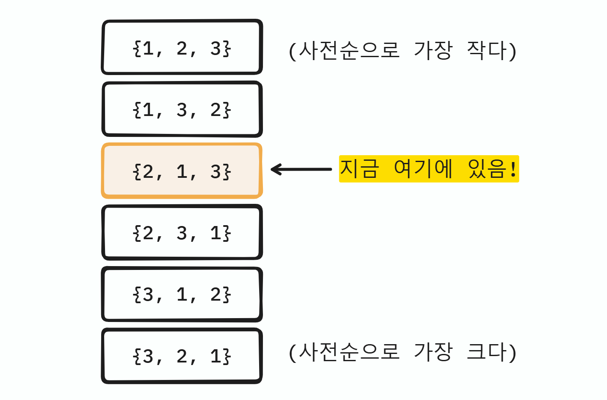
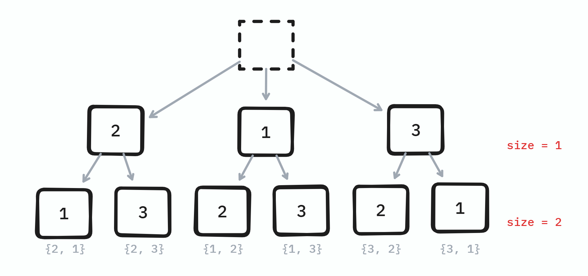
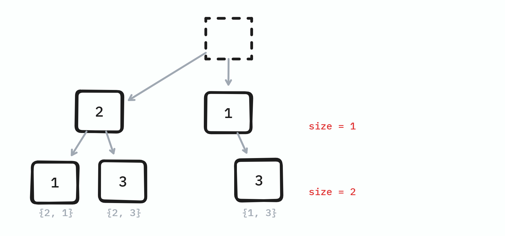

# 개요

순열과 정의의 조합과 구현체, 그리고 구현법에 대해 알아보자.

# 정의

## 순열의 정의

> **순열(Permutation)** 은 서로 다른 $n$개의 원소 중에서 $r$개를 **선택하여 나열하는** 경우의 수이다. 원소를 선택하는 순서가 다른 경우, 다른 경우의 수로 취급한다.

$$
_nP_r = \frac{n!}{(n-r)!}
$$

예를 들어, `A`, `B`, `C` 총 3개에서  2개를 뽑아 나열하는 순열의 수는 `AB`, `AC`, `BA`, `BC`, `CA`, `CB`의 6가지이며, 이를 $_3P_2 = 6$이라고 표현한다.

## 조합의 정의

> **조합(Combination)** 은 서로 다른 $n$개의 원소 중에서 $r$개를 **선택하는** 경우의 수를 의미한다. 단, 원소를 선택하는 순서는 고려하지 않는다.

$$
C(n, r) = _nC_r = \frac{n!}{r!(n-r)!}
$$

예를 들어, `A`, `B`, `C` 총 3개에서  2개를 뽑는 조합의 수는 `AB`, `AC`, `BC`의 3가지이며, 이를 $_3C_2 = 3$이라고 표현한다.

# C++ STL 구현체

C++은 편리하게도 순열 관련하여 기본적인 함수를 제공하며, `<algorithm>` 헤더에 선언되어 있다. 다음의 3가지를 잘 사용하면 된다.
* `std::next_permutation`
* `std::prev_permutation`
* `std::is_permuation`

우선 `next_permutation`과 `prev_permuation`은 각각 양방향 반복자를 범위로 받는다.

각각 *다음*, 혹은 *이전* 순열이 존재한다면 `true`를 반환하고, 전달된 범위를 사전순으로 바로 다음 순열로 변경한다. 

만일 *다음*, 혹은 *이전* 순열이 존재하지 않는다면, `false`를 반환하고, 전달받은 범위를 사전순으로 가장 첫 번째 순열로 변경한다.

기본적으로 `operator<`로 어느 순서가 사전순인지 판별하려고 하나, 원한다면 커스텀 비교 함수를 전달할 수도 있다.

## $_nP_n$구하기

```cpp
string str = "abc"

do {
  cout << str << '\n';
} while (next_permutation(str.begin(), str.end()));
```

위 예제처럼 간단하게 사용할 수 있을 것 같지만, 몇가지 주의해야 할 점이 있다.

`next_permutation`이나 `prev_permutation`은 사전순으로 다음 혹은 이전 순열이 **존재하지 않으면**, 첫 순열로 변경하고 `false`를 반환한다.

다음의 예를 보자.

어떤 수열 `{2, 1, 3}`의 사전순(오름차순) 순열은 다음과 같다.



```cpp
vector<int> seq {2, 1, 3};

do {
  for (const auto& e: seq) {
    cout << e << ' ';
  }
  cout << '\n'
} while (next_permutation(seq.begin(), seq.end()));
```

위 순열은 `{2, 1, 3}` 순열을 끝까지 출력하지 않는다.
출력은 다음과 같다.

```
2 1 3
2 3 1
3 1 2
3 2 1
```

`3, 2, 1`에 도달하면 더이상 사전순으로 다음 순열이 없으므로, `2, 1, 3`으로 만들 수 있는 나머지 순열인 `1, 2, 3`과 `1, 3, 2`는 출력하지 않는다.

그리고, `while` 문을 빠져나온 후 `seq`의 상태는 `{1, 2, 3}`이다.

==때문에, 만일 `next_permutation`이나 `prev_permutation`으로 "전체 순열"을 출력하고 싶다면, 시작 순열이 반드시 정렬되어 있어야 한다.==

때문에 모든 순열을 구하려면 아래처럼 정렬 후 사용해야 한다.

```cpp
vector<int> seq{2, 1, 3};
sort(seq.begin(), seq.end());

do {
  for (const auto& e: seq) {
    cout << e << ' ';
  }
  cout << '\n';
} while (next_permutation(seq.begin(), seq.end()));
```

## $_nP_r$ 구하기

수열 `{2, 1, 3}`에서 2개를 뽑는 순열을 구한다.

다음처럼, 정렬 후에 앞 2개만 출력하는 방식으로 구현하면 된다.

```cpp
vector<int> seq{2, 1, 3};
sort(seq.begin(), seq.end());

do {
  for (int i = 0; i < 2; ++i) {
    cout << seq[i] << ' ';
  }
  cout << '\n';
} while (next_permutation(seq.begin(), seq.end()));
```

다른 방법도 있다. 

인덱스를 기억하는 수열을 새로 만든 후, 해당 수열에 대해 순열을 적용한다.

```cpp
vector<int> seq{2, 1, 3};
vector<int> indices{0, 1, 2};

do {
  for (int i =0; i < 2; ++i) {
    cout << seq[indices[i]] << ' ';
  }
  cout << '\n';
} while (next_permutation(indices.begin(), indices.end()));
```

인덱스로 오름차순 순열을 만들었고, 이는 사전순으로 `0 1 2`부터 `2 1 0`까지 이다. 이 중 앞 두 요소를 이용해 `seq`에 접근하면, 2개를 뽑을 수 있다.

## $_nC_r$ 구하기

위에서 인덱스 배열이라는 추가적인 정보를 이용해 순열을 돌리는 테크닉이 꽤 영리한데, 이와 비슷한 방법을 이용하면 조합을 구현할 수 있다.

인덱스 배열이 아니라 여기서는 `mask`라는 정보를 관리한다.

이를 통해 `{2, 1, 3}`에서 2개를 뽑아 조합하는 예제는 다음과 같다.

```cpp
vector<int> seq{2, 1, 3};
vector<bool> mask(seq.size(), false);

// 뒤에서 2개만 true
fill(mask.rbegin(), mask.rbegin() + 2, true); 

do {
  for (int i = 0; i < seq.size(); ++i) {
    if (!mask[i]) {
      continue;
    }

    cout << seq[i] << ' ';
  }
  cout << '\n';
} while (next_permutation(mask.begin(), mask.end()));
```

도식으로 표현하면 아래와 같다.


# 직접 구현해보기

## $_nP_r$ 구현하기

순열을 직접 구현하는 경우, **백 트래킹**을 이용한다.

백 트래킹은 모든 경우의 수를 탐색하면서도, 유망하지 않은 경로를 가지치기하여 효율적으로 탐색하는 기법이다.

전체 순열에서 사용되지 않은 요소(`used`)를 하나씩 붙여 나가며 순열을 완성한다.

```cpp
void _perm_dfs(
  const vector<int>& seq,
  int size,
  vector<int>& path,
  vector<bool>& used
) {
  // 기저 케이스: 순열이 완성 되었는가?
  if (path.size() == size) {
    for (const auto& e: path) {
      cout << e << ' ';
    }
    cout << '\n';
    return;
  }

  // 사용하지 않은 것을 처음부터 넣기
  for (int i = 0; i < used.size(); ++i) {
    if (used[i]) {
      continue;
    }

    path.push_back(seq[i]);
    used[i] = true;

    _perm_dfs(seq, size, path, used);

    // 백 트랙
    path.pop_back();
    used[i] = false;
  }
}

void perm(const vector<int>& seq, int size) {
  vector<int> path; 
  vector<bool> used(seq.size(), false);
}
```

도식으로 표현하면 아래와 같은 트리를 DFS로 탐색하는 것이다.



## $_nC_r$ 구현하기

순열과 마찬가지로 구현한다. 

다른 점은 사용되지 않은 것에서 선택하는 것이 아니라, 순서상 **이후의 것**을 선택한다.

```cpp
void _comb_dfs(
  const vector<int>& seq, 
  int size, 
  vector<int>& path, 
  int start) {
  // 기저 케이스: 조합이 완성 되었는가?
  if (path.size() == size) {
    for (const auto& e: path) {
      cout << e << ' ';
    }
    cout << '\n';
    return;
  }

  // start 이후의 요소를 선택한다.
  for (int i = start; i < seq.size(); ++i) {

    path.push_back(seq[i]);

    _comb_dfs(seq, size, path, i + 1);

    // 백 트랙
    path.pop_back();
  }
}

void comb(const vector<int>& seq, int size) {
  vector<int> path; path.reserve(size);

  _comb_dfs(seq, size, path, 0);
}
```

도식으로 표현하면 아래와 같다.



# 정리

* `next_permutation`과 `prev_permuation`은 편리하지만, 전달받은 범위를 변경시키며, 모든 순열을 구하고 싶은 경우 범위의 요소들이 정렬되어 있어야 한다. (기본적으로 `operator<`로)
* 인덱스나 마스킹과 같은 추가적인 정보를 이용하여 정렬되지 않은 수열에서 순열을 구하거나, 아니면 조합을 구현할 수도 있다.
* STL을 사용하지 않고 순열과 조합을 직접 구현한다면 *백 트래킹*을 이용하면 된다.
  * 단, 재귀를 이용하므로 스택 오버플로우에 주의하며, 애초에 복잡도가 높은 연산임을 인지한다.

# 참고 문헌

* [std::next_permutation/cppreference.com](https://en.cppreference.com/w/cpp/algorithm/next_permutation)
* [std::prev_permutation/cppreference.com](https://en.cppreference.com/w/cpp/algorithm/is_permutation)
* [std::is_permutation/cppreference.com](https://en.cppreference.com/w/cpp/algorithm/is_permutation)
* {}
