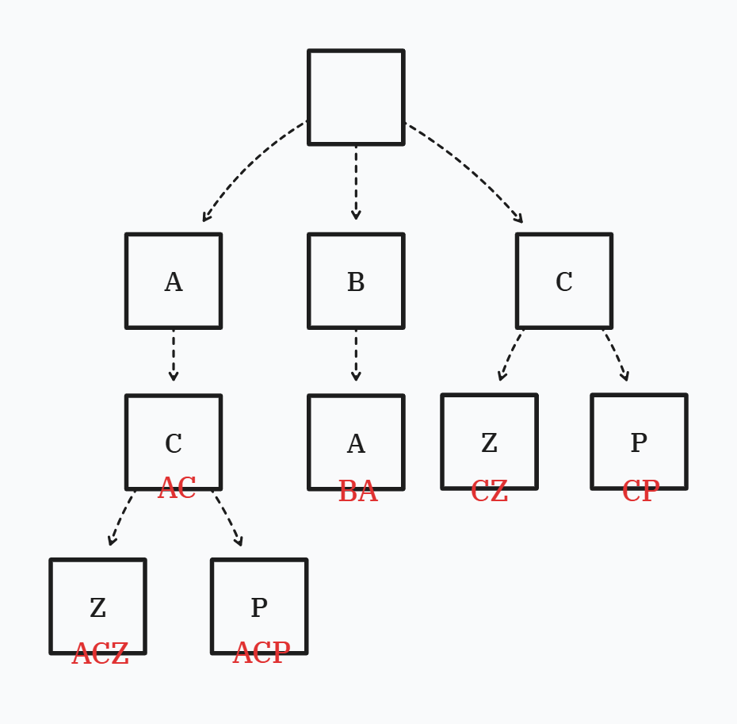

# 트라이 자료구조란?

트라이(Trie)는 탐색 트리의 일종으로서, 주로 문자열들을 저장하고 탐색하는 데에 사용된다.

## 왜 이런게 필요한가?

여러 문자열들로 구성된 집합이 있고, 이 집합에 문자열을 추가/삭제하거나, 특정한 문자열을 빠르게 찾고 싶다고 하자.

여기까지는 셋(`set`, `unordered_set`)으로 해결할 수 있는 문제이다.

하지만 단순히 (빠른) 존재성 판별을 넘어서 다음까지 궁금하다면 어떨까?:
* 어떤 접두사(Prefix)를 가지는 문자열이 집합에 존재하는가?
* 이 문자열이 다른 문자열의 접두사인가?
* 사전순으로 정렬하면 어떻게 되는가?

이렇게 문자열의 **구조** 까지 관심의 영역이 확장되면 셋으로는 처리하기가 복잡한 문제가 된다. 
이 때 압도적인 편의성과 성능을 제공하는 자료구조가 바로 트라이이다.


==트라이는, 문자열 세트에서 문자열을 빠르게 검색할 수 있게 하면서, 문자열의 구조까지 파악할 수 있게 하는 자료구조이다.==


# 트라이 ADT

트라이가 제공해야 하는 기본 연산들은 다음과 같은 것이 있다.


* `Insert(word)`
  * 문자열 `word`를 트라이에 삽입한다.
* `Search(word)`
  * 트라이 내에 정확히 일치하는 문자열 `word`가 존재하는지 확인한다.
* `StartsWith(prefix)`
  * 접두사 `prefix`로 시작하는 문자열이 존재하는지 확인한다.
* `ListWords()`
  * 트라이에 저장된 모든 문자열을 반환


# 트라이의 구현

보통 노드를 이용하여 다음처럼 트리로 구축한다.



하나의 노드에 하나의 문자를 넣고, 노드의 자손으로 문자열을 만들어 트리를 구축한다.

위 예시의 경우 문자열 `"AC"`, `"ACZ"`, `"ACP"`, `"BA"`, `"CZ"`, `"CP"`를 저장하고 있는 트라이를 표현하였다.

중복된 문자는 공통 노드로 처리하며, ==말단 노드 이전에서도 문자열이 끝날 수 있음==이 중요하다.

## 트라이 노드의 구현

트라이의 노드를 어떻게 설계하냐에 따라서 트라이의 성질이 조금씩 달라진다.
기본적으로 다음 3개의 선택지가 있
다.

### `array`를 노드에 사용

```cpp{lineNos=false}
struct Node {
  array<Node*, 128> children;
  bool isEnd{false};
};
```

`isEnd`의 경우 문자열의 끝을 나타내는 플래그이다. 이 플래그가 있기에, 위 그림 예제의 `"AC"`처럼 트리의 중간에서 문자열이 끝나더라도 그 문자열이 트라이 내에 존재함을 표시할 수 있다.

자손 관리에 `array`를 사용하는 트라이 노드의 경우, 가장 간단한 구현이다. 길이가 128인 이유는 ASCII 문자 집합 전체를 범위로 삼기 위함이며, 당연히 ASCII 문자가 아닌 멀티바이트 문자의 경우 이 구조로 저장할 수 없다.

배열이므로 요소 접근이 $O(1)$이며, 캐시 히트로 성능적인 이득을 볼 수 있고, 자동으로 사전순 정렬이 되어있음이 보장된다. 

하지만 일반적인 경우 배열 대부분의 요소를 `nullptr`을 저장하는데에 낭비하게 되므로 공간적 효율은 그리 좋지 못하다.

### `unordered_map`을 노드에 사용

```cpp{lineNos=false}
struct Node {
  unordered_map<char, Node*> children;
  bool isEnd{false};
};
```

`unordered_map`을 사용한 버전의 경우 범용 문자를 저장할 수 있으며, 자손에 대한 접근이 평균적으로 $O(1)$이다.

하지만 자손 문자들이 사전순으로 정렬되어 있음이 보장되어 있지 않다는 것을 주의해야 한다.

### `map`을 노드에 사용
 
```cpp{lineNos=false}
struct Node {
  map<char, Node*> children;
  bool isEnd{false};
};
```

`map`을 사용한 버전은 접근에 $O(\log{N})$이 소요되지만 사전순 정렬이 보장되어 있으므로 해당 기능이 중요한 경우 채택을 고려할 수 있다.

## 트라이의 구현

위 노드 중 *아무거나* 사용한다고 했을 때, 트라이의 인터페이스는 아래처럼 선언할 수 있다.

```cpp{lineNos=false}
class Trie {
public:
  Trie();
  ~Trie();

public:
  void Insert(const string& word);
  void Search(const string& word) const;
  void StartWith(const string& prefix) const;
  void Print() const;

private:
  Node* root{new Node()};
};
```

### `Insert`의 구현

* `Insert(const string& word)`는 트라이 내에 문자열 `word`를 삽입한다.
* 삽입하려는 문자열을 문자 하나하나 쪼개서, 트라이의 루트부터 시작하여 연속하여 중복되는 부분이 있다면 타고 내려간다.
* 만일 연속 중복이 깨지면 새로 자손에 추가한다.

`Node`가 `array`인 경우 구현은 아래와 같다.

```cpp{lineNos=false}
void Trie::Insert(const string& word) {
  // 루트부터 시작하여 트라이를 검색
  Node* node{root_};

  // 추가할 문자열을 문자별로 순회
  for (char c: word) {
    // 자손 중에 구성 문자가 존재하는가?
    auto it{find(node->children.cbegin(), node->children.cend(), c)};
    if (it == node->children.cend()) {
      // 존재 안하면, 새로 분기하여 만듦
      node->children[c] = new Node();
    }

    // 트라이를 말단까지 쭉 훑기 위해 재할당
    node = node->children[c];
  }

  // 삽입할 문자열을 문자로 쪼개 모두 등록했으면 
  // 마지막 노드가 해당 문자열의 끝임을 표기
  node->isEnd = true;
}
```

`Node`가 `unordered_map`이나 `map`인 경우 아래와 같다.

```cpp{lineNos=false}
void Trie::Insert(const string& word) {
  // 루트부터 시작하여 트라이를 검색
  Node* node{root_};

  // 추가할 문자열을 문자별로 순회
  for (char c: word) {
    // 자손 중에 구성 문자가 존재하는가?
    if (node->children.find(c) == node->children.cend()) {
      // 존재 안하면, 새로 분기하여 만듦
      node->children[c] = new Node();
    }

    // 트라이를 말단까지 쭉 훑기 위해 재할당
    node = node->children[c];
  }

  // 삽입할 문자열을 문자로 쪼개 모두 등록했으면 
  // 마지막 노드가 해당 문자열의 끝임을 표기
  node->isEnd = true;
}
```

### `Search`의 구현

* `Search(const string& word)`는 `word`가 정확히 트라이 내에 존재하는지 확인한다.

`Node`가 `array`인 경우 구현은 아래와 같다.

```cpp{lineNos=false}
void Trie::Search(const string& word) const {
  // 루트부터 시작하여 트라이를 탐색
  Node* node{root_};

  // 탐색할 문자열을 문자별로 순회
  for (char c: word) {
    // 자손 중에 구성 문자가 존재하는가?
    auto it{find(node->children.cbegin(), node->children.cend(), c)};
    if (it == node->children.cend()) {
      // 존재 안하면, 해당 문자열은 트라이에 존재하지 않음이 빠르게 확정됨
      return false;
    }
    // 발견하면 트라이를 말단까지 쭉 훑기 위해 재할당
    node = node->children[c];
  }
  // 여기까지 도달했는데, 문자열 끝으로 마킹이 안되어 있으면 
  // 이 문자열을 포함한 문자열이 존재하는거지, 이 문자열이 존재하는건 아님
  return node->isEnd;
}
```

`Node`가 `unordered_map`이나 `map`인 경우 아래와 같다.

```cpp{lineNos=false}
void Trie::Search(const string& word) const {
  // 루트부터 시작하여 트라이를 탐색
  Node* node{root_};

  // 탐색할 문자열을 문자별로 순회
  for (char c: word) {
    // 자손 중에 구성 문자가 존재하는가?
    if (node.children.find(c) == node->children.cend()) {
      // 존재 안하면, 해당 문자열은 트라이에 존재하지 않음이 빠르게 확정됨
      return false;
    }
    // 발견하면 트라이를 말단까지 쭉 훑기 위해 재할당
    node = node->children[c];
  }
  // 여기까지 도달했는데, 문자열 끝으로 마킹이 안되어 있으면 
  // 이 문자열을 포함한 문자열이 존재하는거지, 이 문자열이 존재하는건 아님
  return node->isEnd;
}
```

### `StartsWith`의 구현

* `StartsWith(const string& prefix)`는 접두사 `prefix`로 시작하는 문자열이 트라이 내에 존재하는지 확인한다.

`Node`가 `array`인 경우 구현은 아래와 같다.

```cpp{lineNos=false}
void Trie::StartsWith(const string& prefix) const {
  // 루트부터 시작하여 트라이를 탐색
  Node* node{root_};

  // 탐색할 문자열을 문자별로 순회
  for (char c: prefix) {
    // 자손 중에 구성 문자가 존재하는가?
    auto it{find(node->children.cbegin(), node->children.cend(), c)};
    if (it == node->children.cend()) {
      // 존재 안하면 해당 문자열은 트라이에 존재하지 않음이 빠르게 확정됨
      return false;
    }
    // 발견하면 트라이를 말단까지 쭉 훑기 위해 재할당
    node = node->children[c];
  }
  // 여기까지 도달했다면 어쨌든 prefix로 시작하는 문자열이 
  // 트라이 어딘가에 존재함이 확정되는 것
  return true;
}
```

`Node`가 `unordered_map`이나 `map`인 경우 아래와 같다.

```cpp{lineNos=false}
void Trie::StartsWith(const string& prefix) const {
  // 루트부터 시작하여 트라이를 탐색
  Node* node{root_};

  // 탐색할 문자열을 문자별로 순회
  for (char c: prefix) {
    // 자손 중에 구성 문자가 존재하는가?
    if (node->children.find(c) == node->children.cend()) {
      // 존재 안하면 해당 문자열은 트라이에 존재하지 않음이 빠르게 확정됨
      return false;
    }
    // 발견하면 트라이를 말단까지 쭉 훑기 위해 재할당
    node = node->children[c];
  }
  // 여기까지 도달했다면 어쨌든 prefix로 시작하는 문자열이 
  // 트라이 어딘가에 존재함이 확정되는 것
  return true;
}
```


### `Print`의 구현

* 정확히 말하면 트라이 내에 존재하는 모든 문자열을 반환하거나, 출력하는 메서드이다.
* 트라이는 트리이므로 DFS를 이용하여 `isEnd`가 나올 때까지 문자열을 구축하고, `isEnd`를 만나면 문자열을 출력하고 백 트래킹하는 것을 모두 탐색할때까지 반복한다.

```cpp{lineNos=false}
void Trie::Print() const {
  string current{};
  DFS(root_, current);
}
```

이거는 그냥 래퍼 메서드일 뿐이고 핵심은 아래부터 구현할 `DFS` 메서드이다.

`DFS`는 `Node`가 `array`인 경우 아래처럼 구현한다.

```cpp{lineNos=false}
void Trie::DFS(const Node* node, string& current) const {
  // 문자열의 끝이면 일단 출력한다
  if (node->isEnd) {
    cout << current << '\n';
  }

  // 뒤에 뭔가 더 남아있으면 탐색해보자
  for (size_t i = 0; i < node->children.size(); ++i) {
    if (node->children[i]) {
      // 문자열 구축
      current.push_back(static_cast<char>(i));
      // 구축한 문자열의 자손으로 또다시 여행...
      DFS(node->children[i], current);
      // 더이상 탐색할 곳이 없다는 뜻이므로 백트랙
      current.pop_back();
    }
  }
}
```

`Node`가 `unordered_map` 또는 `map`인 경우 아래처럼 구현한다.

```cpp{lineNos=false}
void Trie::DFS(const Node* node, string& current) const {
  // 문자열의 끝이면 일단 출력한다
  if (node->isEnd) {
    cout << current << '\n';
  }

  // 뒤에 뭔가 더 남아있으면 탐색해보자
  for (const auto& [ch, child]: node->children) {
    // 문자열 구축
    current.push_back(ch);
    // 구축한 문자열의 자손으로 또다시 여행...
    DFS(child, current);
    // 더이상 탐색할 곳이 없다는 뜻이므로 백트랙
    current.pop_back();
  }
}
```

# 복잡도 분석

길이가 $N$인 어떤 문자열을 트라이에 존재하는지 검색하는데 소요되는 복잡도는 $O(N)$이다.
최대로 순회해 봐야, 입력하는 문자열의 길이만큼만 순회하므로 매우 빠르다.

허나 트라이는 이런 빠른 탐색시간을 위한 댓가로 공간은 꽤 많이 쓰는 자료구조이다.

트라이의 전체 노드 수는 삽입된 모든 문자열의 총 문자 수에 비례하는데, 접두사가 많이 겹칠수록 노드 수는 극적으로 줄어든다. 

한 노드의 자식을 표현하기 위해 배열을 사용하는 경우 위에서도 언급했듯 트라이가 다루는 모든 문자의 개수만큼의 포인터가 필요하고, 일반적인 경우 이들 중 대부분이 `nullptr`이므로 비효율적이다. 때문에 `unordered_map`이나 `map`을 쓰는 것이 좋은데, 자식이 정렬될 필요가 없다면 역시 `unordered_map`을 사용하는 것이 공간도 덜 차지하고 성능도 좋다.

# 응용 분야

사용자가 입력한 접두사에 대해서 모든 단어를 제시하는 자동완성(Autocomplete) 시스템을 구현하는 데에 사용되며, 와일드카드(`*`) 검색을 구현하는 데에도 사용된다.

# 참고 문헌

* [Trie/Wikipedia](https://en.wikipedia.org/wiki/Trie)
* [트라이(컴퓨팅)/위키백과](https://ko.wikipedia.org/wiki/%ED%8A%B8%EB%9D%BC%EC%9D%B4_(%EC%BB%B4%ED%93%A8%ED%8C%85))
* [백준 14725 G3 개미굴](https://www.acmicpc.net/problem/14725)
* [백준 51840 G4 전화번호 목록](https://www.acmicpc.net/problem/5052)