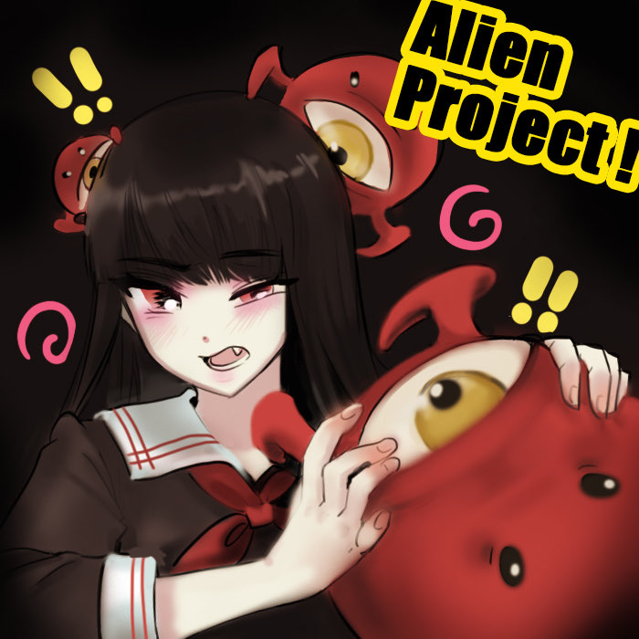
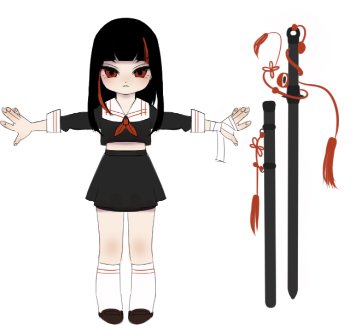
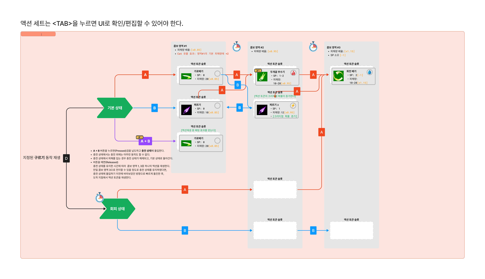
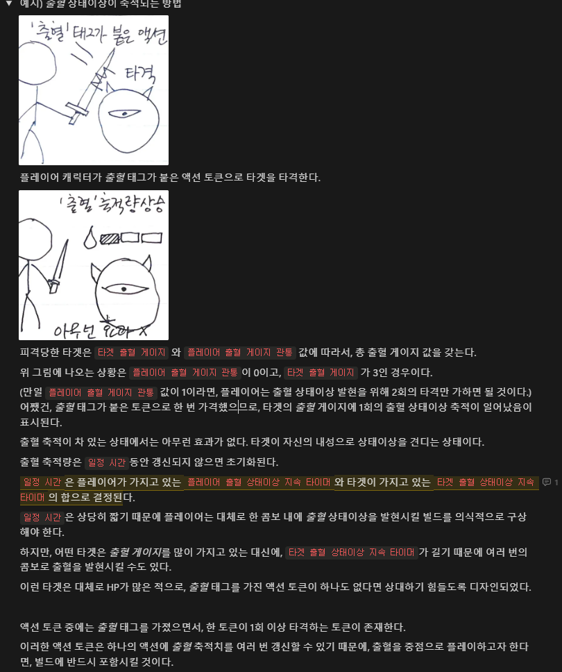
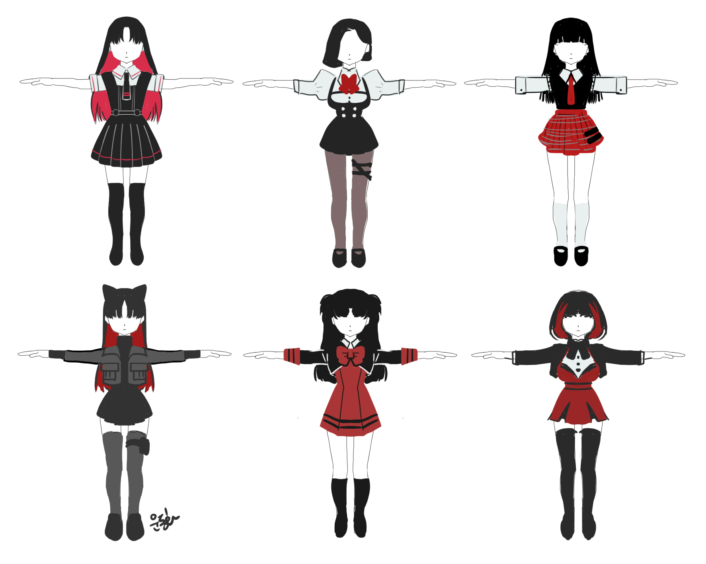
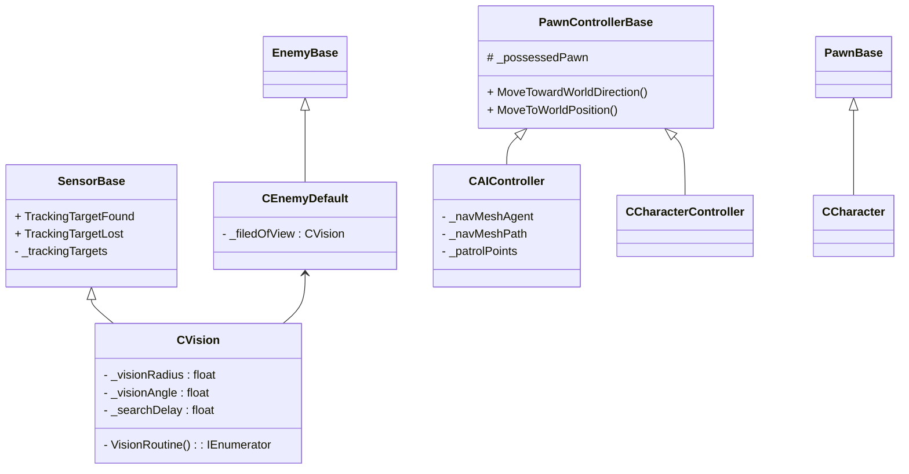

+++
title = "Project: Alien"
date = "2025-01-24"
toc = true
+++

---

## 프로젝트 개괄

* **팀 규모**: 4명
* **직책**: 팀장, 메인 프로그래머, 전체 기획자
* **목표**: 공모전 제출(BIC)
* **게임 개요**:
	* Alien 프로젝트의 가제는 \<외계인 대책반\>으로, 귀여운 여고생 전사들이 지구를 침공한 미지의 외계인들에 용감하게 맞서 싸우는 3D 3인칭 액션 로그라이트 장르의 PC 게임

## 주요 기여 사항

### 게임 전체 기획

게임의 전체 아이디어와 기획안을 작성하고, 기획에 따라 팀을 이끌었습니다.

처음으로 기획서를 작성하며 팀 프로젝트이고 기획이 작업과 동시에 이루어져 전체를 공개하기에는 다듬어지지 않은 부분들이 많습니다. 때문에 이곳에는 게임의 개략적인 컨셉과 주요 기획 사안만을 작성합니다.

\<외계인 대책반\>은 3인칭 액션 로그라이트 장르의 PC 게임입니다. 

시나리오의 로그라인은 아래와 같습니다.

> 정체불명의 외계 기생생물 "기가스"가 지구를 침공한다. 연패를 거듭하던 인류는 이들의 일부가 인간 소녀들과 공생 관계를 이루고 싶어한다는 것을 알아낸다. 이렇게, 기가스와 공생하는 여고생들로 이루어진 특수부대 "여고생 대책반"이 구성되고, 인류의 반격이 시작된다.

\<신세기 에반게리온\>과 \<에일리언 9\>등을  크게 참고하여, 
1. "미지의 적과 싸우기 위해 선택받은 청소년을 전선에 보낸다" 
2. "미지의 적과 싸우기 위해 알 수 없는 적의 힘을 빌린다"

위  두 요소를 서사적/시각적 테마의 큰 축으로 삼았습니다. 

현재 스팀에서 어두운 Y2K(소위 *세기말 감성*), 미소녀 등의 키워드가 크게 인기라고 분석하였고, 개인적으로도 꼭 다뤄보고 싶었던 주제였기 때문입니다.

플레이어블 캐릭터는 여고생과 여고생을 따르는 외계인 무기 "기가스"입니다.

외계인 무기들은 대검, 도끼, 대포 등 흔히 액션 게임에서 볼 수 있는 그것들이고, "살아있는" 무기이므로 게임을 플레이하면서 역동적으로 그 외형과 기능이 변화합니다.

\<외계인 대책반\>의 시스템적 특장점은 다음과 같습니다.

플레이어의 입력에 정교하게 반응하는 액션 체계가 주어집니다. "회피", "공격" 등, 플레이어블 캐릭터가 취할 수 있는 다양한 액션이 존재하며, 각 액션은 이름이 구별되는 것 이상으로 경험되는 느낌이 다릅니다. 게임은 이러한 다양한 액션을 플레이어가 깊이 있게 이해하고, 적재 적소에 활용할 것을 요구합니다.

이 게임이 다른 게임과 구별되는 가장 독특한 점은, 이러한 "액션"을 무작위적으로 습득할 수 있다는 것입니다. 액션은 "액션 토큰"이라는 단위의 형태로 구분되어 있고, 게임을 시작하면 아주 기본적인 토큰만 주어집니다. 게임을 플레이하면서 액션 토큰을 무작위로 얻을 수 있고, 플레이어는 캐릭터의 "액션 세트"에 각 액션 토큰들을 배열하여 자신만의 액션 콤보를 만들 수 있습니다. 캐릭터마다 고유한 액션 세트가 주어지고, 액션 토큰들의 성능은 상황에 따라, 획득한 다른 액션 토큰들이 액션 세트에 배열된 맥락에 따라 달라집니다.

액션 토큰의 예시

액션 세트의 예시

때문에 플레이어는 게임을 플레이 하면서 다양한 액션 토큰들을 획득하여, 이들을 상황에 맞게 조합해 자신만의 액션 맵을 지닌 캐릭터를 육성하면서, 로그라이트의 런(Run)을 완료하는 것을 목표로 하게 됩니다.

이러한 기본 골격 외에, 에너미 시스템, 액션 토큰 및 액션 세트 기획, 상태 이상 시스템 등 많은 것들을 기획하였습니다.

## 캐릭터 컨트롤러 작성 및 애니메이션 적용

<iframe width="560" height="315" src="https://www.youtube.com/embed/dN3sstEcAsE?si=VfxIelOArk4sfVxa" title="YouTube video player" frameborder="0" allow="accelerometer; autoplay; clipboard-write; encrypted-media; gyroscope; picture-in-picture; web-share" referrerpolicy="strict-origin-when-cross-origin" allowfullscreen></iframe>

* 가속도와 감속도가 존재하는 `CharacterController` 기반 캐릭터 컨트롤러 설계.
* 이동하는 방향과 크게 다른 방향으로 이동 입력이 들어오는 경우 애니메이션에 Pivoting이 일어나도록 구현

<iframe width="560" height="315" src="https://www.youtube.com/embed/fuZlXEv7Pgw?si=PfUfqEm7Zti2Oxkf" title="YouTube video player" frameborder="0" allow="accelerometer; autoplay; clipboard-write; encrypted-media; gyroscope; picture-in-picture; web-share" referrerpolicy="strict-origin-when-cross-origin" allowfullscreen></iframe>

* 중간단계 애니메이션

## 에너미 AI 프레임워크 설계

<iframe width="560" height="315" src="https://www.youtube.com/embed/Mg-cqosl_gk?si=HWFAsTVfga8xf2R6" title="YouTube video player" frameborder="0" allow="accelerometer; autoplay; clipboard-write; encrypted-media; gyroscope; picture-in-picture; web-share" referrerpolicy="strict-origin-when-cross-origin" allowfullscreen></iframe>

<iframe width="560" height="315" src="https://www.youtube.com/embed/7mBNiVyho0Y?si=gd1Z51MlYtiwOFbu" title="YouTube video player" frameborder="0" allow="accelerometer; autoplay; clipboard-write; encrypted-media; gyroscope; picture-in-picture; web-share" referrerpolicy="strict-origin-when-cross-origin" allowfullscreen></iframe>

## 레벨 디자인

## 에너미 캐릭터 모델링 + 애니메이션 작업

<iframe width="560" height="315" src="https://www.youtube.com/embed/2CD5fHXqrN0?si=UjhkCg3Xj9RT0FmT" title="YouTube video player" frameborder="0" allow="accelerometer; autoplay; clipboard-write; encrypted-media; gyroscope; picture-in-picture; web-share" referrerpolicy="strict-origin-when-cross-origin" allowfullscreen></iframe>

직접 리깅 (IK 적용)

<iframe width="560" height="315" src="https://www.youtube.com/embed/FGk9ZIb7RTA?si=2QDOIp60Ob24nEuz" title="YouTube video player" frameborder="0" allow="accelerometer; autoplay; clipboard-write; encrypted-media; gyroscope; picture-in-picture; web-share" referrerpolicy="strict-origin-when-cross-origin" allowfullscreen></iframe>

Walking 애니메이션 제작

