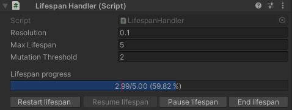

+++
title = "Project: Munchkin"
date = "2025-01-23"
toc = true
+++

## 프로젝트 개괄

* **팀 규모**: 4명
* **직책**: 팀장, 메인 프로그래머, 메인 기획자
* **목표**: 공모전 제출, Itch.io와 Steam에 게임 데모 출시
* **게임 개요**:
	* \<Getting it over\>에서 착안한 고난이도 2.5D 횡스크롤 플랫포밍 게임
	* 특이한 생애주기를 갖고 부활하는 주인공 "닭"을 조작하는 것이 특장점

## 주요 기여 사항

### 전체 기획서 작성

게임 Munchkin은 하찮고 멍청해 보이는 "닭"이 주인공인 고난이도 2.5D 플랫포머 게임입니다.

플레이어블 캐릭터인 "닭"은 극도로 나약한 생물로, 작은 자극에도 기절하거나 죽어 버립니다. 게다가 수명조차 짧아, 아무런 실수를 하지 않았더라도 시간이 지나면 늙어 죽고 맙니다.

하지만 이 미물에게도 한 가지 특별한 능력이 있습니다. 닭은 죽으면 영혼이 되어 가장 가까운 알로 날아갑니다. 게임 월드에는 반드시 하나 이상의 알이 존재하며, 닭의 영혼이 알에 닿으면 닭은 다시 병아리로 부화해 새로운 삶을 시작합니다. 시간이 흐르면 병아리는 닭으로 성장하고, 닭 상태에서는 새로운 알을 월드에 하나 배치할 수 있습니다.

알은 기본적으로 일회용 부활 지점이면서, 닭이 살아서 도달할 수 없는 곳에 던져서 플랫포밍의 돌파구로 활용할 수도 있습니다. 하지만 알을 배치할 때에는 신중해야 합니다. 알은 쉽게 굴러가고 충격에 약해 금방 깨져 버립니다.

만약 플레이어가 월드에 배치한 알이 깨져 버리면, 월드의 시작 지점인 "둥지"에 있는 알이 활성화됩니다. 즉, 처음부터 다시 도전해야 한다는 뜻이죠.

Munchkin은 기본적으로 어려운 게임입니다. 플레이어가 조작하는 닭은 온갖 이유로 허무하게 실패하고 죽으며, 이러한 극적인 실패의 순간이 게임이 내세우는 주요 코미디 요소 중 하나입니다. 

하지만 이 게임은 실패하는 것에 관한 게임은 아닙니다. 반복되는 실패 속에서 플레이어가 "닭"과 "알"의 생애주기를 이해하고, 그것이 환경과 상호작용 하는 법칙들을 학습하면서 포기하지 않고 나아가, 결국에는 승리를 거머쥐는 쾌감을 느끼게 하는 게임입니다.

**기획 문서들**
- [전체 콘셉트](https://substantial-panther-211.notion.site/9a3725e57d7b41a5891e7c0fe1c0d3d5?pvs=4)
- [기획 용어 정리](https://substantial-panther-211.notion.site/a19b8ac4a4904419a9b0a693b6b12ae4?pvs=4)
- [게임의 생애주기](https://substantial-panther-211.notion.site/61fe3ea8d1bb4b14b68105bb148ddb04?pvs=4)
- [게임플레이 서사](https://substantial-panther-211.notion.site/edf4c88bdcd14b2aa3114abfacb01176?pvs=4)
- [플레이어 입력](https://substantial-panther-211.notion.site/853508194aae4672a58a6a2715d4f414?pvs=4)
- [캐릭터 기획](https://substantial-panther-211.notion.site/243480d1e8b44ada8704811f08be5de6?pvs=4)
- [장치와 함정 기획](https://substantial-panther-211.notion.site/3dd5857436dc4a5abdaf021cf439e263?pvs=4)
- [레벨과 스테이지 기획](https://substantial-panther-211.notion.site/5553f23380f448b7a10b1157e1f28512?pvs=4)

### 동적 타일맵 로딩 시스템 구현

명시적인 로딩 스크린이 존재하지 않는 거대한 월드를 구축하는 것이 목표였습니다.

또한, 플랫포밍이 가능한 지형은 Unity TileMap 컴포넌트의 GameObject 브러시를 활용해 테스트와 수정이 용이하도록 했습니다.

다음과 같이 구현하였습니다.

* 씬을 다음의 두 종류로 분류합니다:
	* **상주 씬**
		* 게임 플레이 중, 언로드되면 안 되는 오브젝트들이 존재하는 씬입니다.
		* 캐릭터와 알, 카메라와 각종 매니저들이 상주 씬에 존재합니다.
		* 캐릭터와 알은 모두 상주 씬에서만 생애주기를 가집니다.
	* **월드 씬**
		* 게임의 물리적 레벨을 나타내는 씬입니다.
		* 상주 씬에 더하여, 동적으로 로드됩니다. (Additive Loading)
		* 모든 월드 씬에는 씬의 물리적 경계를 의미하는 Trigger 콜라이더가 존재해서, 특정 오브젝트의 진입을 감지할 수 있습니다.
* 월드 씬들의 인접 관계는 `SceneDependencyData` 라는 ScriptableObject에 정의합니다.
	* 가중치가 없는 그래프를 인접 리스트로 구현하여, *"`Scene11`의 인접 씬은 `Scene12`, `Scene13`, `Scene14`이다"* 라는 정보를 미리 구성해 놓습니다.
* 상주 씬에는 `SceneLoadManager`가 싱글턴으로 존재하며, 불특정 다수의 `SceneLoadTrigger`가 보내는 씬 로드/언로드 요청을 처리합니다.
* `SceneLoadTrigger`가 부착된 오브젝트가 새로운 월드 씬에 진입할 때, `SceneLoadManager`에게 로드와 언로드 요청을 발생시킵니다.
	* 요청은 다음을 의미합니다: 
		* > "내가 지금 `Scene11`에 진입하였으므로, 해당 씬을 기준으로 거리가 2 이내인 씬은 다른 `SceneLoadTrigger`가 없다면 언로드해도 좋다. 만일 거리가 2 이내인 씬 중 로드되지 않은 씬이 있다면, 로드되어야 한다."
		* 어떤 씬을 기준으로 거리가 n이하인 씬은, 언급한 `SceneDependencyData`의 그래프의 탐색 결과를 사용합니다.

[참고] Unity에서 존재하는 `SceneAsset`은 `UnityEditor`에 존재하고, 빌드 게임에서는 사용할 수 없으므로 "씬"의 레퍼런스를 관리하기 위해 외부 애셋(`SceneReference.cs`와 `SceneReferencePropertyDrawer.cs`)을 사용하였습니다. ([출처](https://github.com/NibbleByte/UnitySceneReference/blob/master/Assets/DevLocker/Utils/SceneReference.cs))

위처럼 에디터에서 미리 씬간의 인접 관계를 정의합니다.

씬의 로드/언로드는 비동기적(`AsyncOperation`)으로 이루어지는 데에 반해, 로드/언로드 요청은 `OnTriggerEnter`라는 물리 엔진의 콜백으로 발생하기 때문에, 이미 비동기 작업이 진행 중인 씬에 중복된 요청을 처리하는 것이 관건이었습니다.

다음과 같은 해결책으로 문제를 해결하였습니다.

1. `isLoading`과 `isUnloading` 플래그로 `AsyncOperation`이 작업 중인 씬에 중복 로드/언로드 연산이 발생하지 않도록 방지
2. 다양한 에디터 스크립트를 활용하여 현재 로드/언로드 중인 씬과, 로드된 씬, 그리고 로드된 씬 별로 해당 씬을 로드한 게임오브젝트를 한 눈에 확인할 수 있게 하였습니다.

또한 궁극적으로 모든 씬은 Tilemap 컴포넌트의 GameObject 브러시를 활용한 3D 타일로 구축될 것입니다. 때문에 많은 작은 게임오브젝트에 대해서 로드와 언로드가 매끄럽게 진행되길 원했고, 스트레스 테스트를 진행하였습니다. 에디터에서는 씬 로드/언로드가 일어날 때마다 약간의 프레임 드랍이 있었지만, 빌드 버전에서는 매끄럽게 진행되었습니다.

### 고유의 생애 주기를 갖는 알 오브젝트 구현

캐릭터는 생애주기 내에 월드에 알이라는 특수한 오브젝트를 한 번 배치할 수 있습니다. 알은 Rigidbody를 사용하여 물리 효과를 받으며 굴러다니고, 일정량 이상의 충격을 받으면 깨져서 사라집니다.

알은 다양한 이유로 깨질 수 있고, 체력도 존재해야 하며, 고유의 생애주기를 관리해야 했습니다. 

위와 같은 형태로, `EggLifecycleHandler`부터 시작하여 관찰자 패턴을 적극 활용하여 컴포넌트끼리 느슨한 연결을 갖도록 하되, 필요한 정보를 전달받을 수 있게 구성했습니다. 

`EggLifecycleHandler`는 알의 운명의 결정권한을 가지는 가장 중요한 컴포넌트입니다. 알 인스턴스의 상태를 정리해서 Object Pool에 반납하거나 Object Pool에서 꺼내진 알 인스턴스를 초기화합니다.[^1]

`EggHealthManager`는 알의 **체력**을 관리합니다. 체력은 알이 생애주기를 종료하게 되는 하나의 요인으로서 설계되었으며, 그 자신은 체력의 실제 수치 변화를 다른 컴포넌트에 알리기도 합니다. 예를 들어, 알은 보유한 체력에 따라 외형이 변화하는데, 해당 외형 변화에 관여하는 컴포넌트는 `EggHealthManager`를 구독하면 됩니다.

체력의 변경을 데미지라고 정의하고, `EggDamageSourceBase`는 알의 체력에 영향을 줄 수 있는 요인들의 기초 클래스로 설계했습니다. 예를 들어, 알에 가해진 물리적인 충격 중 임계값을 넘는 것을 데미지로 변환하는 `EggPhysicalDamageSource`가 있습니다.

[^1]: 오브젝트 풀링은 `UnityEngine.Pool`을 활용했습니다. 하지만 오브젝트 풀링이 알 오브젝트 구현에 반드시 필요한 요소는 아니었습니다. 특히, 객체를 풀에서 가져오거나 반납하는 주체를 결정하고, 그 과정에서 반납 전 객체의 상태 정리와 같은 추가적인 엔지니어링 비용을 부담해야 했습니다. 디자인 패턴의 성급한 적용은 비효율을 초래할 수 있다는 것을 배울 수 있었던 좋은 기회였습니다.

또한 알의 생애주기를 에디터에서 편리하게 관리하기 위해 다음처럼 에디터 스크립트를 작성하기도 하였습니다.

추가적으로, 알과 깨진 알을 모델링하고, 알이 체력에 따라 깨진 알 노멀 맵의 알파값을 증가시켜, 알이 점점 깨져가는 것 처럼 보이게 하는 셰이더 그래프를 작성하였습니다.

### 2.5D 플랫포밍 캐릭터 컨트롤러 구현

게임 기획의 핵심 컨셉이 들어있는 캐릭터를 구현하였습니다. 크게 캐릭터가 입력을 받아 플랫포밍 행동으로 전환하는 스크립트와, 캐릭터의 생애주기에 따른 상태를 관리하는 스크립트를 작성하였습니다.

캐릭터 게임 오브젝트는 다음과 같은 구조로 구성됩니다.

* CharacterObject
	* **Input**: InputSystem의 콜백을 받아, 각 Action으로 전달
		* `InputHandler`
	* **Actions**: Input의 각 신호를 캐릭터의 대응하는 행동으로 번역
		* `MoveAction` [참고] Rigidbody 사용
		* `JumpAction`
		* `LookAction`
		* `EggAction`
		* `GrabThrowAction`
	* **Handlers**
		* `LifespanHandler`: 캐릭터의 전체 생애주기를 관리
		* `VisualInstanceHandler`: 생애주기에 따른 캐릭터의 외형을 관리
		* `RotationHandler`
		* `SoulMovementHandler`

캐릭터의 로직과 로직에 따른 비주얼(데이터)를 명확히 구분하였습니다. ScriptableObject를 이용해 캐릭터의 비주얼 세트를 정의하고 이를 런타임에 인스턴싱 하도록 구현하여, 아티스트의 작업이 진행됨에 따라서 캐릭터의 비주얼을 쉽게 교체할 수 있도록 만들었습니다.

이 게임에서 캐릭터는 함정에 데미지를 입는 것 외에도, 게임 플레이 시간에 따라서 수명을 먹고 노화하며 외형과 상태를 변경합니다. 이를 관장하는 스크립트는 `LifespanHandler`이며, 알 오브젝트를 구현한 것과 마찬가지로 관찰자 패턴을 이용하여 캐릭터 생애주기의 시작과 변화, 끝이 발생하였음을 그 구독자 스크립트들에게 알립니다.

캐릭터 수명의 각 시점에서 발생하는 사건들을 에디터에서 통제해야 할 일이 많았으므로, 다른 캐릭터 액션과 함께 전용 에디터 스크립트를 작성하여 쉽게 수명을 조절할 수 있도록 만들었습니다.

