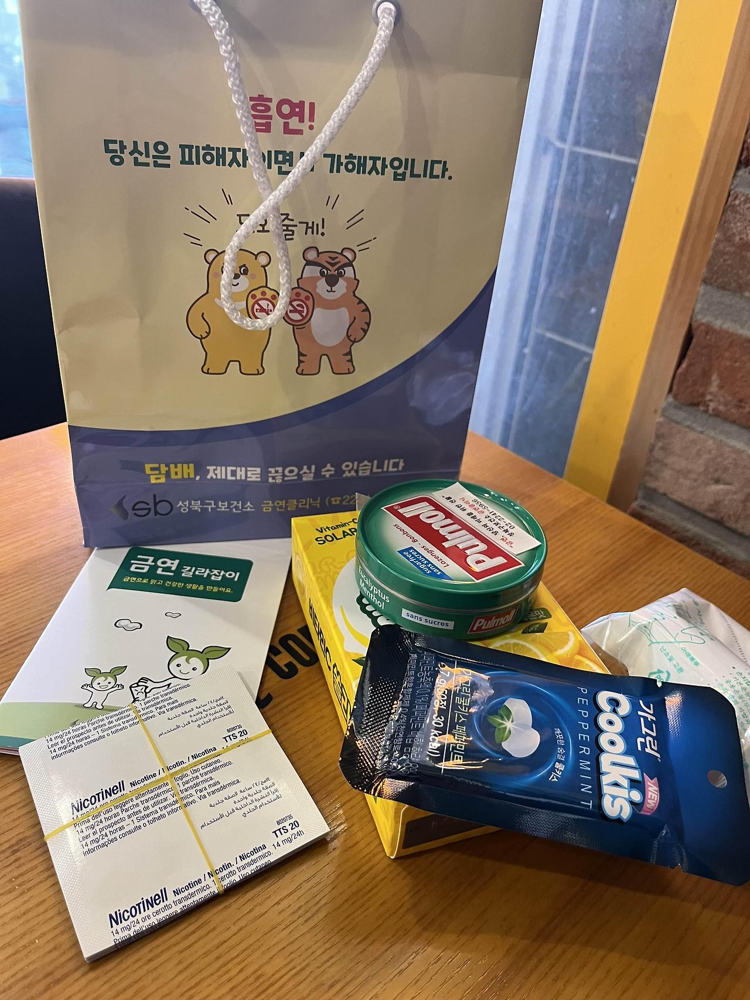

[홈 >금연온>금연도움받기>보건소 금연클리닉 찾기 (nosmokeguide.go.kr)](https://www.nosmokeguide.go.kr/lay2/program/S1T68C107/nosmoke/centermap/bogun_list.do)

여기서 근처 보건소를 찾아 (나의 경우 성북구 보건소였다)
당일 방문하였다.
 
별달리 준비할 것은 없었고, (점심시간만 피해 갔다)
신청서를 작성하고 상담사분이 15분 정도 상담해 주셨다.
 
상담 내용은 별 건 없었고, 프로그램이 어떻게 진행 되는지에 대한 설명이 대부분이었다.
우선 초기에는 매주 상담을 진행하고, 나중에는 월별로 전화 상담을 진행한다고 한다.
그리고 그렇게 6개월 진행하고 나면 일단은 성공으로 본다고.
 
몇가지 금연 보조 용품을 주셨다.
니코틴 패치 7개와, 손 지압기, 설탕이 들어가지 않은 캔디와 비타민을 받았다.
니코틴 패치는 24시간마다 교체하면 되고, 7일 치이므로 7일 후 재방문때 받아 가면 된다고 한다.
부작용으로 불면증이 있을 수도, 없을 수도 있고, 붙이고 있는 동안은 담배를 절대로 피우면 안 된다고.
(쓰러질 수도 있다고 한다.)
 
금연을 시작하면 니코틴 금단 증상을 패치로 완화하더라도
입이 엄청 심심해서 사탕, 과자 등을 자꾸 먹게 되는데
그래서 살이 5kg까지 찔 수 있어서 무설탕 캔디를 보조용품으로 주신다고 하셨다.
 
살 찌는건 싫다. 그치만 일단 경과를 지켜봐야 겠다.
 
손 지압기가 습관을 제어하는데 도움이 많이 된다는데, 아직 용도가 잘 이해되지는 않는다. 

방문 당일부터 금연을 시작하는 게 아니라, 금연 시작일을 따로 정할 수 있어서 나는 9월 1일부터 시작하기로 하였다.
 
상담을 하기 전 가장 걱정되었던 것,
*"프로그램 도중에 욕구에 못 이겨서 담배를 피워버리면 어떻게 하는가!"* 였는데,
상담사 님이 그런 경우가 상당히 많고, 어떤 분들은 부끄러워서 잠수타기도 하는데,
솔직하게 얘기해 주시면 금연 프로그램을 처음부터 다시 시작한다고 하셨다.
 
나는 의지는 있지만 그렇게까지 나를 불가능의 영역으로 몰아붙이고 싶지 않았고,
'실패 하면 죽음뿐이다'라는 마음가짐 보다는
'실패 하더라도 다시 할 수 있다'라는 생각으로 시작하는 것이 좋을 것 같았는데,
다행히도 프로그램도 그 마음의 자세에 열려있는 것 같아서 좋았다.
 
**그리고 이 모든 것이 무료였다.**

흡연하면서 내가 국가에 세금을 꼬박꼬박 냈고, 그 세금으로 금연 프로그램이 진행된다는 것 같다.

(아무리 세상이 이해하기 어렵다지만 이건 상당한 아이러니 이다.)