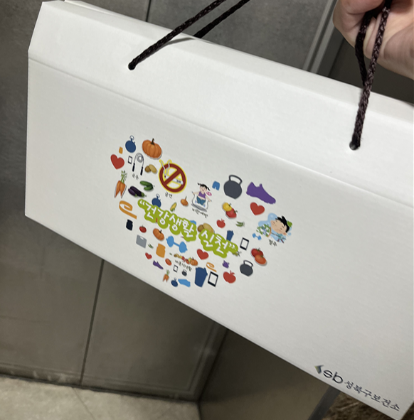

시간이 참 빠르다. 어느덧 6개월이 지나 금연 클리닉을 공식적으로 종료했다.
매달 보건소성북구 보건소를 방문해 짧은 상담을 받고, 사탕이나 영양제 같은 작은 선물을 받는 것이 전부였지만, 이런 사소한 것들이 금연 의지를 유지하는 데에 큰 도움을 주었다.
무료라는 점도 부담이 없었고, 오히려 이렇게까지 챙겨줘도 되나 싶을 정도로 정성스러웠다.

마지막 방문에는 소변 검사를 진행했고, 금연 성공 판정을 받았다! 그리고 또 한번 보상을 받았다. 어떤 지역 보건소에는 금전적 지원을 해주기도 한다는 얘길 들었는데, 성북구 보건소에서는 영양제와 비타민만 주는 모양이었다. 그래도 마지막이라 그런지 정말 많이 챙겨주셨다.

## 생각보다 쉬웠던 금연

6개월이 짧다면 짧고 길다면 긴 시간인데, 돌아보면 난 꽤 쉽게 끊은 것 같다.
흡연자로 지낸 기간이 4년 정도라 그런 걸까? 니코틴 패치도 거의 사용하지 않았고, 흡연 욕구도 통제 가능한 범위 내에 있었다. 

그럼에도 가장 참기 어려웠던 순간은 다음 두가지 였다.
* 흡연자였을 때 자주 갔던 장소에 다시 방문했을 때
* 영화에서 주인공이 멋지게 담배를 피우는 장면을 볼 때 [^1]

[^1]: <아메리칸 허슬>: 

그럼에도 흡연 욕구는 길어야 1~2분 정도였다. 그 시간을 버티면 자연스럽게 사라졌다.

# 금연 후 신체 변화, 정말 있었나?

솔직히 말해서 금연한다고 해서 신체에 극적인 변화가 생기지는 않았다.
체력이 약간 좋아지고, 피곤함이 덜한 것 같기는 하지만 무슨 광명이 찾아온 것은 아니다.

오히려 가장 좋았던 것은 **정서적인 효능감**이다.

주변 사람들이 내 금연 소식을 지지해 주고, 스스로의 욕구를 통제할 수 있게 되었다는 그 자신감이 금연의 가장 큰 보상이 아닌가 싶다.

### 90세 할아버지의 금연 도전기

클리닉에서 들었던 이야기로, 90세 할아버지가 클리닉에 찾아온 적이 있다고 한다. 상담 선생님은 솔직히 연세도 많으시니 너무 힘들게 끊으려고 애쓰지 않아도 된다고 조언했다고 한다. 

하지만 할아버지는 자기가 일생 동안 금연에 번번히 실패했어서, 자기가 죽기 전에는 꼭 자신과의 약속을 지키고 싶다고 얘기하셨다고 한다. 

멋지지 않는가? 

그리고 그 할아버지는 보란 듯이 금연 클리닉을 성공적으로 수료하셨다고.

## 하지만... 대신에 카페인이 늘었다.

금연에 성공한 것 같기는 한데, 대신에 하루에 섭취하는 카페인의 양이 좀 많이 늘었다. ㅋㅋ

결국 현대인이라면 스트레스를 다루기 위해 뭐든 하나는 해야 하는게 아닐까?

## 금연 팁을 좀 적어보자면 ...

* 주변 가까운 사람들에게 내가 금연 중이라는 것을 알리면 책임감이 생긴다.
	* "금연한다고 호언장담 해놓고 피워버리면 뽄새가 빠지겠지?" 라는 생각도 꽤 도움이 된다.
* 원리는 알 수 없지만 손 지압기는 금연에 정말로 도움이 된다. 
* 흡연 욕구는 길어야 3분 내로 끝난다. 3분만 참으면 금연 Streak을 이어 나갈 수 있다.
* 초기에는 입이 정말 심심한데, 클리닉에서 주는 무당 사탕이 정말 도움이 된다.
* 시간이 질날수록 이때까지 참은게 아까워서 담배를 피울 수 없어진다.