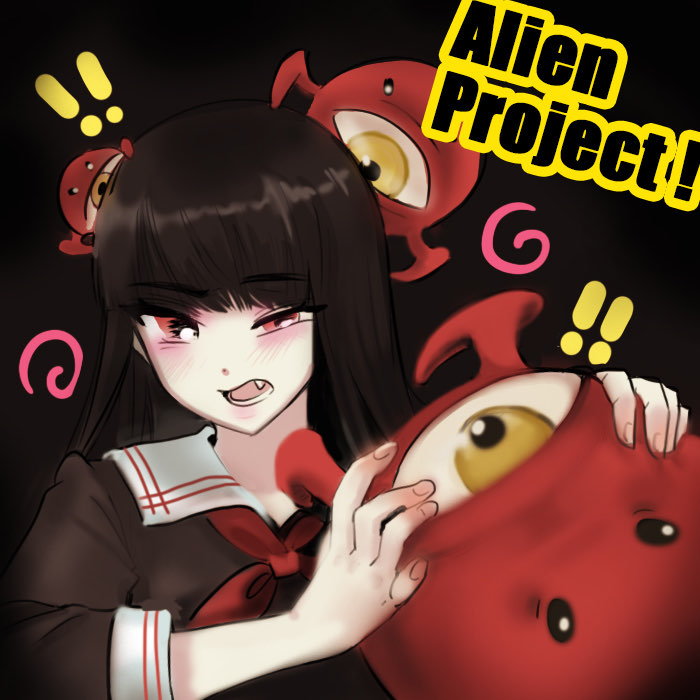
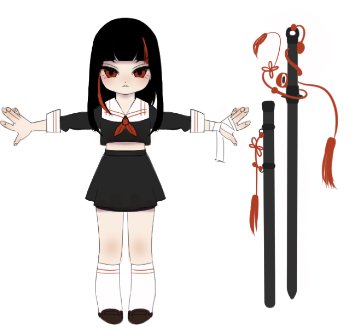
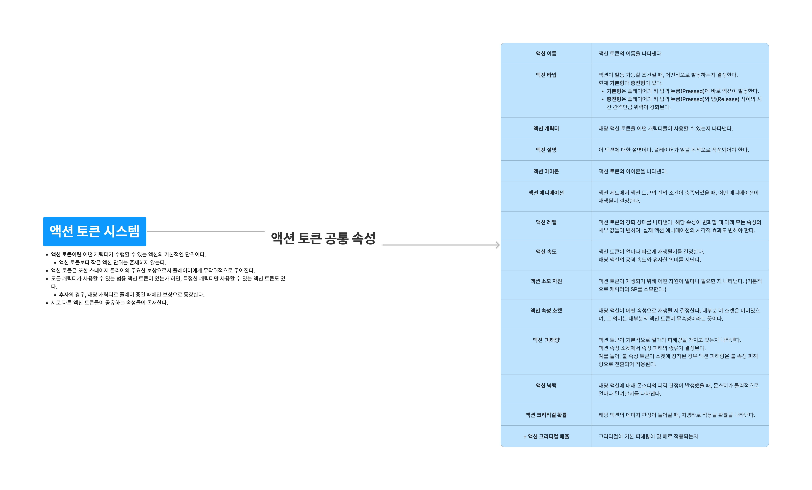
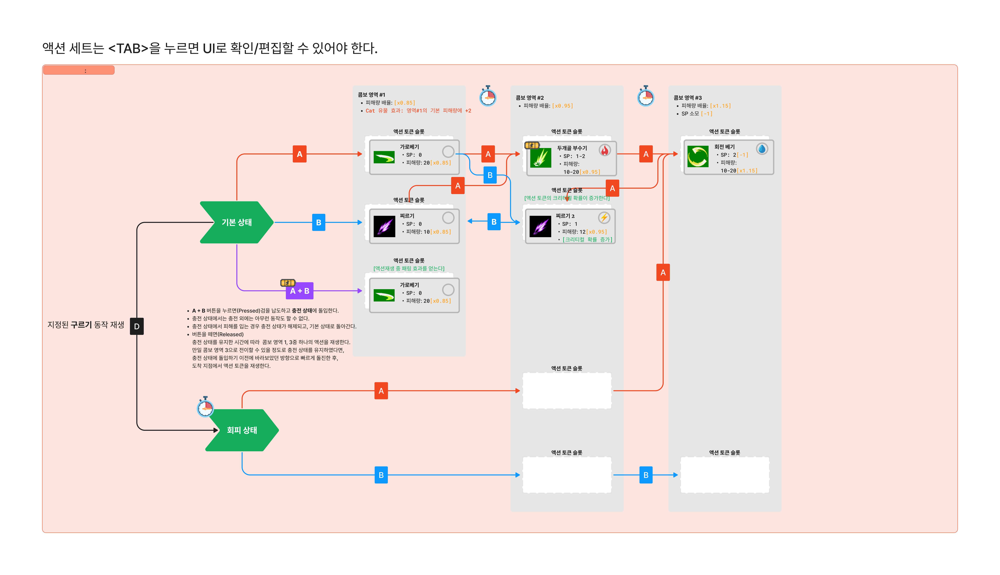
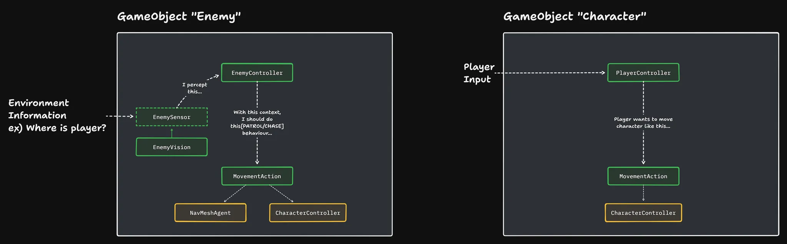
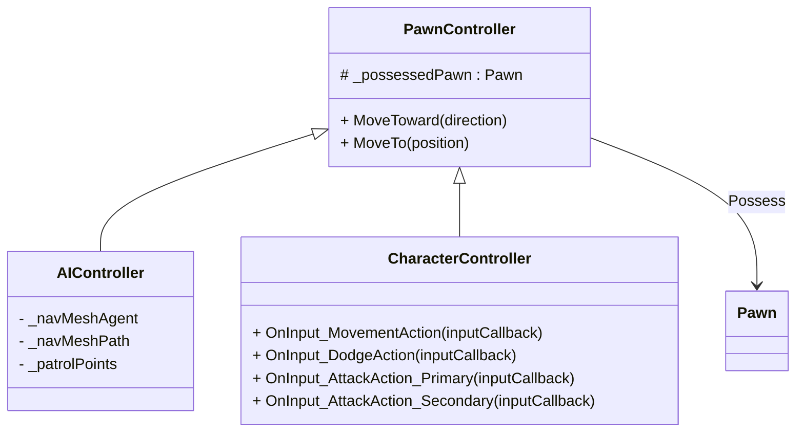
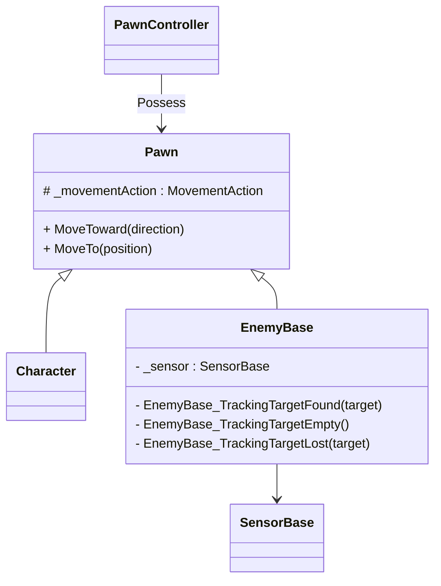
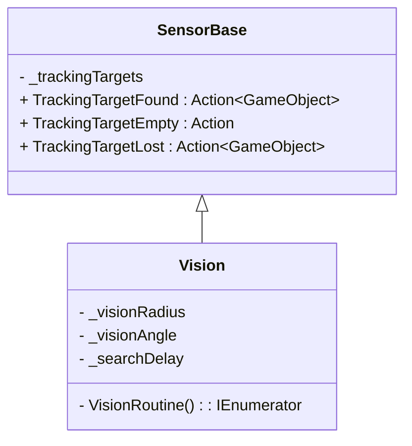
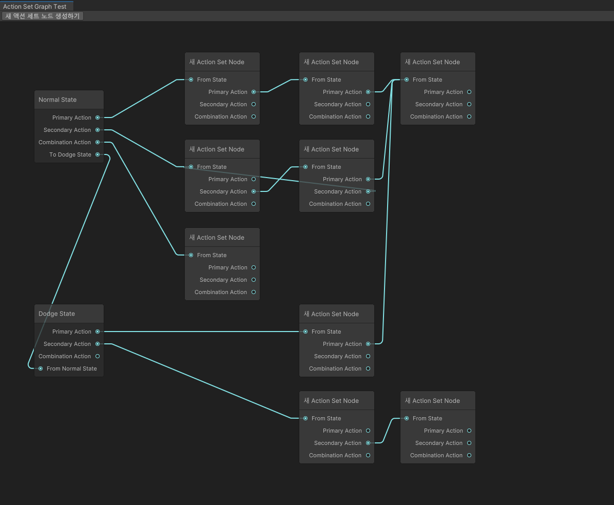

## 프로젝트 개괄



* **팀 규모**: 4명
* **직책**: 팀장, 메인 프로그래머, 전체 기획자
* **목표**: 공모전 제출(BIC)
* **게임 개요**:
	* Alien 프로젝트의 가제는 \<외계인 대책반\>으로, 귀여운 여고생 전사들이 지구를 침공한 미지의 외계인들에 용감하게 맞서 싸우는 3D 3인칭 액션 로그라이트 장르의 PC 게임

## 주요 기여 사항

### 게임 전체 기획 [^1]

게임의 전체 아이디어와 기획안을 작성하였고, 해당 기획에 따라 팀의 개발 일정을 주도하는 팀장 역할을 맡았습니다.

[^1]: 처음으로 기획서를 작성하며 팀 프로젝트이고 기획이 작업과 동시에 이루어져 전체를 공개하기에는 다듬어지지 않은 부분들이 많습니다. 때문에 이곳에는 게임의 개략적인 컨셉과 주요 기획 사안만을 작성합니다.

#### 시나리오 개괄

\<외계인 대책반\>은 3인칭 액션 로그라이트 장르의 PC 게임입니다. 

시나리오의 로그라인은 아래와 같습니다.

> 정체불명의 외계 기생생물 "기가스"가 지구를 침공한다. 연패를 거듭하던 인류는 이들의 일부가 인간 소녀들과 공생 관계를 이루고 싶어한다는 것을 알아낸다. 이렇게, 기가스와 공생하는 여고생들로 이루어진 특수부대 "여고생 대책반"이 구성되고, 인류의 반격이 시작된다.

\<신세기 에반게리온\>과 \<에일리언 9\>등을  크게 참고하여, 
1. *미지의 적과 싸우기 위해 선택받은 청소년을 전선에 보낸다.*
2. *미지의 적과 싸우기 위해 알 수 없는 적의 힘을 빌린다.*

위  두 요소를 서사적/시각적 테마의 큰 축으로 삼았습니다. 

이 게임이 타겟으로 하는 PC 게임 플랫폼 Steam에서 Y2K(소위 세기말 감성), 미소녀 등의 키워드가 크게 인기라고 분석하였고, 개인적으로도 꼭 다뤄보고 싶었던 주제였기 때문입니다.

플레이어블 캐릭터는 여고생과 여고생을 따르는 외계인 무기 "기가스"입니다.


여고생 캐릭터(좌)와 여고생을 따르는 도검형 외계인 무기(우)

외계인 무기들은 대검, 도끼, 대포 등 흔히 액션 게임에서 볼 수 있는 그것들이고, "살아있는" 무기이므로 게임을 플레이하면서 역동적으로 그 외형과 기능이 변화합니다.

#### 게임플레이 시스템 개괄

\<외계인 대책반\>의 시스템적 특장점은 다음과 같습니다.

플레이어의 입력에 정교하게 반응하는 액션 체계가 주어집니다. "회피", "공격" 등, 플레이어블 캐릭터가 취할 수 있는 다양한 액션이 존재하며, 각 액션은 이름이 구별되는 것 이상으로 경험되는 느낌이 다릅니다. 게임은 이러한 다양한 액션을 플레이어가 깊이 있게 이해하고, 적재 적소에 활용할 것을 요구합니다.

이 게임이 다른 게임과 구별되는 가장 독특한 점은, 이러한 "액션"을 무작위적으로 습득할 수 있다는 것입니다. 액션은 "액션 토큰"이라는 단위의 형태로 구분되어 있고, 게임을 시작하면 아주 기본적인 토큰만 주어집니다. 게임을 플레이하면서 액션 토큰을 무작위로 얻을 수 있고, 플레이어는 캐릭터의 "액션 세트"에 각 액션 토큰들을 배열하여 자신만의 액션 콤보를 만들 수 있습니다. 캐릭터마다 고유한 액션 세트가 주어지고, 액션 토큰들의 성능은 상황에 따라, 획득한 다른 액션 토큰들이 액션 세트에 배열된 맥락에 따라 달라집니다.



액션 토큰의 예시



'블레이더' 캐릭터의 액션 세트의 예시

때문에 플레이어는 게임을 플레이 하면서 다양한 액션 토큰들을 획득하여, 이들을 상황에 맞게 조합해 자신만의 액션 맵을 지닌 캐릭터를 육성하면서, 로그라이트의 런(Run)을 완료하는 것을 목표로 하게 됩니다.

이러한 기본 골격 외에, 에너미 시스템, 액션 토큰 및 액션 세트 기획, 상태 이상 시스템 등 많은 것들을 기획하였습니다.


## 캐릭터 시스템 작성 및 애니메이션 적용

<iframe width="560" height="315" src="https://www.youtube.com/embed/dN3sstEcAsE?si=VfxIelOArk4sfVxa" title="YouTube video player" frameborder="0" allow="accelerometer; autoplay; clipboard-write; encrypted-media; gyroscope; picture-in-picture; web-share" referrerpolicy="strict-origin-when-cross-origin" allowfullscreen></iframe>

더미 애니메이션 프로토타입

플레이어의 입력에 다채롭게 반응하는 캐릭터 시스템을 작성하는 것이 목표였습니다. 

예를 들어, 플레이어가 키를 살짝 눌렀을 때, 길게 눌렀을 때, 갑자기 다른 키를 눌렀을 때와 같은 각기 다른 상황에 풍부한 피드백이 있었으면 좋겠다고 생각했습니다. 

핵심 코드는 아래와 같습니다.

```csharp
protected override void Move()
{
	if (IsDesiredToMove)
	{
		_decelDir = Vector3.zero;
		_velocity += _accelDir * _accelMag * Time.deltaTime;

		TryClampMaxVelocity();
	}
	else
	{
		_accelerationDir = Vector3.zero;
		if (IsMoving)
		{
			_accelDir = Vector3.zero;
			_decelDir = -1 * _velocity.normalized;
			_velocity += _decelDir * _decelMag * Time.deltaTime;

			TryClampMinVelocity();
		}
		else
		{
			_decelDir = Vector3.zero;
		}
	}

	if (IsMoving)
	{
		_characterController.Move(_velocity * Time.deltaTime);
	}
}
```

플레이어가 월드에 복잡한 물리적 영향을 끼칠 필요는 없었으므로, `Rigidbody`가 아닌 `CharacterController`를 기초로 하여 개발했습니다.

영상에서는 `_velocity`와 크게 다른 방향의 입력이 들어오는 경우 캐릭터 애니메이션이 입력 방향과 `_velocity` 방향의 차에 비례하여 살짝 Pivoting 되는 것까지 구현되어 있습니다.

<iframe width="560" height="315" src="https://www.youtube.com/embed/fuZlXEv7Pgw?si=PfUfqEm7Zti2Oxkf" title="YouTube video player" frameborder="0" allow="accelerometer; autoplay; clipboard-write; encrypted-media; gyroscope; picture-in-picture; web-share" referrerpolicy="strict-origin-when-cross-origin" allowfullscreen></iframe>

이후에는 애니메이션 세트를 구매하여 진행하였고, 기존의 Pivoting 애니메이션 로직은 구매한 애니메이션과 어울리지 않아 폐기하였습니다. 

## 캐릭터 - 에너미 프레임워크 / AI 설계

Unreal Engine의 [게임플레이 프레임워크](https://dev.epicgames.com/documentation/ko-kr/unreal-engine/gameplay-framework-in-unreal-engine)를 참고하였습니다. 게임 월드에 배치된 폰(Pawn)이 *컨트롤러의 의지*라는 추상화된 명령을 기반으로 작동하도록 하여, AI Enemy의 로직과 플레이어 캐릭터의 로직의 재사용성을 높였습니다.

예를 들어 폰의 움직임을 담당하는 컴포넌트인 `MoveAction`은 이 시스템에서 *입력* 을 *이동 행동* 으로 번역하는 것이 아니라, *추상화된 컨트롤러의 지시*를 *이동 행동*으로 번역합니다. 때문에 `MoveAction` 컴포넌트의 함수성을 Enemy와 Character 모두에게 쉽게 적용할 수 있었습니다.



작동 구조를 다이어그램으로 표현하면 위와 같습니다.



컨트롤러들의 클래스 다이어그램은 위와 같습니다. 구체 컨트롤러들은 자신이 빙의한 폰이 다음에 어떤 행동을 할 지 판단하고, 자신이 소유한 폰에게 명령을 내립니다.

Pawn은 아래와 같이 `Character`와 `EnemyBase`로 나뉩니다.



`EnemyBase`는 게임에서 표현될 모든 적 개체의 기초 클래스입니다. 적 개체는 기본적으로 하나의 감각 기관(`SensorBase`)을 가지고 있고, 이 감각 기관을 통해 게임 월드에서 자신이 알아야 할 정보를 받아들입니다. 

예를 들어, 감각 기관 "눈"을 통해 캐릭터의 위치를 감지하고, 해당 정보를 자신을 제어하는 `AIController`에게 보내, 다음 행동에 대한 판단을 내리도록 합니다.



`SensorBase`는 모든 AI 감각 기관의 기초 클래스입니다. 이 클래스에서 유도되는 구체 클래스들은, *주시 대상(Tracking Target)* 의 인지 상황(`Found`, `Empty`, `Lost`)에 맞는 이벤트를 발생시켜야 합니다. 

예를 들어, 시각을 의미하는 감각 컴포넌트인 `Vision`은 부채꼴 내부에 대상들이 존재하는지, 존재한다면 중간에 장애물이 있는지 확인하여, 주시 대상을 감각할 수 있는 상태인지 판단하고 맞는 이벤트를 발생시킵니다.

<iframe width="560" height="315" src="https://www.youtube.com/embed/Mg-cqosl_gk?si=HWFAsTVfga8xf2R6" title="YouTube video player" frameborder="0" allow="accelerometer; autoplay; clipboard-write; encrypted-media; gyroscope; picture-in-picture; web-share" referrerpolicy="strict-origin-when-cross-origin" allowfullscreen></iframe>

`AIController`는 자신이 빙의한 `EnemyBase`가 정확히 어떤 타입인지 몰라도 되고, 그 `EnemyBase`가 어떤 과정을 통해 주시 대상을 인지하게 되었는지도 몰라도 됩니다. 대신에 단순히 월드 위에 배치된 `EnemyBase`의 인지 정보를 받아들여 해당 정보를 처리하여 다음에 어떤 행동을 취할 것인지 결정하고, 빙의한 `EnemyBase`에게 명령을 내립니다.

<iframe width="560" height="315" src="https://www.youtube.com/embed/7mBNiVyho0Y?si=gd1Z51MlYtiwOFbu" title="YouTube video player" frameborder="0" allow="accelerometer; autoplay; clipboard-write; encrypted-media; gyroscope; picture-in-picture; web-share" referrerpolicy="strict-origin-when-cross-origin" allowfullscreen></iframe>

상기 시스템으로 구성된 Enemy와 Character의 예. `MoveAction` 컴포넌트를 재사용하여, 똑같은 시스템으로 구동되는 영상입니다.


## 에너미 캐릭터 모델링 + 애니메이션 작업


<iframe width="560" height="315" src="https://www.youtube.com/embed/2CD5fHXqrN0?si=UjhkCg3Xj9RT0FmT" title="YouTube video player" frameborder="0" allow="accelerometer; autoplay; clipboard-write; encrypted-media; gyroscope; picture-in-picture; web-share" referrerpolicy="strict-origin-when-cross-origin" allowfullscreen></iframe>

<iframe width="560" height="315" src="https://www.youtube.com/embed/FGk9ZIb7RTA?si=2QDOIp60Ob24nEuz" title="YouTube video player" frameborder="0" allow="accelerometer; autoplay; clipboard-write; encrypted-media; gyroscope; picture-in-picture; web-share" referrerpolicy="strict-origin-when-cross-origin" allowfullscreen></iframe>

게임에 등장할 에너미의 비주얼 컨셉을 잡고, 모델링과 리깅을 진행하고, 애니메이션을 만들어 게임에 적용햐였습니다.

## [실패] 액션 세트 에디터 작성



Unity의 UI Toolkit을 이용해, 노드 방식으로 캐릭터의 액션 세트를 편집하고, 저장하고 로드한 후 런타임에 수정하는 시스템을 구축할 계획이었습니다.

액션 세트와 토큰을 모두 Scriptable Object로 표현하여 에디터 시점과 런타임 시점에서 관리가 용이하도록 만들 계획이었으나, 공모전 마감 기한을 맞출 수 없을 것 같았고, 팀 내 두명의 개발자 모두 UI Toolkit 에 대한 이해도가 부족한 상황에서 너무 섣부르게 욕심을 냈던 것 같습니다.

이 경험을 통해 *가능해 보이는 일*과 *가능한 일*은 서로 아주 멀리 떨어져 있으며, 개발 과정에서 *가능해 보이는 일*을 기준으로 의사 결정을 내릴 때에는 매우 보수적으로 접근해야 한다는 사실을 배웠습니다.