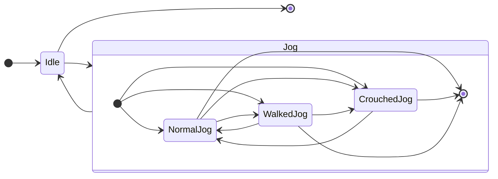
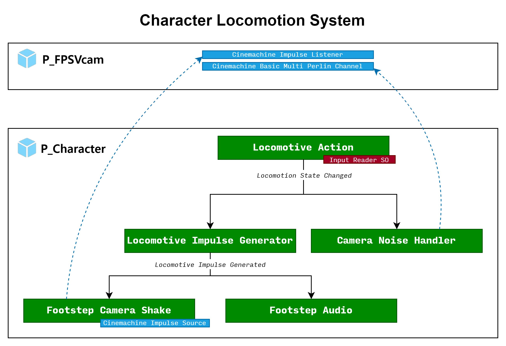
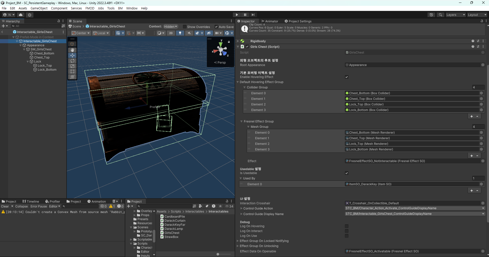
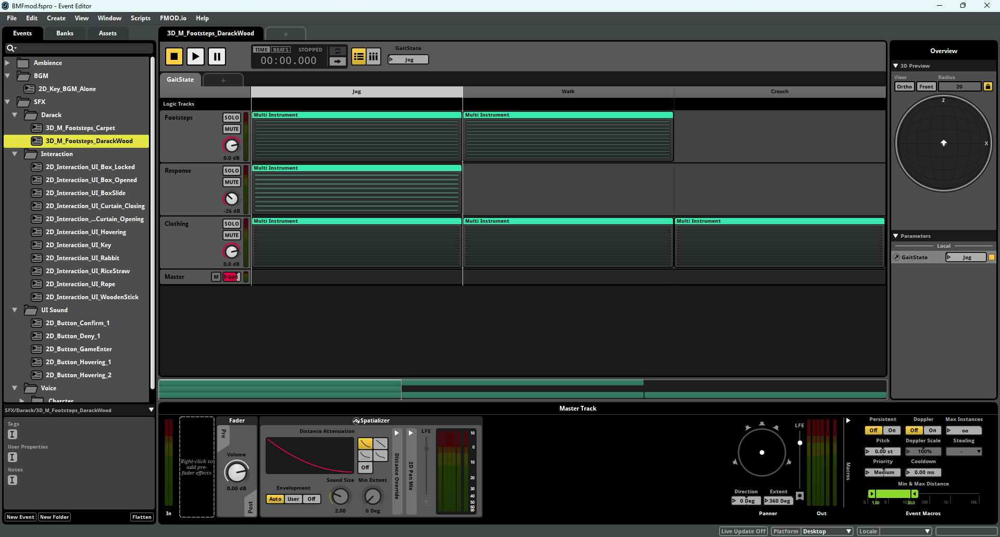
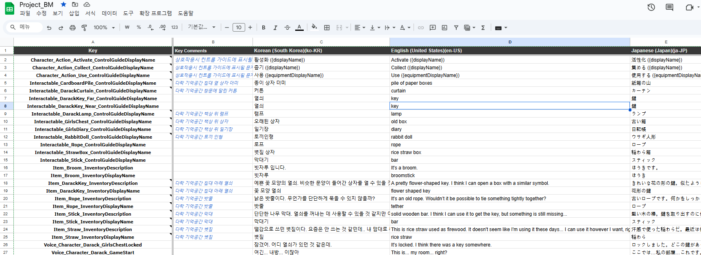
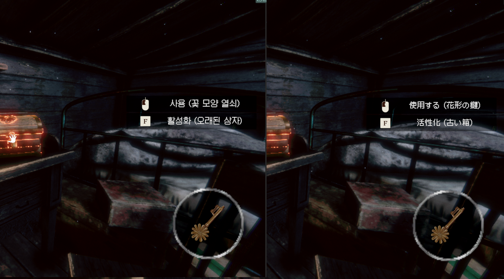
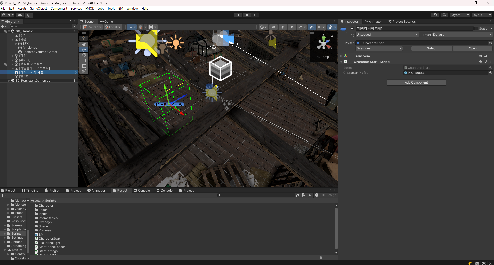
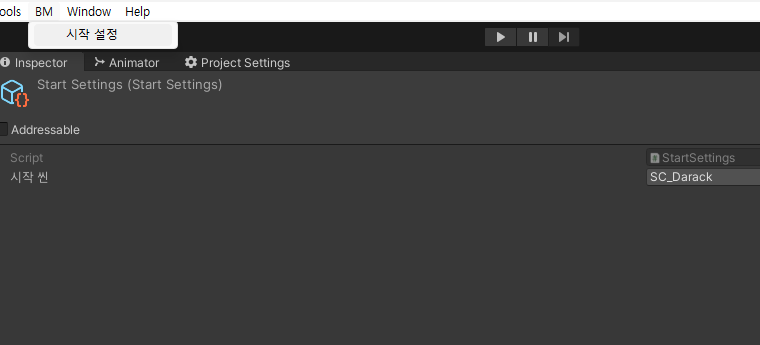
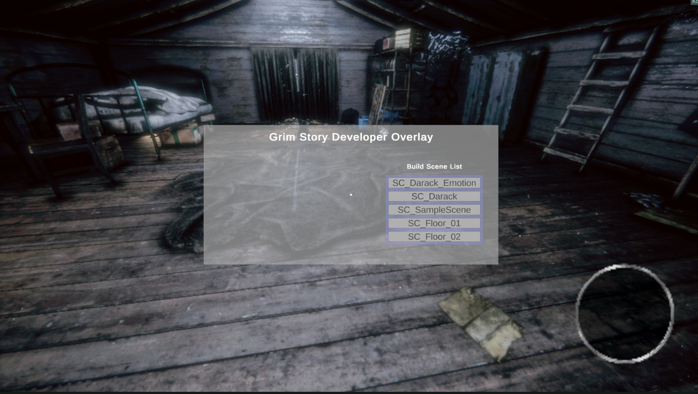

<iframe width="560" height="315" src="https://www.youtube.com/embed/EZtdZAEcpg8?si=08tsFxncRMNzdaYe" title="YouTube video player" frameborder="0" allow="accelerometer; autoplay; clipboard-write; encrypted-media; gyroscope; picture-in-picture; web-share" referrerpolicy="strict-origin-when-cross-origin" allowfullscreen></iframe>

## 프로젝트 개괄

* **팀 규모**: 7명
* **직책**: 메인 프로그래머, PM
* **목표**: 공모전 제출, Itch.io와 Steam에 게임 데모 출시
* **기술 사양**
* **게임 개요**:
	* 1인칭 시점의 공포 테마 방 탈출 게임
	* 선형적인 스토리와 영화같은 연출을 부각
	* 동일한 게임 공간을 두 가지 다른 테마에서 플레이하는 것이 특징

## 주요 기여 사항

### 1인칭 캐릭터 컨트롤러 구현



캐릭터의 이동 상태를 효율적으로 관리하고, 각 상태에 따라 다양한 이동 효과(예: 발소리, 카메라 떨림 효과)를 유연하고 체계적으로 적용할 수 있는 구조를 설계하는 것이 목표였습니다.

이를 위해 메인 이동 컴포넌트 `LocomotiveAction`의 4가지 배타적 이동 상태와 그에 따른 행동들을 명확히 선별하고 관리하였습니다. 또한, 해당 상태들의 변경  시점을 다른 컴포넌트들이 쉽게 인지할 수 있도록 관찰자 패턴을 적용하였습니다.


Locomotion 시스템의 개괄

이동 상태가 변경되면 이동에 따른 충격의 강도와 빈도가 동적으로 조정됩니다. 충격 발생을 처리하는 컴포넌트는 관찰자 패턴을 통해 해당 정보가 필요한 다른 컴포넌트에게 알립니다. 카메라 충격이나 발소리 재생과 같은 구체적인 효과를 담당하는 컴포넌트는 이를 구독하면서 자신의 효과를 적용합니다. 이러한 구조는 컴포넌트간 결합도를 낮추고, 새로운 효과를 추가하거나 기존 효과를 수정 및 제거하는 작업을 용이하게 만들어 주었습니다. 

또한 캐릭터의 이동에 관련된 데이터들은 ScriptableObject로 관리하여 에디터에서 데이터를 쉽게 수정할 수 있도록 하였고, 이를 기반으로 플레이 테스트를 주도했습니다. 이러한 접근은 데이터와 로직을 명확히 구분하여 협업 과정에서의 효율성과 유연성을 크게 향상시키는 데에 기여하였습니다.

구체적인 효과 구현에는 Unity의 `Cinemachine` 관련 컴포넌트들을 적극 활용하였습니다. `CinemachineImpulseSource`로 카메라의 순간적인 흔들림의 진폭과 파형, 방향을 직관적으로 조작할 수 있게 했고, `CameraNoiseHandler`를 통해 `Cinemachine`의 Noise Channel에 Perlin Noise를 주는 방식으로 상시 존재하는 화면 흔들림 효과를 구현했습니다.

이러한 설계는 카메라 흔들림을 하드코딩하는 것보다, 에디터에서 쉽게 수정하고 테스트할 수 있는 환경을 제공했습니다. 

<iframe width="560" height="315" src="https://www.youtube.com/embed/wIU7-DIbJHs?si=O6OLzsyhpoMB1-HY" title="YouTube video player" frameborder="0" allow="accelerometer; autoplay; clipboard-write; encrypted-media; gyroscope; picture-in-picture; web-share" referrerpolicy="strict-origin-when-cross-origin" allowfullscreen></iframe>

각 상태별 이동 충격의 발생을 디버그 모드에서 시각화하는 영상

### 상호작용 시스템 구현

조준자로 검출한 오브젝트와 상호작용할 수 있는 시스템을 구현했습니다.

상호작용 시스템은 기획서가 가장 많이 변경되었고, 현재의 모습은 초기 구상한 모습이 거의 남아있지 않습니다. 계속해서 변경되는 기획에 최대한 유연하게 대응할 수 있는 하는 시스템을 만드는 것이 목표였습니다.

상호작용 시스템은 기획서가 가장 많이 변경되었으며, 중간에 거의 처음부터 다시 작성되기도 하였습니다.

상호작용 시스템 기획의 개괄은 아래와 같습니다. 

* `활성화`: 오브젝트가 가진 고유 기능을 작동시키기
* `수집`: 오브젝트를 캐릭터의 인벤토리에 넣기
* `사용`: 캐릭터의 인벤토리에 있는 오브젝트를 캐릭터의 손에 장착하고 다른 오브젝트에 사용하기

위 개념을 처음에는 그대로 게임의 구조에 적용하였으나, 기획의 잦은 수정과 의미 변경에 유연하게 대응하기 어려웠습니다. 
처음에는 `활성화`와 `수집`이 배타적인 속성으로 간주되었으나, 개발이 진척되면서 `활성화`와 `수집`의 요소를 동시에 갖는 오브젝트들이 등장했습니다.

예를 들어, '볏짚'은 처음에는 `수집` 가능한 오브젝트였습니다. 이 말은 월드에 '볏짚' 아이템이 존재하고, 이 아이템과 상호작용하면 '볏짚' 아이템은 월드에서 사라지면서, 인벤토리용 '볏짚' 아이템을 캐릭터의 인벤토리에 추가했습니다. 처음에 `수집`은 기획의 내용을 그대로 반영하여, `Collect`라는 한 번의 메서드 호출로 상호작용시 자기 자신을 씬에서 삭제하고, 캐릭터의 인벤토리에 지정한 아이템을 추가하도록 구현했습니다. 하지만 개발이 진척되면서 '볏짚' 아이템은 '볏짚통'에 들어있는 아이템으로 바뀌었고, 플레이어는 '볏짚통'과 상호작용하고, 그 결과로 '볏짚통'은 텅 비어있는 모델로 바뀌게 되고 캐릭터의 인벤토리에 '볏짚'을 추가하는 것으로 바뀌었습니다. 이러한 상호작용 아이템들의 목록이 상세한 기획서가 모두 구비된 것이 아니었어서, 기획자의 요구사항을 파악하고 유연하게 대응할 수 있도록 하는 것을 최우선으로 하여 상호작용 객체들의 기초 클래스를 설계하는 것에 집중하였습니다.

저는 상호작용의 기획적 개념들을 `Interact(활성화 + 수집)` 과 `Use` 라는 구체적인 2개의 개념으로 재정의한 후 구현하였습니다. 

또한 상호작용 가능한 오브젝트의 다음과 같은 문제를 해결해야 했습니다.

* 상호작용 오브젝트는 $n(n \geq 1)$개의 `MeshRenderer`가 계층 구조를 형성하고 있을 수 있다.
* 상호작용을 감지하는 콜라이더의 형태는 상호작용 오브젝트의 메쉬의 형태와 관련이 없을 수도 있다.
* 여러 상호작용 오브젝트들끼리 공유하는 상태가 존재하기는 하지만, 전이하는 상태와 행동이 기본적으로 매우 다르다.



상호작용 오브젝트 `GirlsChest`의 예시

  

<iframe width="560" height="315" src="https://www.youtube.com/embed/jboTbFeA7Ys?si=RhgfaL5SJVG6ItEp" title="YouTube video player" frameborder="0" allow="accelerometer; autoplay; clipboard-write; encrypted-media; gyroscope; picture-in-picture; web-share" referrerpolicy="strict-origin-when-cross-origin" allowfullscreen></iframe>

상호작용 시스템

### FMOD Unity를 활용한 사운드 시스템 구축

사운드 디자이너 분과 게임에서 더 질좋은 사운드 경험을 위해 FMOD Unity를 사용하기로 협의하였습니다.  FMOD Event 디자인의 일부에 참여하였고, 전체 게임의 사운드 프로그래밍을 담당하였습니다.



바닥의 재질과 이동 상태에 따라서 다른 발소리 세트를 재생하도록 디자인된 FMOD Event의 예시

FMOD Unity를 사용하는 것은 디자이너 분과 저 모두 처음이었지만, 서로 주도적으로 학습한 후 워크플로우를 구축하였습니다. 그래서 작업 영역이 서로 충돌하지 않으면서, 서로의 피드백이 빠르게 반영되어 멋진 작업물이 나올 수 있어 기뻤습니다.


<iframe width="560" height="315" src="https://www.youtube.com/embed/b9WOPtTx5T4?si=K8wXhzubScijbV1x" title="YouTube video player" frameborder="0" allow="accelerometer; autoplay; clipboard-write; encrypted-media; gyroscope; picture-in-picture; web-share" referrerpolicy="strict-origin-when-cross-origin" allowfullscreen></iframe>

발소리 시스템

* 플레이어가 입력을 하면 즉각적으로 발소리가 재생됩니다.
	* 하지만, 현재 이동 상태(기본, 앉기, 걷기)가 허용하는 발소리 간격보다 짧게 발소리를 재생하지는 않습니다.
* 한 번의 이동 충격에 발소리는 랜덤한 세트 중에 하나가 재생됩니다. 그리고, 지정된 확률에 기반하여 발소리에 대한 반응 소리의 세트중 랜덤한 하나가 재생될지의 여부도 결정됩니다. (나무 바닥을 밟아 *끼이이익*하는 소리)
* 캐릭터의 이동 상태와 캐릭터가 이동하는 바닥에 재질에 따라 발소리는 다릅니다.
* 캐릭터의 기본 발소리의 이벤트 인스턴스는 게임을 시작하면 생성되고, 게임을 종료하면 파괴됩니다. 재질에 따른 발소리는 캐릭터가 재질을 나타내는 볼륨에 입장하면 생성되고, 탈출하면 파괴됩니다.

이에 더해, 단발성 오브젝트 3D 효과음, 앰비언스와 UI 2D 효과음들을 작업하였습니다.

### Localization 협업 시스템 구축

Unity의 Localization 패키지를 이용하여 스트링 테이블로 최종 플레이어에게 전달되는 모든 문자열을 관리하였습니다. 그리고 해당 문자열 테이블을 Google SpreadSheet로 Push / Pull 할 수 있게 만들어 기획자분들이 쉽게 내용을 변경하고 게임에 적용할 수 있게 시스템을 구축하였습니다.



Google Sheet 사용한 Localization String 워크플로우

다음처럼 중첩된 Smart String을 적용하여 Localized UI를 구현하였습니다.



Localization이 최종적으로 인게임에 구현된 모습

### 개발 편의를 위한 에디터 도구 개발

저희 게임은 카메라와 캐릭터 등, 씬 전환에 따라 언로드되면 안 되는 오브젝트들이 존재하는 상주 씬(PersistentGameplay) 에 월드 씬을 Additive로 로드하는 구조로 작동합니다. 

저희는 커밋을 하기 전에 빌드를 해서 문제없이 돌아가야 한다는 규칙이 있었는데요, 비개발 직군이 해당 테스트를 쉽게 진행하기 위해 에디터 ~ 빌드게임 간 스크립트를 작성했습니다.


모든 씬의 시작 지점을 테스트해 볼 수 있는 Character Start

`CharacterStart` 클래스는 Unreal Engine에서 작업했던 경험을 되살려 작성하였습니다. 에디터에서 작동할 때, 상주 씬이 중첩 로드되지 않아 있다면, 이 오브젝트는 상주 씬을 자동으로 중첩 로드하고 자신이 속한 씬을 활성 씬으로 만든 후, 상주씬의 캐릭터 오브젝트의 트랜스폼을 자신의 트랜스폼과 일치시킵니다.

빌드 게임에서는 약간 다르게 작동합니다. 
상주 씬에 게임의 시작 월드 씬을 로드하는 로직이 들어있기 때문에, 상주 씬은 게임에서 가장 먼저 로드되어야 하고, 빌드 인덱스 0번이어야 합니다. 이를 비개발 팀원에게 이해시키는 것은 어렵고 필요하지도 않았기 때문에 상주 씬의 빌드 인덱스를 강제로 0번으로 만드는 `PreBuilder` 네이티브 C# 클래스를 작성하였습니다.

```csharp
using System.Linq;

using UnityEditor;
using UnityEngine;

namespace BM.Editors
{
/// <summary>
/// 유니티 에디터에서 빌드 버튼 눌렀을 때의 이벤트를 후킹하여 스크립트 추가.
/// 상주 씬의 빌드 인덱스를 강제로 0으로 만든다. 빌드 설정에 상주 씬이 없으면, 빌드를 중지한다.
/// TODO: 추후 게임이 형태를 갖춰가면 변경
/// </summary>
/// <remarks> 로그는 %LOCALAPPDATA%/Unity/Editor 에서 확인할 것 </remarks>
[InitializeOnLoad]
public static class PreBuilder
{
	private static readonly string m_pSceneName = "SC_PersistentGameplay";

	static PreBuilder()
	{
		BuildPlayerWindow.RegisterBuildPlayerHandler(OnClickingBuild);
	}

	private static void OnClickingBuild(BuildPlayerOptions options)
	{
		Debug.Log("[BM.PreBuilder] 빌드 후킹 프로세스 시작");

		var scenes = EditorBuildSettings.scenes.ToList();
		var pSceneIndex = 
			scenes.FindIndex(scene => scene.path.Contains($"{m_pSceneName}"));

		Debug.Log($"{m_pSceneName}의 빌드 인덱스는 {pSceneIndex} 입니다.");

		// 상주 씬이 발견되지 않음
		if (pSceneIndex < 0)
		{
			var label = 
				$"File > Build Settings 에 {m_pSceneName} 씬이 없습니다.";

			EditorUtility.DisplayDialog(
				"[BM.PerBuilder] 빌드 오류", label, "알겠습니다. (빌드를 중단합니다)"
			);

			Debug.Log(label);

			return;
		}

		// 상주 씬이 발견되었고, 정상 설정
		else if (pSceneIndex == 0)
		{
			Debug.Log($@"[BM.PreBuilder] {m_pSceneName} 씬이 이미 빌드 오더 0이었기 때문에, 
			기본 설정으로 빌드를 시작합니다.");

			BuildPlayerWindow.DefaultBuildMethods.BuildPlayer(options);
		}
		// 상주 씬이 발견되지 않았고, 비정상 설정
		else
		{
			var pScene = scenes[pSceneIndex];

			scenes.RemoveAt(pSceneIndex);
			scenes.Insert(0, pScene);

			options.scenes = scenes.Select(scene => scene.path).ToArray();

			Debug.Log($@"[BM.PreBuilder] {m_pSceneName} 씬이 빌드 오더 0이 아니었기 때문에, 
			빌드 오더 0으로 만들었습니다.");

			if (!pScene.enabled)
			{
				pScene.enabled = true;
				Debug.Log($@"[BM.PreBuilder] {m_pSceneName} 씬이 빌드 설정에서 활성화 되지 
				않았기 때문에, 활성화 시킵니다.");
			}

			BuildPlayerWindow.DefaultBuildMethods.BuildPlayer(options);
		}
	}
}
}
```


Start Scene Selector

또한 빌드 게임의 진입 월드 씬을 설정할 수 있도록 에디터 전용 메뉴를 만들었고, 해당 메뉴에서 Scriptable Object의 내용을 수정하는 방식으로 상주 씬이 빌드 게임의 시작 시점에 어떤 씬을 로드할 지 결정할 수 있도록 만들었습니다. 상주 씬의 `SceneLoadManager`가 해당 Scriptable Object에 기록된 씬을 게임 시작 시점에 로드하고, 해당 씬의 `CharacterStart`를 찾아 플레이어를 이동시키고 초기화합니다.


Developer Overlay

이에 더해 여러 씬의 테스트를 빌드 게임에서 편하게 만들기 위해, Developer Overlay를 만들어 빌드 게임에서 씬 전환을 쉽게 만들었습니다.
다른 팀원들, 특히 비개발 팀원들에게 반응이 좋았던 기능입니다.
