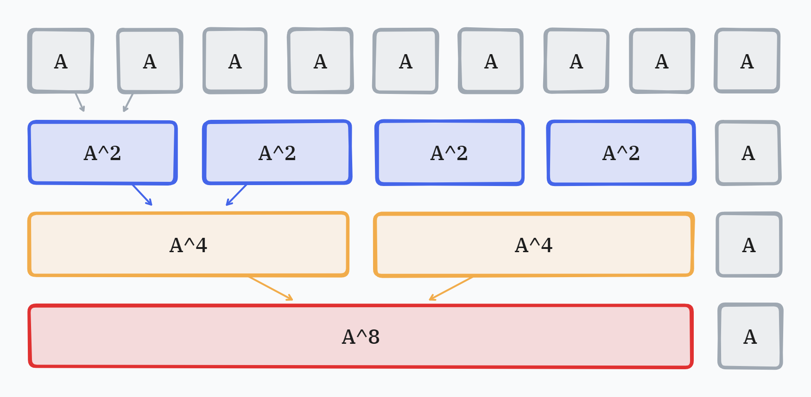

# 접근

## 완전 탐색으로 생각하기

작성한 알고리즘이 $O(B)$여도  $10^{12}$의 연산을 하게 되므로 제한 시간인 1초를 벗어나게 된다. 때문에  나이브하게 곱셈을 $B$번 반복하는 것으로 풀이해서는 안된다.

또한 행렬 곱셈에 $O(N^3)$이 소요된다. 행렬 곱셈 자체가 가장 부담되는 연산이므로, 이 곱셈 연산 수 자체를 줄이는 것으로 알고리즘 방향을 잡아야 한다.

## 곱셈 짝짓기

곱셈을 뭉텅이로 *두 개씩* 짝짓는다면 어떨까? $A^9$를 예로 들어보자.

* $A$를 9번 누적해서 곱하면, 말 그대로 $A$를 9번 곱하는 것이므로 연산 횟수는 9번이다.
* 만일 $A^2$을 구한 후에, $A^2$을 4회 누적하여 곱한 후, 그 결과에 $A$를 다시 한 번 곱하면 연산 횟수는 5회이지만 $A^9$를 구할 수 있다.
* 만일 $A^2$을 구한 후, 그 결과로 $A^4$를 구한 후, 그 결과로 $A^8$을 구한 후, 그 결과에 $A$를 다시 한 번 곱하면, 연산 횟수는 4회이지만, $A^9$를 구할 수 있다.

그림으로 표현하면 아래와 같다.



식으로 표현하면 아래와 같다.

$A^9 = A \cdot A^8 = A \cdot (A^4)^2 = A \cdot ((A^2)^2)^2 = A \cdot ((A\cdot A)^2)^2$

연산 횟수가 9회에서, $\log_{2}{(9-1)} + 1$회로 줄어들었다.

이를 일반화해보자. $A^n$을 구하는 함수 $f(A,n)$은 다음과 같이 정의할 수 있다.

$$
f(A, n) =
\begin{cases}
A                 & \text{if } n = 1 \\\
f(A, \frac{n}{2})^2 & \text{if } n \text{ is even} \\\
A \cdot f(A, n - 1) & \text{if } n \text{ is odd}
\end{cases}
$$

복잡도는 $O(N^3\log{B})$이다.

이를 그대로 한번 코드로 옮겨 보자.

우선 행렬 곱셈 함수인 `mul`은 아래와 같다.

```cpp{lineNos=false}
using mat_t = vector<vector<long long>>;

mat_t mul(const mat_t& l, const ma_t& r) {
  mat_t ret(l.size(), vector<long long>(l.front().size(), 0));

  for (int i = 0; i < N; ++i) {
    for (int j = 0; j < N; ++j) {
      for (int k = 0; k < N; ++k) {
        ret[i][j] += l[i][k] * r[k][j];
      }
    }
  }
  
  return ret;
}
```

> [**참고**] 보면 알겠지만 `mul`은 `for`문이 3번 중첩된 흉측한 $N^3$의 함수이므로, ==우리가 이런 짓을 하는 것은 모두 다 이 `mul`의 호출 횟수를 줄이기 위함이다.==

행렬 지수승 최적화 재귀 함수는 아래와 같다.

```cpp{lineNos=false}
mat_t f(const mat_t& A, long long n) {
  // 기저 사례
  if (n == 1) {
    return A;
  }

  // 지수가 짝수
  if (n % 2 == 0) {
    // 결과를 재사용하기 위해 변수에 저장
    mat_t half = f(A, n / 2);
    return mul(half, half);
  // 지수가 홀수
  } else {
    return mul(A, f(A, n - 1));
  }
}
```

> [**참고**] **결과를 재사용**하기 위해 `half`에 저장하여 `mul(half, half)`처럼 작성한 것을 주의한다. 만일 `half`를 사용하지 않고 `mul(f(A, n / 2), f(A, n / 2))`를 하면 그냥 곱셈을 계속해서 반복한 것과 다름없는 연산 횟수가 되어버린다.

예를 들어 $A^{11}$의 경우 다음과 같이 재귀가 호출된다.

* ```cpp{lineNos=false}
  f(A, 11) = mul(A, f(A, 10));
  ```
  * ```cpp{lineNos=false}
    // f(A, 10)
    half = f(A, 5)
    f(A, 10) = mul(half, half);
    ```
    * ```cpp{lineNos=false}
      f(A, 5) = mul(A, f(A, 4));
      ```
      * ```cpp{lineNos=false}
        // f(A, 4)
        half = f(A, 2);
        f(A, 4) = mul(half, half);
        ```
        * ```cpp{lineNos=false}
          // f(A, 2)
          half = f(A, 1);
          f(A, 4) = mul(half, half);
          ```
          * ```cpp{lineNos=false}
            f(A, 1) = A; // 기저 사례
            ```

# 코드

코드는 재귀에서 반복을 사용하였고, 1000으로 나눈 나머지를 저장한다는 조건을 추가하였다.


