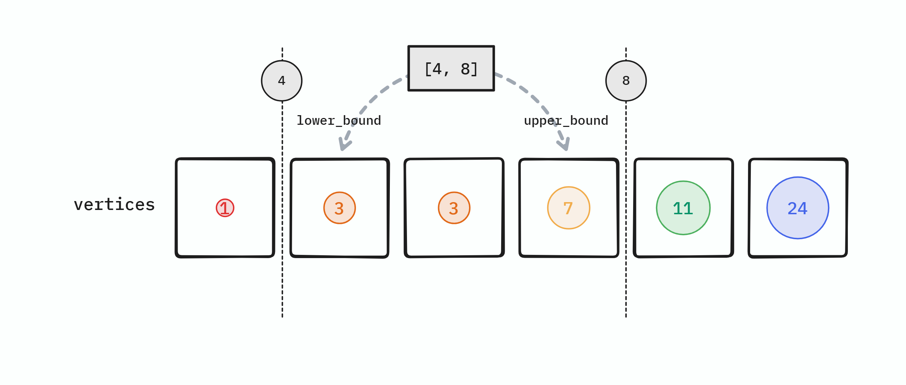

# 개요

어려운 문제는 아니지만 그렇기 때문에 완전탐색을 기반으로 한 초기 알고리즘을 최적화 해나가는 과정이 특기할 만 하기에, 리뷰 노트를 작성한다.

# 완전 탐색이 안 되는 이유 분석

완전 탐색 풀이는 매우 단순하다.

> * $M$개의 선분(범위) $r$에 대해서:
>    * $N$개의 각 점 $v$에 대해서
>        * $v$가 $r$에 포함되는지 확인하고 포함되면 기록한다.

여기서 시간 복잡도가 $O(M\cdot N)$임을 알 수 있으나, $N$과 $M$의 범위가 모두 최대 $10^5$이므로, **최악의 경우 총 $10^{10}$번의 연산** 을 하게 된다. 그리고 이는 약 10초이므로 주어진 제한 시간 1초를 훌쩍 뛰어넘는다.

## 완전 탐색 코드

아무튼 이렇게 풀이한 코드는 아래와 같으며 당연히 시간 초과가 발생한다.



자, 그럼 어떻게 해야 할까?

## 모든 좌표를 배열로 표현해 버리면 어떨까?

처음에 나는 가능한 좌표를 모두 배열로 만들어, 선분이 존재하면 `true`, 존재하지 않으면 `false`로 만드려고 하였다. 

하지만 좌표의 범위가 $10^{9}$까지이기에, 좌표 하나를 1 비트로 하더라도 125 메가바이트가 필요하다.

게다가 선분이 서로 겹칠 수 있으므로 사실 1 비트가 아니라 배열 한 칸이 $M$개 정보를 표현할 수 있어야 한다. 한 칸에 필요한 최소 비트 수는 대략 $\log{_2}{M}$이며, 역시 $M$의 범위로 보건데, $125 \cdot \log{_2}{M}$ 바이트는 문제에서 주어진 메모리 제한 256 메가바이트를 넘어선다.

# 이진 탐색

이 문제는 **구간(선분)에 포함되는 점의 개수** 를 요구한다.

$N$개의 점과 $M$개의 구간을 모두 순회하면 복잡도가 $O(NM)$이 되니, **점이나 구간 중 하나는 순회하면 안 된다.**
(그럴 수가 있나? 싶겠지만 그럴 수가 있다.)

점을 순회하겠다는 것은, $N$개의 점을 *하나 하나 확인* 하면서 구간 $r$에 포함 되는지 아닌지 확인하겠다는 것이다.

어떤 점이 구간 $r$에 포함되려면, 점의 좌표가 $r$의 시작보다 크거나 같고, $r$의 끝보다 작거나 같아야 한다.

> [**풀이의 핵심**]  
> 반대로 $r$의 **시작보다 크거나 같은 첫 점의 위치** 와, $r$의 **끝보다 큰 첫 점의 위치** 를 찾아낼 수 있다면, ==두 점의 위치 차==가 해당 구간에 속하는 점의 개수일 것이다. 이러면 점을 모두 순회하지 않고도 구간에 속하는 점의 개수를 구할 수 있다!

그러면 $r$의 시작보다 크거나 같은 첫 점의 위치와, 끝보다 큰 첫 점의 위치를 어떻게 찾을까?

이에 대한 유명한 알고리즘이 있으니, **이진 탐색** 이다.

이진 탐색을 사용하려면 정렬된 데이터셋이 필요하므로, 점들의 위치 배열 `vertices`를 다음처럼 정렬하자.  
정렬에는 당연히 $O(\log{N})$이 소요된다.

그리고, 선분을 $[start, end]$의 폐구간 $r$로 정의하자.

만일 `vertices`가 **정렬되어 있다** 면, 
* 이진 탐색을 이용하여 $start$ 이상의 첫 번째 요소의 위치(`upper_bound`) $s$를 $O(\log{N})$에 찾을 수 있다.
* 이진 탐색을 이용하여 $end$ 초과의 첫 번째 요소의 위치(`lower_bound`) $e$를 $O(\log{N})$에 찾을 수 있다.

$s$와 $e$ 사이 `vertices`의 요소 개수가, 주어진 구간에 속하는 점의 개수이다.
또한, 구간 하나에 점의 개수를 찾아내는데에 $O(\log{N})$이 소요되므로, 모든 구간에 대해서는 $O(M\log{N})$이 소요된다.

전체 복잡도는 정렬까지 포함하여 $O(N\log{N} + M\log{N})$이 되며, 초기의 완전 탐색 접근인 $O(MN)$에 비하면 매우 최적화되었다.

## 이진 탐색 코드

코드는 아래와 같다.



