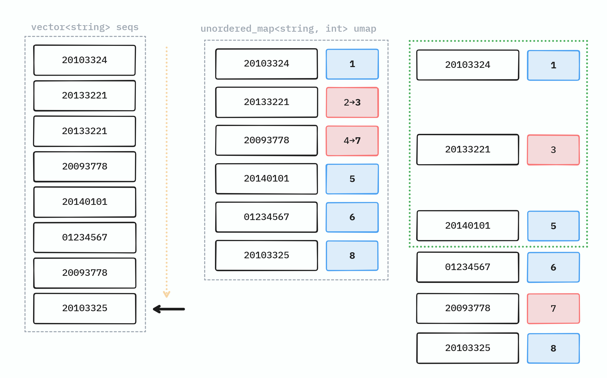

# 접근

## 완전 탐색으로

우선 잘 모르겠으므로 완전탐색으로 접근한다 생각해 봤을 때, 각 학번이 중복되었는지 매 순간 완전히 파악하려면 학번별로 $L$만큼 순회해야 하므로 벌써 복잡도가 $O(L^2)$이며, $L^2=10^{10}$이므로, 주어진 제한 시간 1초를 넘길 것이다.

$L$의 범위로 보건데, *한 번의 순회* 로 순서를 모두 알아내지 않는 이상, 시간 초과가 나는 문제이다.

## 한번의 순회로 순서를 다 결정하기 (1)

핵심은 학번을 키로 하는 해시 테이블을 만들고, 값으로 해당 학번의 최종 상대 순서를 저장하는 것이다.

클릭한 순서를 기록한 대기목록을 한번 순회하면서, `index`라는 카운터 변수를 한 번의 순회마다 증가시킨다.

```cpp
// 클릭한 순서를 기록한 대기목록
vector<string> seqs;

// 학번과 최종 상대 순서
unordered_map<string, int> umap;

int index = 0;

for (const string& num: seqs) {
  ++index;
  umap[num] = index;
}
```

이러면 중복된 것이 발견되더라도 항상 마지막 `index`로 업데이트 되기 때문에, 대기열의 끝으로 보낼 수 있다.

다이어그램으로 표시하면 아래와 같다.



왼쪽 `seq`의 원소를 하나 하나 순회하면서, `umap`의 키-값을 업데이트 해 나가면 된다.

이러면 마지막에 `umap`을 `vector`로 바꾼 후 **정렬**을 해 준 후에, 앞에서부터 `K`개를 출력해 주어야 한다.

복잡도는 클릭 대기열을 한 번 순회하는데 $L$, 정렬에 $L\log{L}$, 앞에서부터 $K$개 출력에 $K$가 드므로, $O(L + L\log{L} + K)$이고, 이는 대략 $O(L\log{L})$이다.

코드는 아래와 같다.



## 한번의 순회로 순서를 다 결정하기 (2)

다른 방법도 있다.

위 방식은 인덱스로 상대 순서만 관리하였는데, 리스트를 이용하여 실제 최종 대기열을 유지하는 방식으로 구현할 수도 있다.

> **[참고]** 중복되는 항목에 대해서 최종 대기열의 *중간* 에서 삭제가 빈번하게 일어나므로 `list`를 선택한다.

이 경우, 내가 중복된 경우 리스트의 정확히 어디를 지워야 하는지 기억하고 있어야 하므로, `unordered_map<string, list<string>::iterator>`를 사용한다.

클릭한 순서를 기록한 대기목록을 순회하면서:
* 처음 보는 학번의 경우, 리스트의 마지막에 추가한다.
* 처음 보는 학번이 아닌 경우, `unordered_map`에서 해당 학번이 리스트에서 어디에 위치했는지 반복자로 받아오고, 그 위치의 노드를 지운다. 그리고, 리스트의 마지막에 추가하고 해당 위치를 다시 `unordered_map`에 갱신한다.

이 경우 정렬이 필요 없고, 클릭한 순서 목록을 한 번만 순회하면 되므로 $O(L)$이다. [^1]

> **[?]** 하지만, 이상하게도 실제 제출시 시간은 더 오래 걸리는데, 아무래도 `list`의 캐시 미스 때문인 것으로 추정된다.

코드는 아래와 같다.



