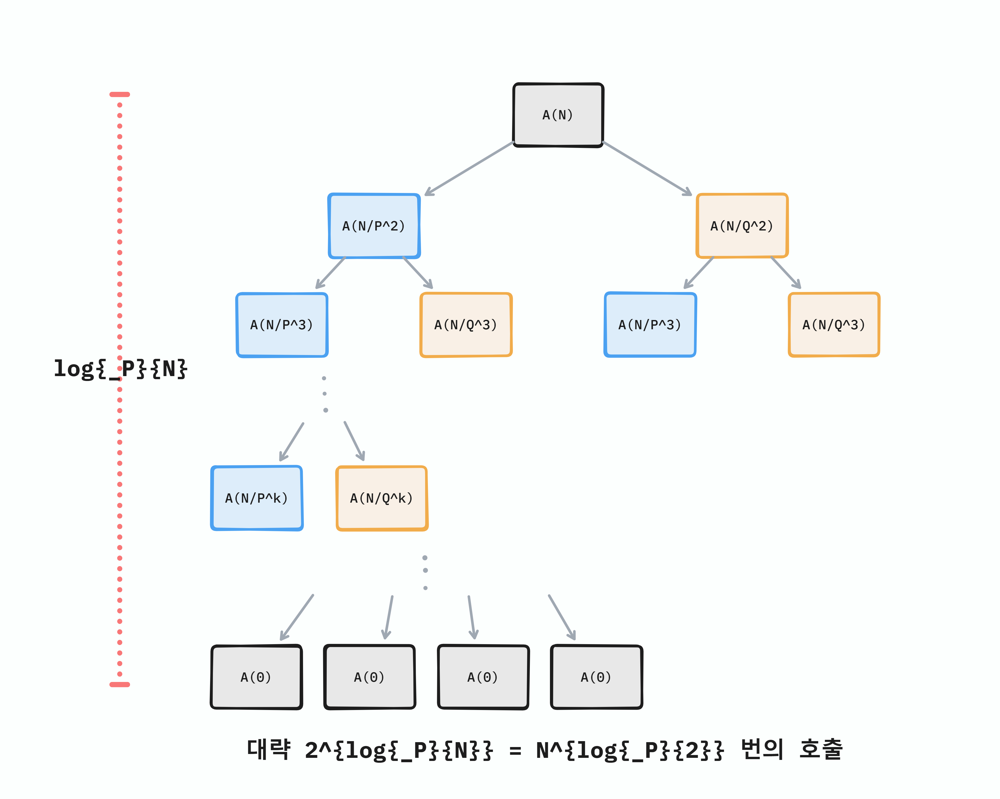

# 완전탐색 재귀로 접근

재귀함수를 쓰고 싶은 욕구를 참을 수 없게 하는 문제이다.
완전 재귀함수로만 풀이하면 복잡도가 어떻게 될까?

호출 트리를 그려보면 아래와 같다.

이 그림은 $P$를 기준으로 그렸지만, 어쨌든 재귀로 생성되는 부분 문제의 수는 대략 $2^{\log_{max(P,Q)}{N}}= N^{\log_{max(P,Q)}{2}}$이다.

그러므로 복잡도는 $O(N^{\log_{max(P,Q)}{2}})$인데, 최악의 경우 $N = 10^{12}$ 그리고 $P=2$,  $Q=2$인 경우 $O(10^{12})$이므로, 주어진 제한 시간을 초과할 확률이 높다.

# 재귀 호출 횟수를 줄이기 위한 두 가지 아이디어

이 문제를 현명하게 해결하기 위해서 두 가지 아이디어가 필요하다. 

## (1) 메모이제이션

첫 번째는 **메모이제이션** 을 사용해야 한다는 것이다.

위 호출 트리를 보면 알겠지만, *중복된 호출* 이 굉장히 많이 발생한다.

만일 중복된 호출에 대한 값을 캐싱할 수 있다면, 각 값은 딱 한번씩만 호출하여 계산하면 된다. 

그러면 복잡도는 깊이별로 하나의 노드의 값만 신경쓰면 되므로, $O(\log_{max(P,Q)}{N})$이 된다.

## (2) 해시 테이블 이용

하지만 여기서 또 하나의 함정이 있는데, $N$의 범위가 $10^{12}$ 까지이므로 단순히 배열을 이용해 모든 값을 캐싱하려면 주어진 메모리 제한인 128MB를 초과한다.

때문에 두 번째 아이디어가 필요하다. 

조금만 생각해 보면 $A_N$를 구하기 위해서, $N$이하의 모든 수 $i$에 대해 모든 $A_i$를 알 필요는 없다는 것을 발견할 수 있다.

간단하게, $A_{N-1}$은 어디에서도 사용되지 않지 않는가?

그러므로 메모이제이션을 위한 자료구조로 전체 값을 저장하기 위한 배열이 아니라, 특정 값만 저장할 수 있는 해시 테이블을 사용한다.

# 코드



