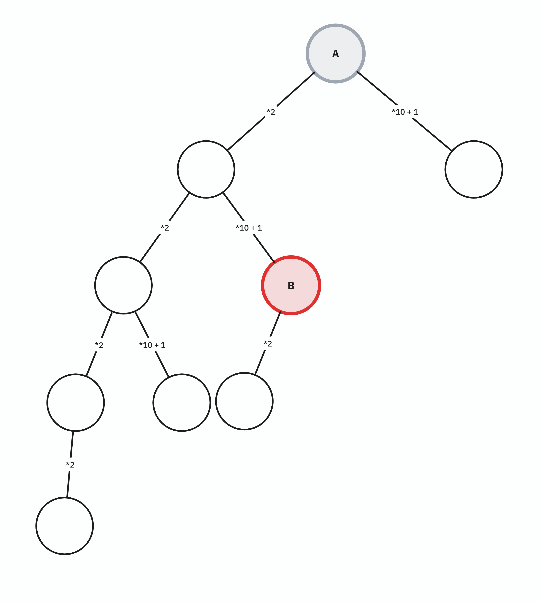
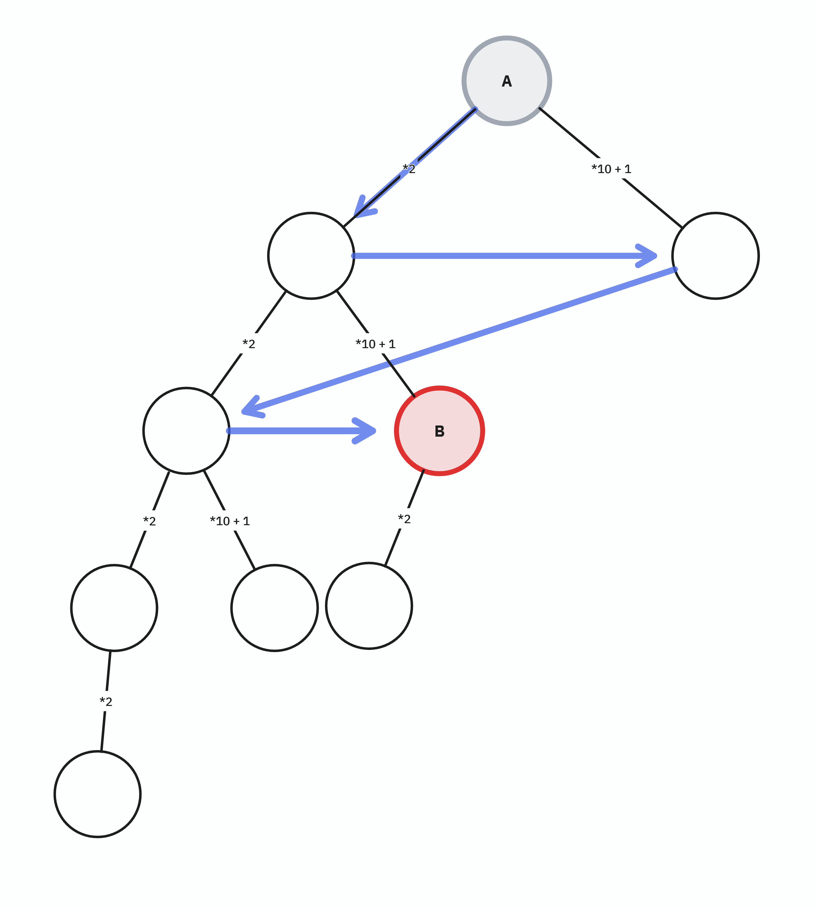
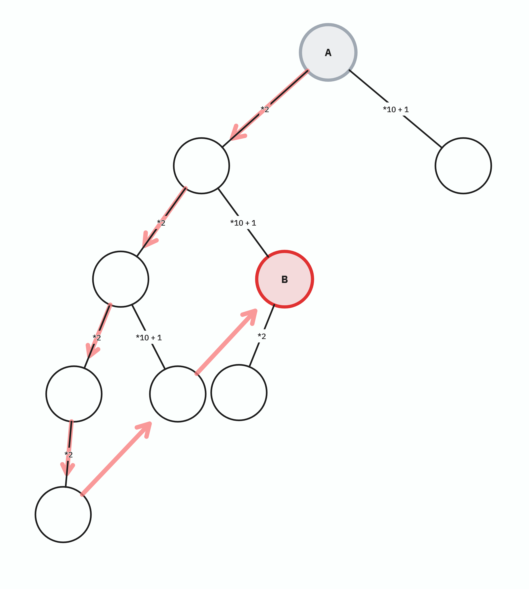

# 트리 탐색 문제로 접근

$A$를 루트로 하는 트리에서 존재 여부를 알 수 없는 $B$ 노드를 탐색하는 문제로 환원할 수 있다.

예를 들어 다음과 같은 트리를 그릴 수 있다.

각 노드가 $\times 2$를 취한 자식과, $\times 10 + 1$를 취한 자식을 갖는 이진 트리가 된다.

위 예에는 $B$ 노드가 트리 내 어딘가에 존재하지만, 사실 문제에 따르면 $B$가 아예 존재하지 않을 수도 있다.

**$B$의 존재 여부에 따라**
* 존재하지 않는다면, 당연히 트리 **전체**를 탐색해야만 *"$B$가 존재하지 않음"* 이라고 확정할 수 있다. (최악의 경우)
* 존재 한다면, 최소 연산 횟수를 요구하는 문제에 따라, $B$ 노드까지 **최단 경로** 를 찾아야 한다. 

최단 경로에는 당연히 너비 우선 탐색을 사용하는 것이 좋다.

## 너비 우선 탐색으로 $B$ 찾기

탐색 경로는 위와 같다. 최단 경로임이 보장된다. 코드는 아래와 같다.





## 근데 DFS로도 통과할 수 있다.

사실 나는 별 생각 없이 풀었기 때문에 처음에는 아, 백트래킹 문제구나 DFS 써야지, 하고 DFS를 사용하였다.

**DFS 쓸 때 주의할 점?**

* ==DFS로 $B$를 찾아내는 경우, **최단 경로**라는 보장이 없다.==
* (사실, 위 예제들에서 그래프 내에 $B$ 노드가 하나만 존재하는데, $B$가 그래프 내에 하나만 존재한다는 보장도 없다.)
  * 연산을 여러번 중첩하여 $B$에 도달하는 방법은 여러 개 있을 수도 있다.

BFS를 사용하면 그래프 내에 $B$가 몇 개 있더라도, $A$로부터 가장 가까운 깊이의 $B$를 가장 먼저 발견한다.

하지만 DFS는 그런 보장이 없으므로, 추가적인 처리를 해주어야 한다. 
사실 매우 비효율적이지만, 이 문제에서 어쨌든 통과하기는 한다.

코드는 아래와 같다.





