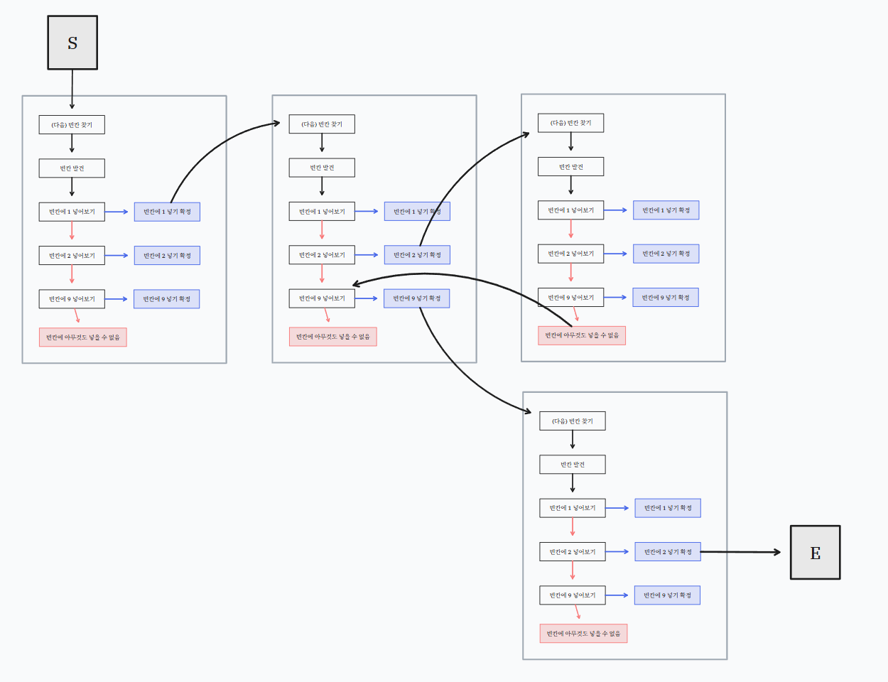

# 풀이

평소 스도쿠를 재미있게 하는 편이고 할 때마다 "스도쿠를 자동으로 풀어내는 알고리즘"에 대해 생각해보곤 했는데, 이렇게 문제로 만나버렸다.

무식하게 푼다고 가정하고, 모든 칸이 빈 칸이라고 생각해보자. 왼쪽 위위부터 차례대로 채워나간다고 할 때, 각 칸에 숫자를 채울 때는 다음 세 가지 제약 조건을 반드시 만족해야 한다.

* 해당 가로 행에 같은 숫자가 없어야 한다.
* 해당 세로 열에 같은 숫자가 없어야 한다.
* 해당 칸이 포함된 3x3 박스 영역에 같은 숫자가 없어야 한다.

숫자는 1부터 9까지 가능한 수 중에서, 위 제약 조건을 모두 만족하는 가장 작은 숫자를 채운다. (사전순으로 가장 앞선 숫자)

# 탐욕적 접근으로는 항상 해에 도달하지 못한다

이건 매번의 판단에서 가장 적합한(3가지 제약을 만족하고, 사전순으로 가장 앞선) 숫자를 기입한다는 점에서 탐욕적 접근이다. 하지만 매 순간 탐욕적으로 숫자를 택하면, 스도쿠의 보드를 완성할 수 있을까?

## 탐욕적 알고리즘이 성공하기 위한 조건



탐욕적 알고리즘이 성공하려면 다음 두 가지 조건이 있어야 한다.

* **탐욕 선택 속성(Greedy Choice Property)**
  * 문제를 풀 때 각 단계에서 최선이라고 생각되는 선택을 하는 것이, 전체 문제의 최적해로 이어진다는 보장이 있어야 한다. (전략적 확신)
* **최적 부분 구조(Optimal Substructure)**
  * 문제의 전체 최적해가, 그 하위 부분 문제들의 최적해로 구성된다. (구조적 속성)



예를 들어, 10, 50, 100, 500원짜리 동전이 무한히 있고, 거스름돈 760원을 최소 개수로 만들고 싶다. 탐욕적으로는 큰 동전부터 가능한 만큼 쓰면 해결할 수 있다. 이 예제에서 탐욕 선택 속성은 큰 동전을 먼저 쓰는게 항상 유리하다는 것이다. 그리고, 최적 부분 구조는 760원 문제를 500원을 쓰고, 나머지 260원을 푸는 하위 문제로 나눌 수 있다는 것이다.

하지만 반례로 1원, 3원, 4원으로 동전을 최소 갯수만 사용하여 6원을 만든다고 하자. 탐욕적으로 역시 큰 동전부터 가능한 만큼 쓰고 싶지 않은가? 4원을 1개, 1원을 2개 써서 3개가 최적해인 것 같지만, 사실 3원을 2개 쓰면 3개보다 적게 사용하여 6원을 만들 수 있다. 즉, 탐욕이 실패하였고, 실패 원인은 탐욕 선택 속성이 만족되지 않기 때문이다.

## 스도쿠가 탐욕 알고리즘으로 풀 수 없음을 나타내는 반례

==그러면 스도쿠는 탐욕 선택 속성이 있을까 없을까?==

어떤 문제가 탐욕 선택 속성이 없는 것을 증명하기 위해서는 반례를 딱 하나만 찾아내면 된다. 그러니까, 지금 최선의 숫자라고 생각하여 선택했던 것이, 전체 스도쿠를 완성시키지 못하는 결과를 낳는 경우를 찾으면 된다.

다음과 같은 반례가 있다.

```txt{lineNos=false}
B1 3  4  5  6  7  8  B2 9
A  B  C  D  E  F  G  2  F
...
```

`B1`부터 칸을 채워나갈 것이고, `B1`에는 1 혹은 2가 들어올 수 있다.
`B1`에 1을 넣어버리면, 나중에 탐색되는 `B2`의 운명은 2로 고정되어 버린다.
하지만, `B2`는 애초에 2가 들어갈 수 없는 자리이다. 
하지만 우리는 이 사실을 `B2`에 가서야 알아차리게 된다.

# 백 트래킹의 필요성

매 순간 탐욕적 선택으로는 해를 만들 수 없는 종단점(Dead-end)에 도달할 수도 있다는 것을 보았다.

때문에 위 반례에서 `B2`에서 *"아, 더이상 스도쿠를 채워나갈 수가 없구나"*라고 깨달았다면 이전 상태로 복기해야 하기 때문에 백 트래킹을 해야한다.

사실 스도쿠가 욕심쟁이 알고리즘으로 풀 수 없음을 생각해내는 것이 어렵지, 백 트래킹을 해야한다는 사실만 알았으면 풀이 자체는 쉬운 편이다.



위처럼, 아직 스도쿠를 다 완성하지도 않았는데 넣을 숫자가 없다면 지금 어딘가에서 잘못된 분기를 타고 들어온 이유로 전체 해를 완성할 수 없다는 의미이다.

그러므로, 백 트래킹을 하여 다시 탐색해야 한다.

# 코드

코드는 아래와 같다.

```cpp
#include <iostream>
#include <array>
#include <string>

using namespace std;

const int BLANK{0};
array<array<int, 9>, 9> board;

/// @brief board[i][j]에 c가 들어갈 수 있는지 확인
bool check(int i, int j, int c) {
  for (int v{0}; v < 9; ++v) {
    if (c == board[v][j]) {
      return false;
    }
  }

  for (int h{0}; h < 9; ++h) {
    if (c == board[i][h]) {
      return false;
    }
  }

  int vp{(i / 3) * 3}, hp{(j / 3) * 3};

  for (int v{vp}; v < vp + 3; ++v) {
    for (int h{hp}; h < hp + 3; ++h) {
      if (c == board[v][h]) {
        return false;
      }
    }
  }

  return true;
}

bool DFS() {
  for (int i{0}; i < 9; ++i) {
    for (int j{0}; j < 9; ++j) {
      if (board[i][j] == BLANK) {

        for (int c{1}; c <= 9; ++c) {
          if (check(i, j, c)) {
            // 한 번 넣어본다
            board[i][j] = c;

            // 넣어본 상태로 탐사
            if (DFS()) { 
              // 여기에 도달하는 시점은 전체 문제를 해결하는 시점이다.
              return true; 
            }

            // 백 트래킹
            board[i][j] = BLANK;
          }
        } 

        // 이 칸에 어떤 수도 넣을 수 없었다면 여기에 도달하게 된다.
        return false; 
      }
    }
  }
  return true; 
}


int main() {
  // 입력
  for (int i{0}; i < 9; ++i) {
    string line; cin >> line;

    for (int j{0}; j < 9; ++j) {
      board[i][j] = line[j] - '0';
    }
  }

  // 풀이
  DFS();

  // 출력
  for (int i = 0; i < 9; ++i) {
    for (int j = 0; j < 9; ++j) {
      cout << board[i][j];
    }
    cout << '\n';
  }
}
```