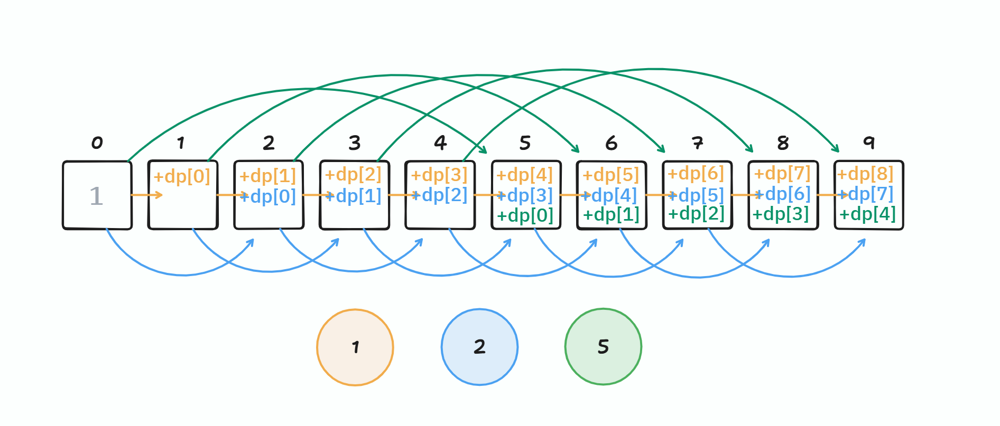

# 접근

제한 시간이 0.5초이므로, 완전 탐색으로 접근하면 안된다.
완전 탐색으로 접근시 각 동전의 종류별로 갯수를 다르게 하면서 $k$를 만들 수 있는지 테스트 해야 하는데,

이건 $n$개 중에 $k$개를 뽑는 중복 조합의 수이고, 총 $_nH_k = _{n+k-1}C_k = \frac{(n+k-1)!}{k!(n-1)!}$이므로, 아주 큰 복잡도이다.

뭔가 다른 방법을 찾아야 한다.

문제에서 관심 있는 것은 만들수 있는 방법의 가짓수이고, 실제로 $k$원을 어떻게 만드는 지에는 관심이 없다.

다음의 `dp` 정의가 이 문제를 해결하는 데에 핵심적이다. 

> 어떤 배열 `dp`를 선언하고, **`dp[i]`를 `i`원을 만드는 데 사용되는 동전의 갯수라고 정의하자.**

그러면 1, 2, 5원짜리 동전이 있을때, `dp[i]`를 다음처럼 채울 수 있다.

`dp[0]`은 1인데, 도합 0원을 만드려면 아무 동전도 사용하지 않는 한 가지 경우의 수가 있기 때문이다.

`dp[1]`의 경우, 다음 하나의 경우의 수 밖에 없다.
* 0원을 만들 수 있는 가짓수에서, 1원짜리 동전을 하나 추가하면 된다.  

`dp[2]`의 경우, 다음의 두 경우의 수의 합이다.
* 1원을 만들 수 있는 가짓수에서 1원짜리 동전을 하나 추가
* 0원을 만들 수 있는 가짓수에서 2원짜리 동전을 하나 추가

`dp[5]`의 경우, 다음의 세 경우의 수의 합이다.  
* 4원을 만들 수 있는 가짓수에서 1원짜리 동전을 하나 추가.
* 3원을 만들 수 있는 가짓수에서 2원짜리 동전을 하나 추가.
* 0원을 만들 수 있는 가짓수에서 5원짜리 동전을 하나 추가.

이러면 동전의 개수만큼 $k$번 순회하면 되므로 복잡도는 $O(nk)$이다.

이를 기반으로 코드를 짜면 아래와 같다.

# 코드


