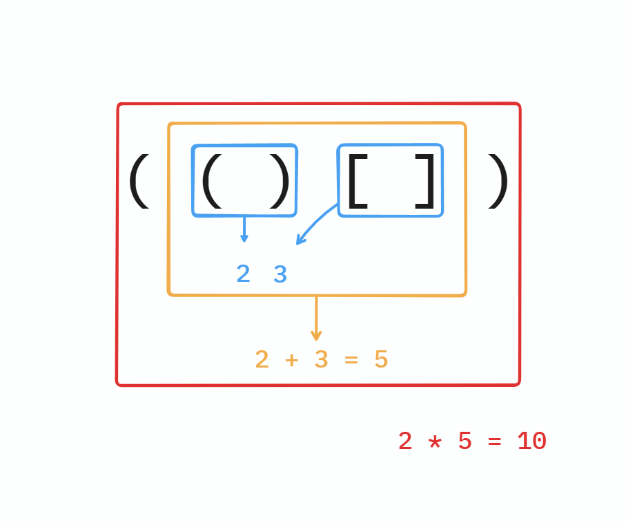

# 접근

올바른 괄호쌍을 찾는 문제는 보통 LIFO 구조인 스택을 이용하여 풀이한다.

이 문제는 그에 더해 서로 다른 두 괄호의 **연속**(예: `()[]`)과 **중첩**(예: `[()]`)을 다르게 계산해야 한다.

예를 들어 `(()[])`에 대해서 생각해보자.

`)`와 `]`을 만나면서, **가장 근처**의 `(` 혹은 `[`과 먼저 상쇄되며 계산이 진행된다.

주의할 점은 **연속**에 대해서는 그때 그때 값을 그대로 누적하여 더하면 되는데, **중첩**에 대해서는 `(` 혹은 `[`를 **기억**했다가, 나중에 곱해줘야 한다는 것이다.

> [**풀이의 핵심**] `(` 혹은 `[`를 만날 때마다, **기억**했다가, `)` 혹은 `]`를 만날 때마다 적절히 상쇄시켜야 한다.

이를 위해, 계산 값을 저장할 용도로 역시 자료구조 **스택**을 사용하고, **기억**을 위한 용도로 `(`와 `[`를 위해 특정한 값을 매핑한다.

예를 들어 계산 값을 저장할 용도인 스택 `num`을 선언했다고 하자.

`(` 혹은 `[`를 만나는 경우 이게 `()` 혹은 `[]` 꼴인지,  `(X)` 혹은 `[X]` 꼴인지, ==문자열의 다음 항목을 읽지 않고는 알 수가 없다.==

그러므로, `(` 혹은 `[`를 만났을 때, 특정한 가짜 값을 스택에 우선 넣어 두고, `)` 혹은 `]`를 만날 때마다 상황에 맞게 처리하도록 한다.

`(`를 `-2` 라는 값으로, `[`를 `-3`이라는 값으로 표현하기로 해보자.

만일 지금 이 순간, `)`를 만나는 경우 아래와 같은 경우의 수가 있다.
* **`num`의 최상단에 `-2`가 있다.**
  * `()`가 만들어진 경우이다. 
  * 최상단의 `-2`를 `num`에서 빼고, `()`의 값인 `2`를 `num`에 넣는다.
* **`num`의 최상단에 `-3`이 있다.**
  * `[)`의 경우로, 올바르지 않은 괄호쌍이다.
* **`num`의 최상단에 `-2`나 `-3` 외의 숫자가 있다.**
  * `X)`인 상황으로, 약간의 검사를 수행해야 `(X)` 인지, `[X)`인지, `X)`인지 알 수 있다.
  * `num`의 최상단이 `-2`이 될 때까지 최상단의 수를 임시로 계속 더한다.
  * 만일, `-2`를 찾는 중에 `-3`을 만나거나 `num`이 비어버리면, `[X)`이거나 `X)` 라는 올바르지 않은 괄호쌍이므로 종료한다.
  * `-2`를 제대로 찾았으면, `-2`까지도 `num`에서 팝 하고, 임시로 더한 값에 2를 곱하여 `num`에 다시 넣어준다.

`]`를 만나는 경우도 동일하다.

# `(()[[]])([])` 의 예시

| `i` | 탐색된 괄호들 | 닫힘 괄호 추가 | 스택 |
| :-: | :-: | :-: | :-: |
| 0 | `(` | X | `[-2]` |
| 1 | `((` | X | `[-2, -2]` |
| 2 | `(()` | **O** | `[-2, {-2}]` → `[-2,  2]` |
| 3 | `(()[` | X |  `[-2, 2, -3]` |
| 4 | `(()[[` |X |  `[-2, 2, -3, -3]` |
| 5 | `(()[[]` |**O** | `[-2, 2, -3, {-3}]` → `[-2, 2, -3, 3]` |
| 6 | `(()[[]]` |**O** |  `[-2, 2, {-3, 3}]` → `[-2, 2, 9]` |
| 7 | `(()[[]])` |**O** |  `[{-2, 2, 9}]` → `[22]` |
| 8 | `(()[[]])(` |X |  `[22, -2]` |
| 9 | `(()[[]])([` |X |  `[22, -2, -3]` |
| 10 | `(()[[]])([]` |**O** |  `[22, -2, {-3}]` → `[22, -2, 3]`|
| 11 | `(()[[]])([])` |**O** | `[22, {-2, 3}]` → `[22, 6]` |

최종적으로 스택 `num` 에는 `[22, 6]`이 남아있게 되는데, 따라서 답은 **22 + 6 = 28**이다.
a

# 코드

코드가 좀 위아래로 길다



