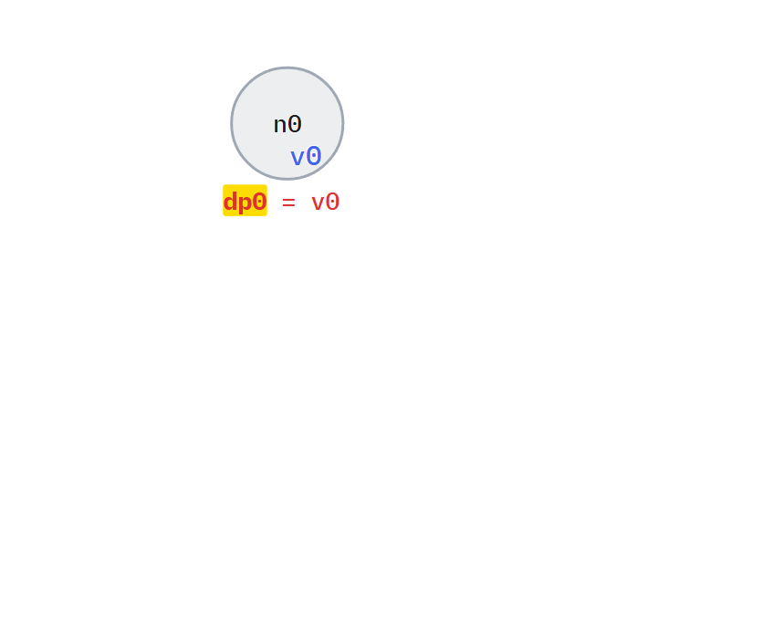
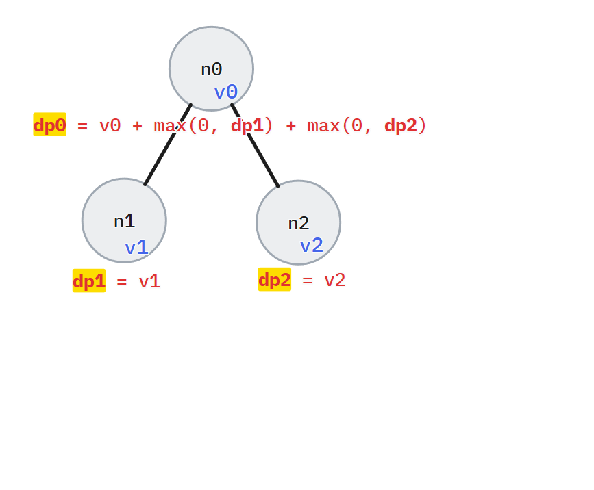
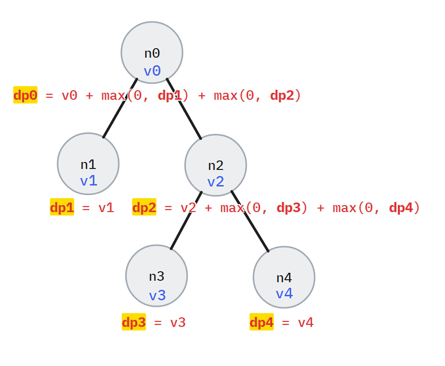

# 알고리즘 설명

`i`번 노드의 번호를 `ni`라고 하고, `i`번 노드의 값을 `vi`라고 하자.

## `dp`의 정의

`dpi`를 다음과 같이 정의하자.

> `dpi`는 `ni`를 루트로 하는 서브트리에서, 노드를 방문하여 만들 수 있는 값의 최대치.

## 노드가 하나일 때

노드가 하나일 때부터 차근 차근 계산해보자.

당연하게도, `n0`을 루트로 하고 노드가 `n0` 하나 뿐인 트리에서 모든 노드를 방문하여 만들 수 있는 값의 최대치 `dp0`은 `v0`이다.

## 자식이 있을 때

조금 더 복잡한 예를 보자.

이제 조금의 생각이 필요하다.

`n0`부터 방문하여, `dp0`을 구하려고 하는데, `n0`에는 자식이 둘 있다.

`n0`의 자식은 `n1`과 `n2` 둘인데, `n0` 입장에서는 `n1`과 `n2`만 *보이고*, 자신의 자식들이 자식을 가지는지 알 수 없는 상황이다.

하지만 `n0`이 계산하고 싶은 것은 `dp0`이지, 자식들의 자식 존재 여부가 아니다.

`dp0`의 정의를 되새겨 보면, `dp0`는 `n0`를 루트로 하는 서브트리에서, 노드를 방문하여 만들 수 있는 값의 최대치이다. 이걸 어떻게 구할까?

**트리를 서브 트리로 쪼개기**

이 그림에서, ==`n0`을 루트로 하는 서브트리는, 다시 `n0`과 `n1`을 루트로 하는 서브트리, `n2`를 루트로 하는 서브트리로 나눌 수 있다.==

이렇게 나눈 경우, `n1`을 루트로 하는 서브트리에서 노드를 방문하여 만들 수 있는 최대값과, `n2`를 루트로 하는 서브트리에서 노드를 방문하여 만들 수 있는 최대값, 그리고 `n0` 자체의 값을 더하면 `dp0`이라고 할 수 있지 않을까?

그러니까, `dp0 = v0 + dp1 + dp2`라고 할 수 있지 않을까?

**아예 방문 자체를 않는 것이 이득인 서브트리**

결론적으로 말하면 `dp0 = v0 + dp1 + dp2`가 아니다.

문제를 보면 `vi`는 음수가 될 수 있고, 때문에 어떤 노드를 루트로 하는 서브트리의 노드를 모두 방문함으로서 얻는 최대 값 또한 **음수가 될 수 있다.**

또한, 문제에서 모든 노드를 반드시 방문할 필요는 없다고 하였다. 

예를 들어, `dp1`이 결국 음수가 나왔다고 가정하자. 그러면, `n0` 입장에서는 `n1` 쪽 경로는 아예 방문하지 않는 것이 `dp0`을 최대로 만들기 위해 가장 좋은 전략이다.

**식으로는 어떻게 표현할까**

`dp0 = v0 + dp1 + dp2`를 위 논리에 맞게 바꿔 표현해 보자.

`dp1`, `dp2`가 양수인 경우에만 더해주면 된다.

때문에 식은 다음 처럼 표현할 수 있다.

> `dp0 = v0 + max(0, dp1) + max(0, dp2)`

간단하게, 0과 `dpi` 중에 더 큰것을 더하면, 음수인 경우 0이 더해지므로 결과에 아무런 영향을 끼칠 수 없게 된다.

## 더 복잡한 예

위상적으로 [바로 이전의 예](#노드가-하나일-때)와 별 차이는 없다.

결과적으로, `dpi`를 계산할 때에는, 할 수 있는 한 최대로 트리를 깊게 타고 들어가 리프 노드까지 도달해야 한다. 왜냐하면, 리프 노드는 자손이 없기 때문에 `dp` 값이 자기 자신의 값으로 고정되기 때문이다.

그리고 역순으로 타고 올라오면서, 계산한 리프 노드들의 `dp`값으로, 서브트리 루트의 `dp`값들을 갱신해 나가면서 최종적으로 루트의 `dp`값을 갱신한다.

이에 가장 적절한 알고리즘은 단연 DFS이다.

# 코드

