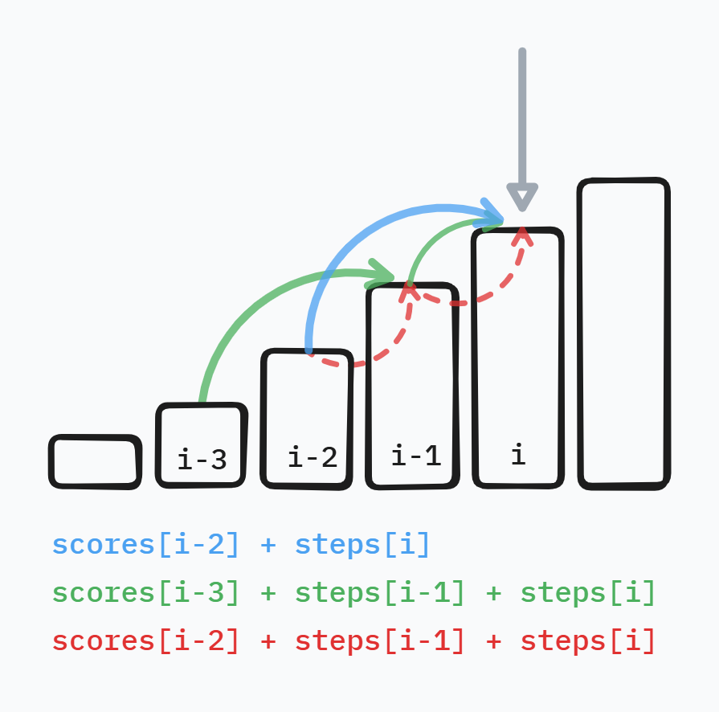

# 접근

## 완전 탐색으로 접근

완전 탐색으로 접근하는 경우, 매 계단마다 한 칸과 두 칸을 어떻게 배열하여 도달할지에 관해 계산해야 하고, 그 와중에 연속된 세 칸 밟는 경우를 빼 주어야 한다.

이러면 문제가 너무 복잡해지고 시간 복잡도도 올라간다.

## 동적 계획법으로 접근

동적 계획법을 사용하면 문제가 정말 간단해진다.

다음을 만족하는 `scores`를 생각해 내는 것이 문제 풀이의 관건이라고 볼 수 있겠다.

> `i`번째 계단에 도달했을 때, **얻을 수 있는 점수의 최대 값**을 `scores[i]`라고 한다.

`i`번째 계단에 적혀 있는 점수를 `steps[i]`라고 할 때,

첫 번째 계단의 경우, 그냥 첫 번째 계단을 밟는 경우의 수 밖에 없으므로, `score[0] = steps[0]`이다.

두 번째 계단의 경우 다음의 두 가지 경우의 수 중에서 최대값일 것이다.
* 첫 번째 계단을 밟고 두 번째 계단을 밟았다. (`score[0] + steps[1]`)
  * 이 경우, 점수를 `steps[0] + steps[1]`로 표현할 수 있지만, 첫 번째 계단까지의 최대값을 보존한 채 한 계단 전진했음을 표현하기 위해 `scores[0] + steps[1]`이라고 하자.
* 바로 두 번째 계단을 밟았다. (`steps[1]`)

최종적으로 두 번째 계단을 밟았을 때 점수의 최대값은 `scores[1] = max(scores[0] + steps[1], steps[1])`이다.

세 번째 계단의 경우, 도 다음 두 가지 경우 수 중에서 최대값일 것이다.
* 첫 번째 계단을 밟고, 세 번째 계단을 밟았다. (`scores[0] + steps[2]`)
* 두 번째 계단을 밟고, 세 번째 계단을 밟았다. (`scores[1] + steps[2]`)

최종적으로 세 번째 계단을 밟았을 때 점수의 최대값은 `scores[2] = max(scores[0] + steps[2], scores[1] + steps[2])`이다.

네 번째 계단의 경우,
* 직전에 두칸 점프해서 네 번째 계단에 도달했다. (`scores[3 - 2] + steps[3]`)
* 직전에 한 칸 점프해서 네 번째 계단에 도달했다.
  * 하지만, 한 칸 점프 직전에 또 한 칸 점프했다면, 연속해서 세 칸 점프한 것이므로 제외하여야 한다.
  * 따라서, ==직전에 한 칸 점프해서 네 번째 계단에 도달했다면, 그 직전에는 반드시 두 칸 점프했어야 규칙을 만족할 수 있다.== (`scores[3 - 3] + steps[3 - 1] + steps[3]`)

최종적으로 네 번째 계단을 밟았을 때 점수의 최대값은 `scores[3] = max(scores[3 - 3] + steps[3 - 1] + steps[3], scores[3 - 2] + steps[3])` 이다.

이를 일반화 해보면,

`i`를 3 이상이라고 할 때, (4번째 계단 이후) `i`번째 계단을 밟았을 때 
* 직전에 두 칸 점프해서 `i`에 도달한 경우 (`scores[i - 2] + steps[i]`)
* 직전에 한 칸 점프,  그리고 그 직전엔 두 칸 점프한 경우. (`scores[i - 3] + steps[i - 1] + steps[i]`)

따라서 `i`번째 계단을 밟았을 때의 점수의 최대값 `scores[i] = max(scores[i - 3] + steps[i - 1] + steps[i], scores[i - 2] + steps[i])`이다.

이를 도식으로 표현하면 아래와 같다.

동적 계획법을 이용하는 경우 계단 수를 `N`이라 했을 때, `N`을 한 번만 순회하면 해를 구할 수 있으므로, 주어진 제한시간 1초에 넉넉히 문제를 해결할 수 있게 된다.

# 코드



