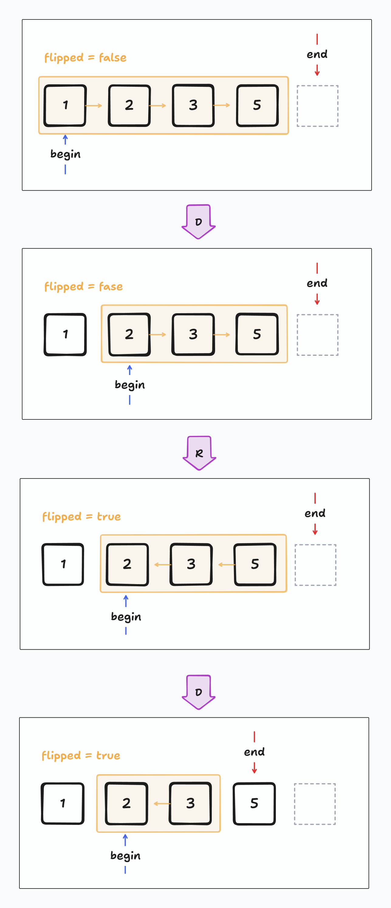

<!-- 80분, 시간 초과 -->

# 접근: 무식하게 그냥 연산을 적용하면 안 되는 이유

시간 제한 1초에 각종 수치들이 불쾌하게 거대하므로 시간 복잡도에 대해서 머리를 많이 굴려야 한다.

이 문제에서 다루는 문자열(수열)의 규모가 $10^5$이고, 함수의 갯수도 최대 $10^5$이므로 뭔가 조금만 잘못된다면 바로 시간 초과가 발생할 것이다.

명령어는 `R`과 `D` 단 두개인데, 둘 모두 컴퓨터에게는 부담스러운 연산이다.

**수열의 길이를 $n$이라고 했을 때:**
* 수열 전체를 뒤집어 버리는 `R` 연산의 시간 복잡도는 $O(n)$이다.
  * (뒤에서부터 앞으로 순회하면서 새 수열을 만들어야 하기 때문)
* 수열의 맨 앞 수를 없애 버리는 `D` 연산의 시간 복잡도는 $O(n)$이다.
  * (맨 앞 하나를 삭제하고, 뒤의 모든 수를 앞으로 한 칸씩 땡겨야 하기 때문)

때문에 이러한 $O(n)$짜리 연산이 도합 $m$개 들어온다면, 시간 복잡도는 $O(m \cdot n)$이다. 

문제에서 $m$은 $[1, 10^6]$범위이고, $n$은 $[0, 10^6]$이므로, 경우 최악의 경우 연산을 $10^{12}$ 번 해야한다. (이렇게 풀 면 안된다는 뜻이다.)

# 알고리즘

## 연산을 누적하여 상태로 관리

수열을 수정하는 것은 비싸므로, 모든 연산에 대해 원본 수열을 수정하지 말자.

가만히 들여다 보면, ==문제에서 주어진 연산들은 수열에 바로 적용하지 않고도 누적된 연산으로 표현==할 수 있다.

그러기 위해서는 **수열에 연산이 얼마나 적용되었는가를 나타내는 상태 정보**를 추가적으로 관리하면 된다.

### `R` 연산의 표현

예를 들어, `R` 연산은 수열이 *"현재 뒤집혀 있는가 아닌가"* 에만 관여하지, 실제로 뒤집을 필요는 없다. 나중에 모든 연산이 다 누적된 후, 최종 상태를 적용하면 된다.

수열에 더해 추가적으로 부울형 변수 `flipped`를 유지한다고 하자. 수열은 처음에 당연히 순방향으로 주어지므로 초기값은 `flipped = false`일 것이다. 허나, `R` 연산이 들어오면 `flipped = !flipped`로 수열의 뒤집힘 상태 정보가 반전된다.

### `D` 연산의 표현

`D` 연산은 현재 수열의 `flipped` 상태에 따라서 다르게 적용된다. <sup>("`flipped` 상태에 의존한다" 라고 표현해도 좋다.)</sup>

수열이 현재 정순이냐 역순이냐에 따라서 `D`는 수열의 맨 앞에 있는 것을 제거할 수도 있고, 맨 뒤에 있는 것을 제거할 수도 있다.

결과적으로 연속적인 `D` 연산이 적용되는 순서는 수열의 맨 앞부터, 혹은 맨 뒤부터 차례대로이다.

마치 반복자처럼, `D` 연산이 현재 적용된다면 어느 인덱스에 적용될 것인지 수열의 맨 앞의 경우 `begin`, 맨 끝의 경우 `end`로 관리해보자.

`D` 연산이 들어왔을 때: 
* 현재 `flipped == false` 라면, 원본 수열의 왼쪽에서부터 차례대로 수를 삭제하는 것이므로, `begin`의 인덱스를 하나 증가시킨다.
* 현재 `flipped == true` 라면, 원본 수열의 오른쪽에서부터 차례대로 수를 삭제하는 것이므로 `end`의 인덱스를 하나 감소시킨다.

### 수열을 출력할 때 누적된 정보를 반영

수열을 출력할 때, 누적된 연산으로 인한 수열의 상태 정보를 적용해 주면 된다.
* 수열이 현재 뒤집혀 있지 않다면, `begin`과 `end`를 순방향으로 출력하면 된다.
* 수열이 현재 뒤집혀 있지 않다면, `begin`과 `end`를 역방향으로 출력하면 된다.

### 도식

알기 쉽게 이미지로 표현하면 아래와 같다.



## 사실 문자열 다루기가 더 어렵다

수열 입력이 숫자로 들어오는 것이 아니라 `[1,2,3]` 과 같이 문자열 형태로 들어오므로, 문자열 처리가 익숙치 않다면 명령어 처리를 위한 로직을 생각해 내는 것보다 문자열과 씨름하는 데에 시간을 더 많이 소요할 것이다.

이는 하단의 기타 항목에서 자세히 서술한다.

# 코드



# 기타

## `std::stringstream`

`std::stringstream`은 `std::string`이 `std::basic_string<char>`의 타입 별칭인 것처럼 `std::basic_stringstream<char>`의 타입 별칭이다.

이 `std::basic_stringstream`은 문자열 기반 스트림에 대해서 입력과 출력 연산을 구현하는 클래스 템플릿이다. `std::basic_string`의 인스턴스를 효율적으로 저장하고 입력과 출력 연산을 수행한다.  

> 좀 더 쉽게 말하면 `std::stringstream`은 `std::string`이 마치 스트림(`std::cin` 처럼)인 것 처럼 다룰수 있게 해 주는 도구라는 것이다.  그래서 `std::stringstream`은 입력을 파싱하여 다양한 형태로 가공하는 데에 주로 사용된다.

기본적인 메서드는 다음과 같다:
* `clear`
  * 스트림을 비운다
* `str`
  * 스트림에 존재하는 내용으로 문자열 객체를 반환한다.
  * 혹은 받은 문자열로 스트림의 내용을 바꾼다.
* `operator<<`
  * 스트림에 문자열을 추가한다.
* `operator>>`
  * 스트림에서 뭔가를 읽는다.

### [예제] 숫자와 문자열 간 변환

```cpp{lineNos=false}
int i_num = 42;
float f_num = 34.2f;

std::stringstream ss; 

ss << i_num; 
ss << " "; 
ss << std::fixed << std::setprecision(2) << f_num;

std::cout << "* Result: " << ss.str() << std::endl;
//* Result: 42 34.20

int new_num;
ss.str("567");

ss >> new_num;

std::cout << new_num << std::endl;
// 42
```

### [예제] 공백으로 구분된 문자열 파싱

```cpp{lineNos=false}
std::string input = "apple banana cherry";
std::stringstream ss(input);
std::string word_buff;
std::vector<std::string> words;

while (ss >> word_buff) words.push_back(word);
```

### [예제] 특정 문자로 구분된 문자열 파싱

`std::getline`을 이용하면 공백이 아닌 임의의 구분자로 문자열을 나눌 수 있다.

```cpp{lineNos=false}
std::string input = "1,2,3";
std::stringstream ss(input);
std::string word_buff;

while (std::getline(ss, word_buff, ',')) {
  std::cout << word_buff << std::endl;
}
```

주의할 점은, 구분자는 **문자열**이 아니라 **문자**라는 점이다. 여러 문자로 구성된 구분자로 파싱하려면

* 수동으로 파싱 (...)
* `std::regex_token_iterator`

방법을 사용하면 된다.

이 문제에서도 `"[1,2,3]"` 과 같이 주어지는 수열 문자열을 파싱하기 위해 사용되었다.

### [예제] 다양한 형식의 여러 값을 한 줄에 출력

```cpp{lineNos=false}
int id = 101;
std::string name = "rznbrn"
double score = 101.02f

std::stringstream ss;
ss << "ID: " << id; 
ss << ", Name: " << name;
ss << ", Score: " << score;

std::cout << ss.str() << std::endl;
```

### [예제] 문자열에서 다양한 형식의 여러 데이터 추출

```cpp
std::string data = "42 3.14 hello";

std::stringstream ss(data);

int i_val; double d_val; std::string t_val;
ss >> i_val >> d_val >> t_val;
```

## `substr(pos, count=npos)`

* 원래 문자열의 `pos` 부터 `count` 길이만큼의 문자열을 반환한다.
* 부분 문자열의 길이가 문자열의 범위를 초과하면, 문자열의 끝까지만 반환한다.
* 원래 문자열의 `[pos, pos + count)` 까지의 문자열을 반환한다.
* 만일 `pos`가 문자열의 범위를 초과하면 예외(`std::out_of_range`)를 발생시킨다.
* 원본 문자열은 변경하지 않는다.
* 만일 요청한 부분 문자열의 길이가 $n$이라면, 시간 복잡도는 $O(n)$이다.

```cpp{lineNos=false}
std::string str = "Hello, World"

auto sstr0 = str.substr(1, 3); // ell
auto sstr1 = str.substr(2); // llo, World
auto sstr2 = str.substr(2, 999); // llo, World
auto sstr3 = str.substr(999); // ERROR: std::out_of_range
```

