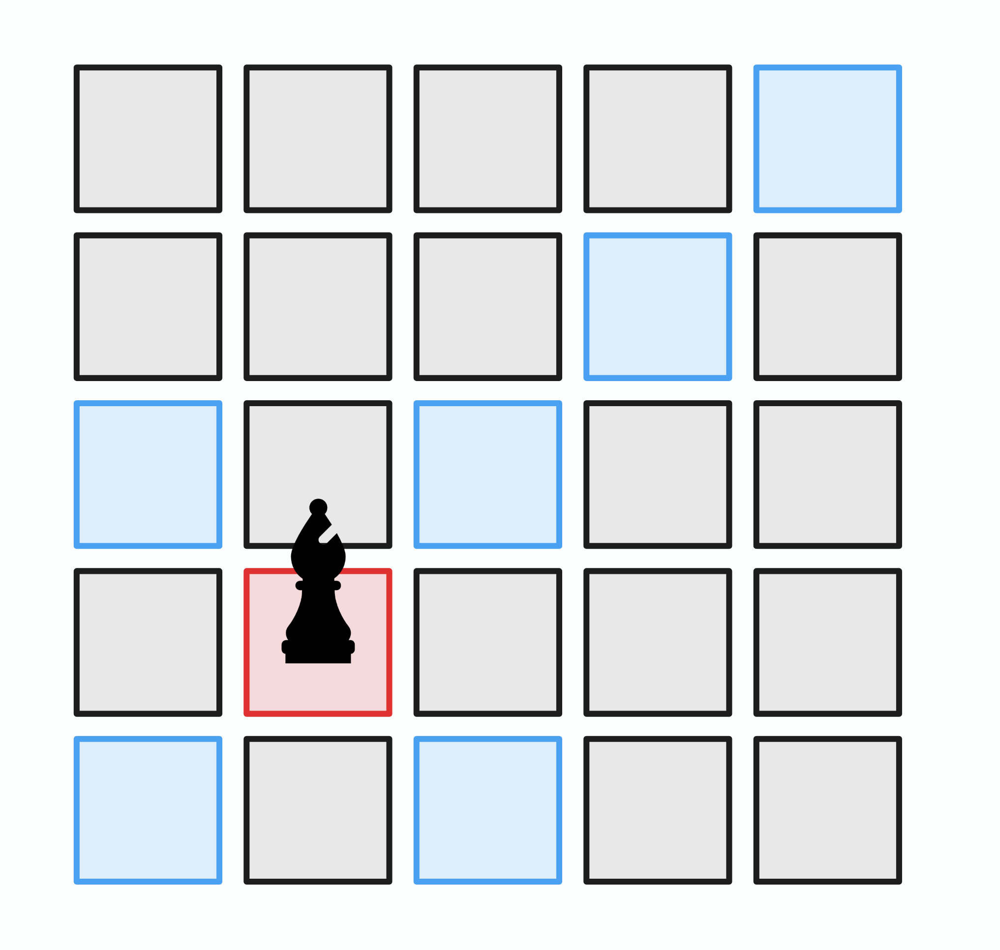

# 접근

격자 형태의 그래프 탐색 문제에서 보통 *인접하다*의 정의는 `상`, `하`, `좌`, `우`인 경우가 많으나, 이 문제는 *인접하다* 의 정의가 조금 다른 것이 특징이다.

체스 기물 비숍의 경우 상하좌우 대각선으로 한 칸만 이동할 수 있는게 아니라, 몇 칸이든 이동할 수 있으므로, 해당 칸들이 모두 현재 위치와 *인접하다*고 평가할 수 있다.





이를 이용해 **경로를 저장하는 BFS** 를 사용하면, 비숍이 시작 지점부터 끝 점까지 특정 이동 횟수 내로, 최소한만 이동하여 도달할 수 있는지의 여부를 판단할 수 있다.

BFS 관련 일반적인 내용에 대한 정리는 아래의 게시물을 참고한다.

* {}

# 알고리즘



* **빠른 종료**
  * 시작점과 끝점이 이미 같은 경우, 출력하고 종료한다.
  * 시작점과 끝점의 색이 다른 경우, 아무리 노력해도 도달할 수 없으므로 출력하고 종료한다.
* **BFS 탐색 시도**
  * BFS 초기화 단계
    * 위 두가지 케이스가 아닌 경우 BFS 탐색이 필요한 경우이다:
    * BFS 큐에 더해, 시작점부터 거리를 저장한 `dists` 배열과 경로 부모 노드를 저장할 `parent` 배열을 초기화한다.
    * 큐에 시작 정점을 넣고, `dists`와 `parent`를 시작 정점에 대해 초기화한다.
    * 도착점을 찾았는지 관리하는 `found` 부울 변수를 선언하고, `false`로 초기화한다.
  * BFS 실행 단계
    * 현재 정점 처리 단계
      * 큐에서 정점을 하나 꺼낸다.
      * 만일 현재 처리중인 정점까지 거리가 4 초과면, 네번 초과 이동한 것이므로 문제 조건에 어긋난다. 따라서 넘어간다.
      * 꺼낸 정점이 도착점이면 도착점까지의 최단 경로를 확인한 것이므로 `found`를 `true`로 만들고, BFS를 종료한다.
    * 인접 정점 탐색 단계
     * 현재 정점에 대해 비숍의 모든 인접 정점을 구하고 각 인접 정점에 대해서:
        * 인접 정접의 거리(`dists`)가 이미 계산되어 있으면 넘어간다.
        * 계산되어 있지 않으면, `dists`를 계산하고 부모 경로 노드도 업데이트하고, 현재 인접 정점을 큐에 넣는다.
* **출력**
  * `found`가 참이면:
    * `parent`를 거꾸로 출력한다
  * 거짓이면:
    * 경로를 찾을 수 없다고 출력한다.



경로를 구해야 하는 경우 **경로 부모 노드** 배열을 관리해야 한다.

# 헷갈렸던 부분

BFS는 Single Source to All Destination 알고리즘으로, 그래프 내 기준점에서 다른 모든 노드까지의 최단 경로를 계산한다.

==다시 표현하면 BFS를 어느 한 시작점에 대해 돌리는 경우 목표로 하는 점 외의 **다른 모든 점 까지** 최단 경로 정보도 갱신된다는 뜻이다.==

때문에 `parent`나 `dists`의 **최초 갱신**은 시작 점으로부터 해당 노드까지의 **완전한 최단 경로 정보의 갱신**이다.

때문에 유망하지 않은 분기라 하더라도 해당 정보를 지울 필요가 없으며 백 트래킹처럼 상태를 추가/복원할 필요 자체가 없다.

# 코드

