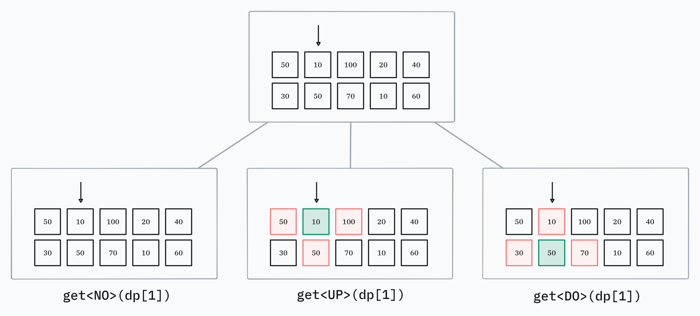

# 접근

동적 계획법 문제이며, 점화식을 세우는 것이 조금 까다롭다.



`dp[i]`를 열 1 부터 `i` 까지 고려했을 때, `i`열에서
* 아무것도 하지 않거나
* 위쪽 스티커를 떼거나
* 아래쪽 스티커를 떼었을 때

얻을 수 있는 점수의 최대값 이라고 정의한다.



편의를 위해 `dp`와 열거형을 다음과 같이 정의한다.

```cpp{lineNos=false}
using ll = long long;
enum state {
  NO=0, UP, DO
};
vector<tuple<ll, ll, ll>> dp(n + 1);
```

이러면,

* 열 `i`에서 *아무것도 하지 않은 경우*: 
  * 1열부터 `i`열까지 진행했을 때 점수의 최대값은 `get<NO>(dp[i])`
* 열 `i`에서 *위쪽 스티커를 뗸 경우*: 
  * 1열부터 `i`열까지 진행했을 때 점수의 최대값은 `get<UP>(dp[i])`
* 열 `i`에서 *아래쪽 스티커를 뗸 경우*:
  * 1열부터 `i`열까지 진행했을 때 점수의 최대값은 `get<DO>(dp[i])`

라고 표현할 수 있다.

# `i = 2`일때 예

한번 실제로 그림을 그려 보면서, `i=2`열에서 어떻게 되는지 확인해 보자.



**(1) 2번 열에서 *아무것도 하지 않은 경우* 점수의 최대값(`get<NO>(dp[2])`) 구하기**

* 이전 열인 0번 열에서 *아무것도 하지 않은 경우* 점수의 최대값(`get<NO>(dp[2 - 1])`)
* 이전 열인 0번 열에서 *위쪽 스티커를 뗀 경우* 점수의 최대값(`get<UP>(dp[2 - 1])`)
* 이전 열인 0번 열에서 *아래쪽 스티커를 뗀 경우* 점수의 최대값(`get<DO>(dp[2 - 1])`)

중의 최대값이다.

**(2) 2번 열에서 *위쪽 스티커를 뗀 경우* 점수의 최대값(`get<UP>(dp[2])`) 구하기**

이 경우, 이전 열에서 *위쪽 스티커를 떼지 않았다는 보장*이 있어야 가능한 분기이다.  
따라서,

* 이전 열인 0번 열에서 *아무것도 하지 않은 경우* 점수의 최대값(`get<NO>(dp[2 - 1])`)
* 이전 열인 0번 열에서 *아래쪽 스티커를 뗀 경우* 점수의 최대값(`get<DO>(dp[2 - 1])`)

중의 최대값이다.

**(3) 2번 열에서 *아래쪽 스티커를 뗀 경우* 점수의 최대값(`get<DO>(dp[2])`) 구하기**

이 경우, 이전 열에서 *아래쪽 스티커를 떼지 않았다는 보장*이 있어야 가능한 분기이다.  
따라서,

* 이전 열인 0번 열에서 *아무것도 하지 않은 경우* 점수의 최대값(`get<NO>(dp[2 - 1])`)
* 이전 열인 0번 열에서 *위쪽 스티커를 뗀 경우* 점수의 최대값(`get<UP>(dp[2 - 1])`)

중의 최대값이다.

# `i = 1`일때

초기 값인 `i = 1` 일 때에는 조금 다르다. 
이전 열이 없으므로, 항상 모든 행동을 할 수 있다. 값은 다음과 같이 하나로 정해진다.

* 첫 번째 열에서 *아무 것도 하지 않은 경우* 점수의 최대값은 `get<NO>(dp[1]) = 0`
* 첫 번째 열에서 *위쪽 스티커를 뗀 경우* 점수의 최대값은 `get<UP>(dp[1]) = s1[1]`
* 첫 번쨰 열에서 *아래쪽 스티커를 뗀 경우* 점수의 최대값은 `get<DO>(dp[1]) = s2[1]`

# 점화식 일반화

따라서, `dp[i]` 는

> `i = 1` 일 때
>  ```cpp{lineNos=false}
>  get<NO>(dp[1]) = 0;
>  get<UP>(dp[1]) = s1[1];
>  get<DO>(dp[1]) = s2[1];
>  ```
> `i = k (k > 1)` 일 때
>  ```cpp{lineNos=false}
>  get<NO>(dp[i]) 
>    = max({get<NO>(dp[i - 1]), get<UP>(dp[i - 1]), get<DO>(dp[i - 1])})
>  get<UP>(dp[i]) 
>    = max({get<NO>(dp[i - 1]),                   , get<DO>(dp[i - 1])})
>  get<DO>(dp[i]) 
>    = max({get<NO>(dp[i - 1]), get<UP>(dp[i - 1]),                   })
>  ```

라고 볼 수 있다.

그리고, 구하려는 값은 1부터 끝 열까지 진행한 후, 각 분기의 최대값이므로

```cpp{lineNos=false}
max({get<NO>(dp[n]), get<UP>(dp[n]), get<DO>(dp[n])})
```

이다.

# 코드

