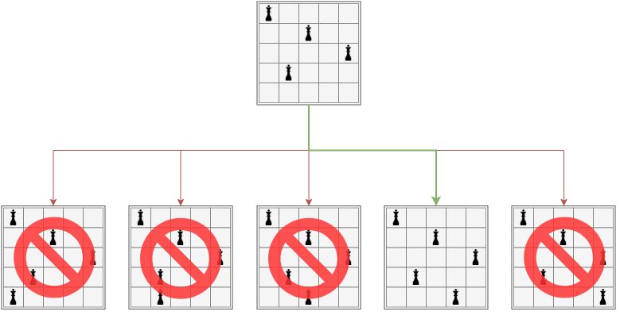
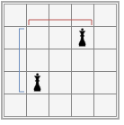

# 접근

쉽게 문제에 접근하기 위한 꽤 중요한 아이디어는 ==한 열에는 퀸이 딱 하나만 배치될 수 있다==는 것이다. 

한 열에 퀸을 배치하고, 다음 열에는 행이 겹치지 않게 퀸을 배치하고, 이런 식으로 반복하면 $N(N−1)(N−2)…1=N!$의 경우의 수가 있을 것이다.
이는 $O(N!)$의 무시무시한 복잡도이지만, 시간 제한이 10초이기 때문에 괜찮다.

때문에 이 문제는 완전 탐색으로 가능한 모든 해의 공간을 탐색하되, 유망하지 않은 분기를 판단하기 쉬우므로 백 트래킹을 적용하면 쉽게 풀 수 있다.

# 알고리즘

위에서도 이야기했듯, 문제에 쉽게 접근하려면 한 열에는 퀸이 딱 하나만 배치될 수 있다는 아이디어가 꽤 중요하다.

이 말은, 전체 체스판의 상태를 1차원 배열 하나로 표현할 수 있다는 뜻이다. 예를 들어, 크기 `N`짜리 `vector<int> queen` 을 만들었다고 가정하자. 그러면 `queen[i] == j` 라면 `i` 행에서 퀸의 위치는 `j` 라는 뜻이다.

0번 열부터 시작하여 퀸을 배치해 본다. 퀸을 배치하면 체스판의 상태가 바뀌며, 결정 트리 내에서 가능성이 분기한다.



예를 들어, N = 5 인 경우, 0번 열 부터 시작하여, 현재 4번 열에 배치하려고 한다면, 위와 같은 분기가 일어날 것이다.
네번째 노드를 제외한 나머지 넷은 체스의 규칙상 배치를 할 수 없는 곳에 배치를 한 것이므로, 더 이상 진행할 수 없는 Dead-End 노드이다. 이러한 Dead-End 노드에서는 이전의 선택으로 복귀하기 위해 백 트래킹을 수행한다.
마지막 열인 4번 열까지 배치를 진행했고, 체스의 규칙을 위반하지 않았다면, 모든 배치에 성공한 것이므로, '퀸을 배치할 수 있는 경우의 수'를 하나 증가시킨다. 

깊이 우선 탐색을 통해 결정 트리를 순회하며 백 트래킹 하는 함수 bt(v) 는 다음처럼 작동한다.



1. `v` 번 열부터 시작하며 퀸을 배치해보자. (백트래킹 시작)
2. [Base Case] 만일 지금 처리하고 있는 열이 마지막 열인 `N` 번 열이라면, 갯수를 하나 증가시키고 함수를 종료한다.
3. 현재 열에서 가능한 모든 행 `h` 에 대해서 배치 시도를 한다.
	1. 이전 행의 모든 퀸들이 현재 배치하려는 행과 부딪히지 않는지 확인(`is_safe`)한다.
		1. 부딪히지 않으면 배치한다. 다음 열인 `v + 1` 으로 이 함수를 다시 호출한다. 
		2. 부딪힌다면, 백 트래킹한다.



이를 코드로 표현한다면 아래와 같다.

```cpp{lineNos=false}
void bt(int v) {
  // 마지막 열인가?
  if (v == N) {
    ++cnt;
    return;
  }

  for (int h = 0; h < N; ++h) {
    if (!is_safe(v, h)) {
      continue;
    }
    queen[v] = h;
    bt(v + 1);
  }
}
```


`queen[v] = -1` 은 사실 없어도 상관 없지만, (덮어 쓰기 때문) 백 트래킹이 일어났다는 것을 보여주기 위해 추가하였다.

## `is_safe` 함수의 설계

퀸을 배치해도 문제가 없는지 판단하는 함수 is_safe 는 다음처럼 설계한다.

```cpp{lineNos=false}
bool is_safe(int v, int h) {
  for (int pv = 0; pv < v; ++pv) {
    int ph = queen[pv];

    // 이전 열에 배치된 퀸퀸 중 하나의 위치가 pv열 ph행이다.
    // 현재 v열 h행에 새 퀸을 배치할 수 있는지 확인한다.

    // 같은 행에 놨는지 검사
    if (ph == h) {
      return false;
    }    

    // 대각선이 겹치는지?
    if (abs(pv - v) == abs(ph - h)) {
      return false;
    }

  }
  return true;
}
```


여기서 두 퀸이 대각 방향으로 서로 공격할 수 있는지 판단하기 위한 로직이 눈여겨 볼 만 하다.



좌 상단, 좌 하단, 우 상단, 우 하단 대각선에 존재하는지 확인하려면, 두 퀸의 행 번호 차이의 절대값과, 열 번호 차이의 절대값이 같은지 확인하면 된다.

# 코드

전체 코드는 아래와 같다.



# 제약 만족 문제(CSP, Constraint Satisfaction Problem)

N-Queen은 사실 **제약 만족 문제(CSP, Constraint Satisfaction Problem)이다.**
CSP는 여러 변수에 값을 할당하되, 제약 조건을 모두 만족시키는 해를 찾는 문제이다. 핵심은 모든 변수에 충돌 없이 값을 배정하는 것이다.


CSP는 다음의 3가지 구성 요소로 정의된다.
- 변수(Variables)
	- 값을 할당할 대상들
- 도메인(Domain)
	- 각 변수에 가능한 값의 집합
- 제약 조건(Constaints)
	- 어떤 변수들의 조합이 유효한지 명시하는 규칙


N-Queen 문제를 CSP로 해석하면 다음과 같다.


- 변수
	- queen[0] 부터 queen[N - 1] 까지
		- ==앞서 이 표현법이 특이하다고 하였는데, 사실 CSP문제의 구조적 특성을 반영한 표현이다.==
	- 0 부터 N - 1 까지 각 행에 퀸이 놓일 수 있는 열의 위치
- 제약 조건
	- is_safe 


CSP 해 공간이 매우 크다는 특징이 있고, 대체로 백 트래킹을 이용해 제약 조건을 만족하지 않으면 이전 분기로 되돌아가는 풀이를 사용한다.

대표적인 CSP 문제로 N-Queen, 스도쿠, 그래프 색칠, 시간표 작성 문제가 있다. 