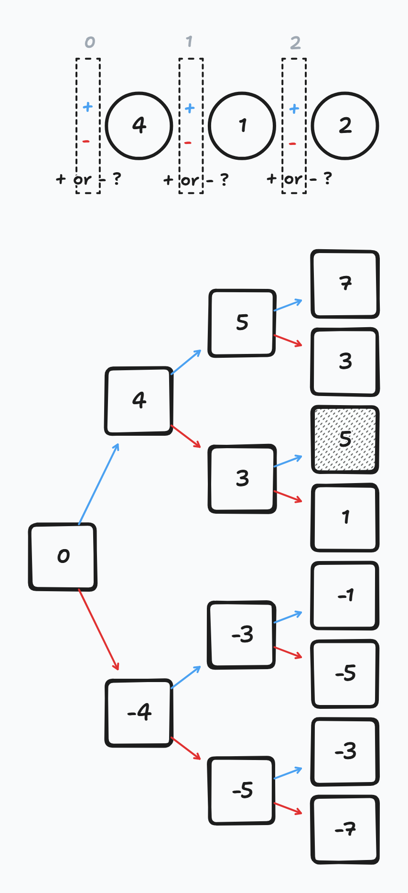

<!--  2025-02-28 풀이 실패 , 복습 후 Gpt -->

# 모든 가능한 경우의 수를 완전 포화 이진 트리로 표현

`numbers`가 `{4, 1, 2}` 라고 가정하자.

각 숫자 사이에서 적용할 연산 $+$ 와 $-$ 중 하나를 선택해야 한다.

목표하는 값인 `target`을 `5` 라고 하고, 각 노드를 현재 단계 까지의 합으로 정의하면, 다음처럼 그래프를 그려볼 수 있다.





각 단계마다 경우의 수가 두 개로 제한되고, 마지막 레벨까지 모든 노드가 가득 차 있으므로 완전 포화 이진 트리이다.

# 완전 포화 이진 트리를 DFS로 탐색하자

## 먼저, 복잡도 검증

완전 포화 이진 트리를 모두 탐색하여 가능한 해를 찾는 방식으로 풀 것인데, 혹시 복잡도를 초과하지 않을까?
한번 계산해 보자.

`numbers`의 연속한 각 수마다 더하냐($+$), 혹은 빼냐($-$)의 두 가지 경우의 수가 주어진다.
그러므로 `numbers`의 길이가 $n$이라고 하였을 때, 총 $2^n$번의 탐색을 하게 된다.

문제에서 `numbers`의 길이는 20 이하라고 하였고, 때문에 최대 $2^{20} \approx 10^6$ 번의 연산을 하므로, 시간 초과가 나지 않을 만큼의 양이다.

탐색을 위한 알고리즘은 BFS를 쓰건, DFS를 쓰건 상관 없지만, DFS를 쓰는 경우 재귀를 사용하기 때문에 재귀의 깊이가 스택 오버플로우를 발생시키지 않는지도 고려해야 한다.

이 문제의 경우 재귀의 깊이가 `numbers.size()`에 비례하는데, 20 이하이므로 신경쓸 수치는 아니다.

## 코드

DFS를 이용하여 구현한 코드는 아래와 같다.



