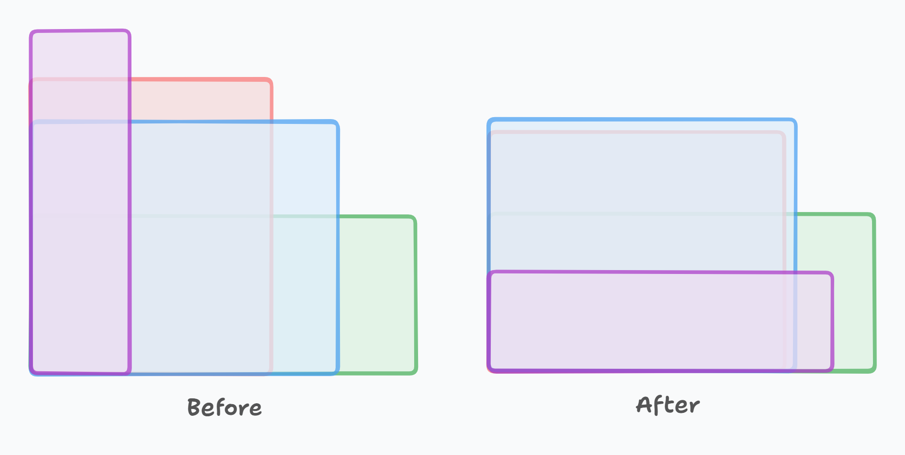



[\[프로그래머스\] LV1 최소 직사각형](https://school.programmers.co.kr/learn/courses/30/lessons/86491)

지갑을 *돌릴 수 있다*는 사실에 너무 집착하면 이 문제를 풀 수가 없다. (`if`문의 향연을 보게될 것이다 ...)

돌릴 수 있다는 것은 의미상 가로와 세로가 정해져 있지 않다는 것인데, 쫄지 말고 내가 정하면 된다.

**핵심 아이디어는 직사각형의 두 변중 더 큰 쪽을 가로라고 부르고, 더 작은 쪽을 세로라고 부르는 것이다.** 이렇게 가로와 세로를 정하면, 기준이 생기는 것이므로 더 이상 지갑을 돌릴 수 없다.

전체 코드는 아래와 같다.

```cpp
#include <vector>
#include <algorithm>

using namespace std;

int solution(vector<vector<int>> sizes) {
    int max_w = 0, max_h = 0;

    for (auto const &wallet : sizes) {
		// 지갑의 두 변 중 더 큰 쪽이 가로
        int const w = max(wallet[0], wallet[1]);
		// 지갑의 두 변 중 더 작은 쪽이 가로
        int const h = min(wallet[0], wallet[1]);
        
		// 더 큰 가로가 나오면 업데이트
        max_w = max(max_w, w);
		// 더 큰 세로가 나오면 업데이트
        max_h = max(max_h, h);
    }

    return max_w * max_h;
}
```

그림으로 보면 훨씬 이해가 쉽다.
굳이 설명이 필요하지 않을 정도로 직관적이다. 



어렵게 생각하지 말자.
