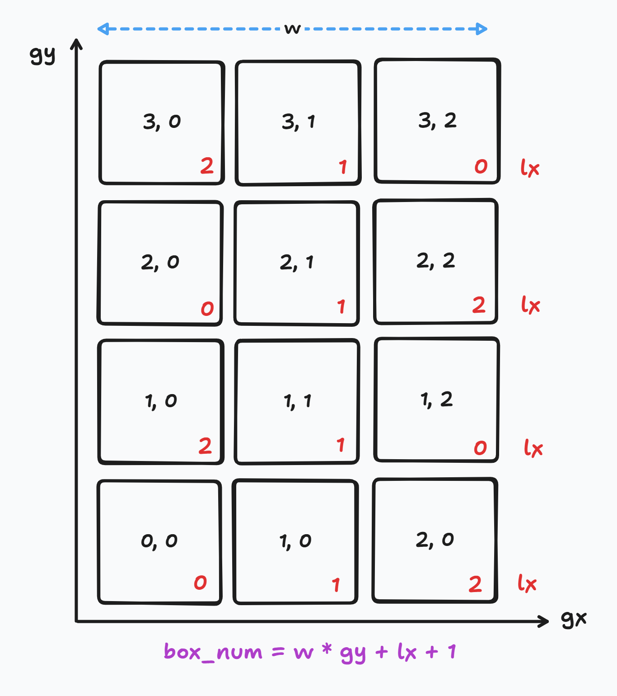

[\[프로그래머스\] LV1 택배 상자 꺼내기](https://school.programmers.co.kr/learn/courses/30/lessons/389478?language=cpp#)

입력으로 상자의 번호(`num`)를 받는다.
상자들의 배열을 좌표계로 생각해 볼 수 있다.
상자의 번호와 상관없이, 가로축과 세로축의 오프셋이 0, 1, 2, ... 로 증가한다고 하면, 상자의 좌표를 나타낼 수 있다.

* `(0, 0)`: `0`층의 왼쪽에서 `0`번째 상자
* `(1, 2)`: `1`층의 왼쪽에서 `2`번째 상자
* `(3, 1)`: `3`층의 왼쪽에서 `1`번째 상자

이를 글로벌 좌표라고 하면, 입력받은 상자의 번호 `num`으로 글로벌 좌표`(num_gx, num_gy)`로 전환할 수 있다.

| `상자에 적힌 값` -> `격자 내에서 상자의 절대 위치`

우리는 상자 격자의 최대 너비 `w`를 알고 있으므로, `num_gx`와 `num_gy`는 다음과 같다.

```cpp
int const num_gy = (num - 1) / w;
int const num_gx = num_gy % 2 == 0 ? 
	(num - 1) % 2 : w - (num - 1) % 2 - 1;
```

절대 위치의 `n_gx`(좌우 오프셋)은 고정한 채로, `n_gy` 즉, 층을 한칸씩 올리면서 해당 위치에 존재하는 상자의 값(`box_num`)이 조건(`box_num <= n`)에 맞는지 확인한다.

이때, 새로운 층의 글로벌 y 좌표값인 `gy`에 대해서, 글로벌 위치로 새로이 상자에 적힌 값을 계산해 내야 한다. 

| `격자 내에서 상자의 절대 위치` -> `상자에 적힌 값`

여기서 상자의 층계 정보 `gy`가 홀수냐 짝수냐에 따라 상자에 적힌 최종 값을 도출하는 식이 조금 달라진다.

홀수 층계에서는, `gx`를 그대로 적용하면 되지만, 짝수 층계에서는 `w - gx - 1`로 처리해야 한다. 어쨌든, 이렇게 한번 변경한 값을 `lx`라는, 지역 가로 오프셋이라는 변수에 담아 처리한다.


```cpp
std::size_t cnt = 0;

for (int gy = num_gy; ; ++gy) {
	int const lx = gx % 2 == 0 ?
		num_gx : w - num_gx - 1;

	int const box_num = w * gy + lx + 1;
	
	if (box_num <= n) {
		++cnt;
	} else {
		break;
	}
}
```

이를 그림으로 나타내면 아래와 같다.



전체 코드는 아래와 같다.

```cpp
#include <string>
#include <vector>

using namespace std;

int solution(int n, int w, int num) {
    
    int const num_gy = (num - 1) / w;
    int const num_gx = num_gy % 2 == 0 ? 
        (num - 1) % w : w - (num - 1) % w - 1;
    
    std::size_t cnt{};
    
    for (int gy = num_gy; ; ++gy) {
        int const lx = gy % 2 == 0 ?
            num_gx : w - num_gx - 1;
       	int const box_num = w * gy + lx + 1;
        
        if (box_num <= n) {
            ++cnt;
        } else {
            break;
        }
    }
    
    return cnt;
}
```
