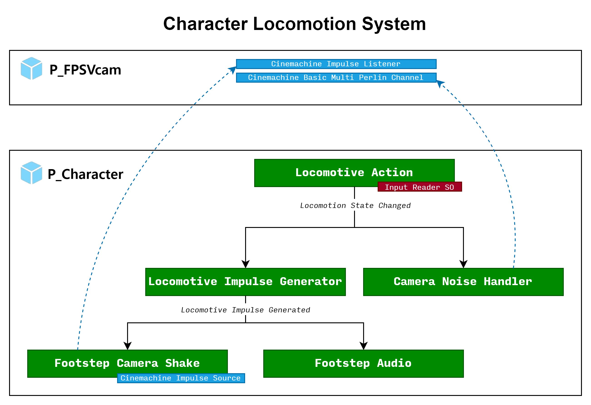

# 소개

(초안)
기술과 예술이 가장 적극적으로 만나는 게임이라는 영역에 관심이 많은 테크 + 인문돌이임을 강조

* 이메일 nachiketa3299@gmail.com
* 깃허브 
* 블로그 [Even Idiots Can Make Game](https://argien.tistory.com/)

# Available Skills

* Unity 5(2D + 3D), Unreal Engine 4
* Git
* C/C++, C#, Python, Lua, Dart
* Visual Studio / Visual Studio Code
* Vim

# 참여 프로젝트

## "Grim Memories" 프로젝트 <i>2024년 9월 ~ 현재</i>

<iframe width="560" height="315" src="https://www.youtube.com/embed/EZtdZAEcpg8?si=08tsFxncRMNzdaYe" title="YouTube video player" frameborder="0" allow="accelerometer; autoplay; clipboard-write; encrypted-media; gyroscope; picture-in-picture; web-share" referrerpolicy="strict-origin-when-cross-origin" allowfullscreen></iframe>

* 팀 규모: 7명
* 게임 개요:
	* 1인칭 시점의 공포 테마 방 탈출 게임
	* 선형적인 스토리와 시네마틱 연출을 체험할 수 있다.
	* 동일한 공간을 두 가지 버전으로 체험할 수 있게 하는 것이 특장점.
* 직책: 메인 프로그래머, 프로젝트 매니저
* 목표: Itch.io와 Steam에 게임 데모 출시

### 주요 구현 사항

* 기획 의도에 맞는 1인칭 캐릭터 컨트롤러 및 상호작용 시스템 구현
* FMod 를 활용한 앰비언스 & 사운드 효과 구현

#### 1인칭 캐릭터 컨트롤러 및 상호작용 시스템 구현

<iframe width="560" height="315" src="https://www.youtube.com/embed/wIU7-DIbJHs?si=O6OLzsyhpoMB1-HY" title="YouTube video player" frameborder="0" allow="accelerometer; autoplay; clipboard-write; encrypted-media; gyroscope; picture-in-picture; web-share" referrerpolicy="strict-origin-when-cross-origin" allowfullscreen></iframe>

조용하고 정적인 공간에서 대부분의 플레이가 진행되는 1인칭 시점의 캐릭터 컨트롤러를 구현하는 것이 과제였습니다. 기본 이동, 앉기, 걷기 등에 따라 이동의 효과 (카메라 흔들림, 사운드)가 다르게 느껴져야 했습니다.

아래처럼 옵저버 패턴을 활용하여 컴포넌트간 커플링을 최대한 줄였습니다. 각 컴포넌트는 자신이 관심 있는 이벤트만 구독하면 되고, 이벤트를 발생하는 주체는 누가 자신을 구독하는지 몰라도 상관 없습니다.

또한 Unity에 이미 존재하는 Cinemachine 컴포넌트들을 적극 활용하여 

---

## "Munchkin" 프로젝트 <i>2024년 6월 ~ 8월</i>

* 직책: 팀장, 메인 프로그래머, 메인 기획자
* 팀 규모: 4명
* 게임 개요 
	* \<Getting Over It\>에서 영감을 얻은 고난이도 2.5D 플랫포밍 게임
	* "달걀 → 병아리 → 닭"이라는 고유의 생애주기를 갖는 캐릭터를 주인공으로 내세운 점이 특이점. 실패가 빈번한 어려운 게임이지만 "가장 가까운 알"에서 "병아리" 상태로 부활한다는 고유의 메커니즘으로 게임을 클리어할 수 있도록 기획.
* 목표: Itch.io에 게임 데모 출시
* 전체 기획서 링크
	* [전체 콘셉트](https://substantial-panther-211.notion.site/9a3725e57d7b41a5891e7c0fe1c0d3d5?pvs=4)
	* [기획 용어 정리](https://substantial-panther-211.notion.site/a19b8ac4a4904419a9b0a693b6b12ae4?pvs=4)
	* [게임의 생애주기](https://substantial-panther-211.notion.site/61fe3ea8d1bb4b14b68105bb148ddb04?pvs=4)
	* [게임플레이 서사](https://substantial-panther-211.notion.site/edf4c88bdcd14b2aa3114abfacb01176?pvs=4)
	* [플레이어 입력](https://substantial-panther-211.notion.site/853508194aae4672a58a6a2715d4f414?pvs=4)
	* [캐릭터 기획](https://substantial-panther-211.notion.site/243480d1e8b44ada8704811f08be5de6?pvs=4)
	* [장치와 함정 기획](https://substantial-panther-211.notion.site/3dd5857436dc4a5abdaf021cf439e263?pvs=4)
	* [레벨과 스테이지 기획](https://substantial-panther-211.notion.site/5553f23380f448b7a10b1157e1f28512?pvs=4)

### 주요 구현 사항

#### 주요 기술적 설계 의사결정 주도

* 게임 플레이 내내 절대 언로드되지 않는 상주 씬(Persistent Scene)에 월드 씬을 런타임에 Additive 모드로 로드 / 언로드하여 게임플레이 월드를 구축
	* 이를 위해, 씬 간의 물리적 인접 관계를 에디터에서 그래프로 표현 후, 런타임에 해당 그래프를 탐색하여 필요한 씬을 로드하고 언로드하는 시스템을 구축.
* 레벨 디자인에서 수정이 용이하도록, Tilemap의 GameObject 브러시를 이용하여 블럭으로 모듈화된 분할 월드 씬 개발

#### 동적 Additive 씬 로딩 시스템 구축

메트로배니아 장르의 게임 처럼 거대한 맵에서 플랫포밍을 하는 게임으로, 플레이어에게 가시적인 로딩이 없었으면 좋겠다고 생각했습니다. 그래서 게임 월드를 작은 씬들로 쪼개, 필요에 따라 런타임에 로드하고 언로드하는 방식을 구현하려 하였습니다.

여기서 씬의 로드가 필요한 경우는 다음과 같습니다.
* 주요 오브젝트(예: 캐릭터)가 현재 존재하는 씬과, 해당 씬과 깊이 $n$으로 인접한 씬

위와 같은 상태가 아닌 씬들은 모두 언로드가 필요합니다.

씬의 로드가 필요한 오브젝트는 "캐릭터"와 "알" 이었습니다. 캐릭터가 사망 처리된 경우, 영혼으로 변하여 "알"로 지형을 무시한 채 이동하여 부활할 필요가 있기 때문이었습니다. (여기서 "알"은 Non-Kinematic Rigidbody 오브젝트입니다.)

캐릭터와 알 모두 다음과 같은 요청을 보내는 상황이라고 생각하였습니다.

> 내가 현재 존재하는 씬으로부터, 논리적 거리가 $n$이하인 씬들은 로드되어 있어야 하고, 그렇지 않은 씬들은 다른 오브젝트가 요청을 보내지 않았다면 언로드해도 괜찮아.

이를 위해 씬 로드/언로드 요청을 보내는 `SceneLoadTrigger`를 작성하였습니다. 이 스크립트는 해당 스크립트가 부착된 오브젝트가 어떤 씬의 경계[^1]에 들어갈 때, 해당 씬을 기준으로 설정된 거리 이내로 인접한 씬들을 로드해야 한다고 요청을 보냅니다.

[^1]: 씬마다 경계를 의미하는 Trigger Collider를 부착하였습니다.

그리고 다수의 `SceneLoadTrigger`들의 요청을 취합하여 최종적으로 씬 로드/언로드 연산을 수행하는 싱글턴 클래스 `SceneLoadManager`를 작성하였습니다.

씬 로드 / 언로드는 비동기 연산(`AsyncOperation`)이기 때문에 여러 프레임에 걸쳐 이뤄지는 일이지만, 어떤 씬을 로드하라 / 언로드하라 라는 요청은 "주요 오브젝트가 씬의 경계에 들어갈 때"라는 *물리적 사건*에 의해 일어나므로 이론적으로 중복되는 요청이 발생하기 쉬웠습니다.

예를 들어 씬 A가 이미 로드/언로드 연산이 진행 중인 씬에 대해서 또다시 로드/언로드 연산이 요청되는 경우를 처리해야 했습니다.

---

## "Alien" 프로젝트 <i>2024년 3월~2024년 5월</i>

* 팀 규모: 4명
* 직책: 팀장, 메인 프로그래머, 메인 기획자
* 목표: BIC 출품 위한 MVP 제작

---

## Unreal Labs

* 약 20명 규모의 Unreal 엔진 소스코드 분석 연구회
* `ActorComponent` 팀에서 해당 기능을 분석
* [발표자료](https://docs.google.com/presentation/d/19-R6U1GwiAnyQH91bM8MlbIXAxXcxeDGW7L3T93jJ6w/edit?usp=sharing)
* 연구 학생으로 참여